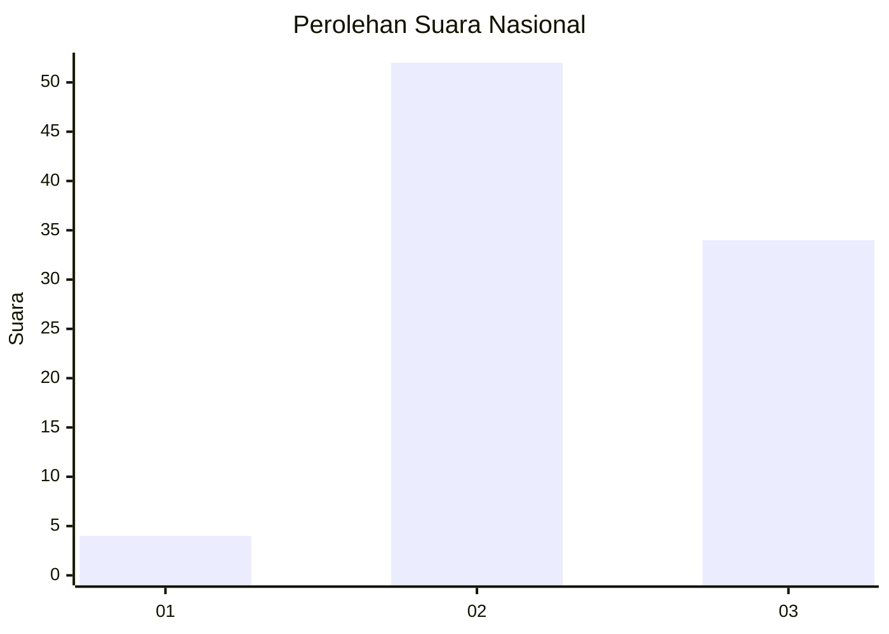
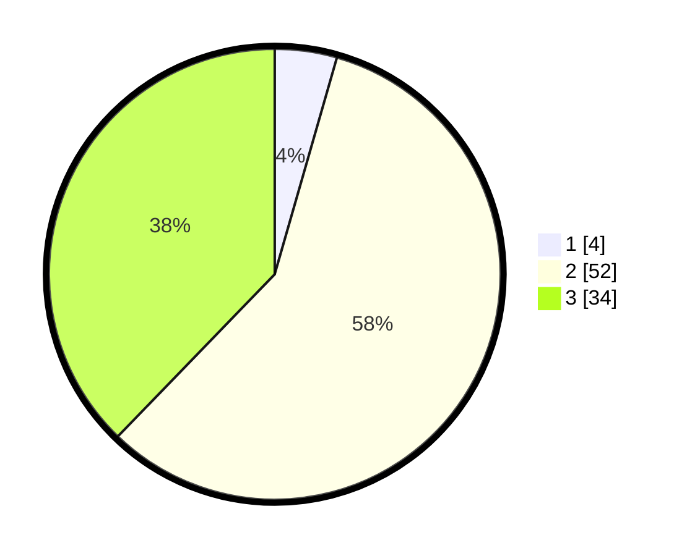

# Hasil

## Grafik

## Tabel

| No. | Nama Paslon    | Suara | Suara (raw) | Persentase |
|:--- |:-------------- | -----:| -----------:| ----------:|
| 1   | ANIES MUHAIMIN | 4     | [4][p-1]    | 4,44       |
| 2   | PRABOWO GIBRAN | 52    | [52][p-2]   | 57,78      |
| 3   | GANJAR MAHFUD  | 34    | [34][p-3]   | 37,78      |

[p-1]: https://github.com/gigit-pemilu/pemilu-2024/blob/main/pilpres/hitung-suara/sub/16-sumatera-selatan/sub/06-musi-banyuasin/sub/01-sekayu/sub/2002-lumpatan/sub/016-tps/sub/paslon-1.txt
[p-2]: https://github.com/gigit-pemilu/pemilu-2024/blob/main/pilpres/hitung-suara/sub/16-sumatera-selatan/sub/06-musi-banyuasin/sub/01-sekayu/sub/2002-lumpatan/sub/016-tps/sub/paslon-2.txt
[p-3]: https://github.com/gigit-pemilu/pemilu-2024/blob/main/pilpres/hitung-suara/sub/16-sumatera-selatan/sub/06-musi-banyuasin/sub/01-sekayu/sub/2002-lumpatan/sub/016-tps/sub/paslon-3.txt

## Foto C Plano

https://sirekap-obj-formc.kpu.go.id/ce30/pemilu/ppwp/16/06/01/20/02/1606012002016-20240217-213416--34570244-e3f2-40e3-8131-378f8b3bea8a.jpg

https://sirekap-obj-formc.kpu.go.id/ce30/pemilu/ppwp/16/06/01/20/02/1606012002016-20240217-213505--0ef05c08-3a3a-4811-84b4-415ea4f885e2.jpg

https://sirekap-obj-formc.kpu.go.id/ce30/pemilu/ppwp/16/06/01/20/02/1606012002016-20240217-213808--129f5a5a-a89a-4b3f-a7d9-72b1987489bd.jpg

## Metadata

| Key        | Value               |
| ---------- | ------------------- |
| Time Stamp | 2024-02-19 06:16:00 |

