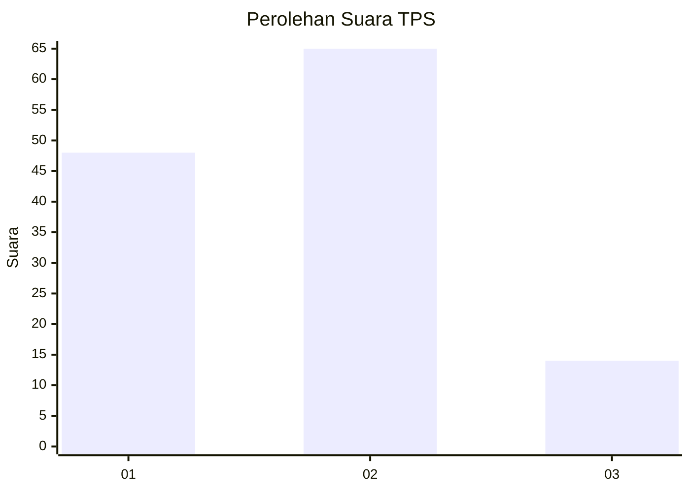
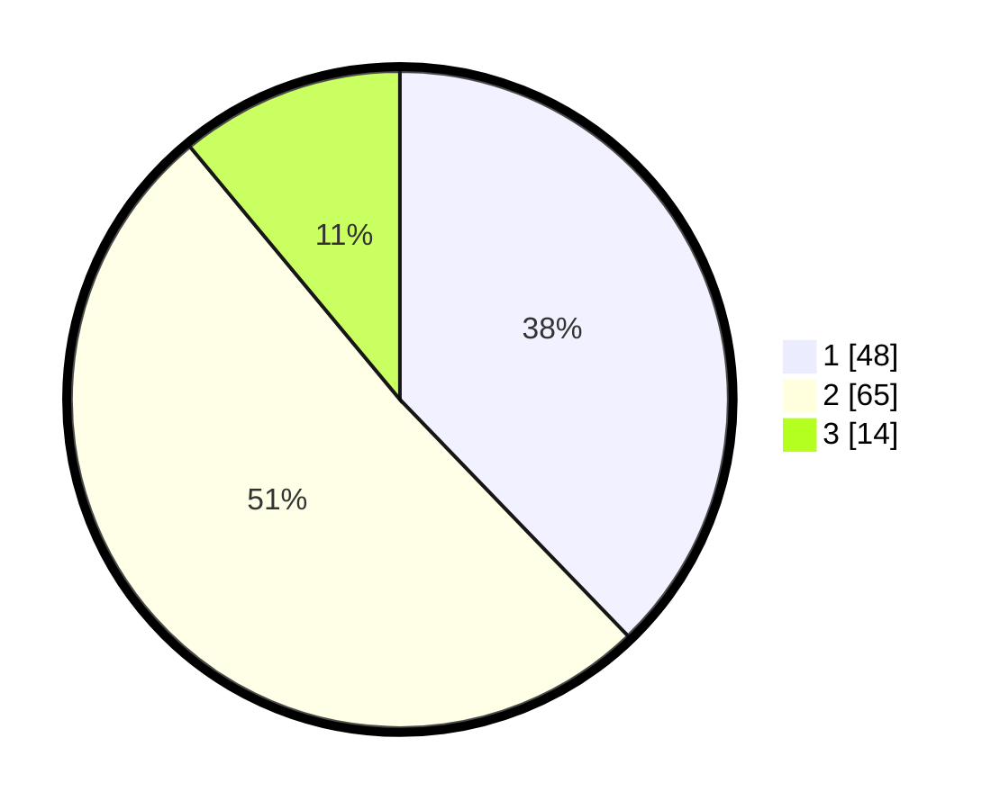

# Hasil

## Grafik

## Tabel

| No. | Nama Paslon    | Suara | Suara (raw) | Persentase |
|:--- |:-------------- | -----:| -----------:| ----------:|
| 1   | ANIES MUHAIMIN | 48    | [48][p-1]   | 37,80      |
| 2   | PRABOWO GIBRAN | 65    | [65][p-2]   | 51,18      |
| 3   | GANJAR MAHFUD  | 14    | [14][p-3]   | 11,02      |

[p-1]: https://github.com/gigit-pemilu/pemilu-2024-16-sumatera-selatan/blob/main/pilpres/hitung-suara/sub/16-sumatera-selatan/sub/06-musi-banyuasin/sub/01-sekayu/sub/2004-muara-teladan/sub/014-tps/sub/paslon-1.txt
[p-2]: https://github.com/gigit-pemilu/pemilu-2024-16-sumatera-selatan/blob/main/pilpres/hitung-suara/sub/16-sumatera-selatan/sub/06-musi-banyuasin/sub/01-sekayu/sub/2004-muara-teladan/sub/014-tps/sub/paslon-2.txt
[p-3]: https://github.com/gigit-pemilu/pemilu-2024-16-sumatera-selatan/blob/main/pilpres/hitung-suara/sub/16-sumatera-selatan/sub/06-musi-banyuasin/sub/01-sekayu/sub/2004-muara-teladan/sub/014-tps/sub/paslon-3.txt

## Foto C Plano

https://sirekap-obj-formc.kpu.go.id/48d9/pemilu/ppwp/16/06/01/20/04/1606012004014-20240222-214812--51a9cb84-e539-40f5-95ae-7ce8a8d1650a.jpg

https://sirekap-obj-formc.kpu.go.id/48d9/pemilu/ppwp/16/06/01/20/04/1606012004014-20240222-214908--57758674-1732-496d-8d1c-8a54f010c4cb.jpg

https://sirekap-obj-formc.kpu.go.id/48d9/pemilu/ppwp/16/06/01/20/04/1606012004014-20240222-214955--495c6b5e-0963-4e3c-a575-64e76a890328.jpg

## Metadata

| Key        | Value               |
| ---------- | ------------------- |
| Time Stamp | 2024-02-24 22:31:28 |

