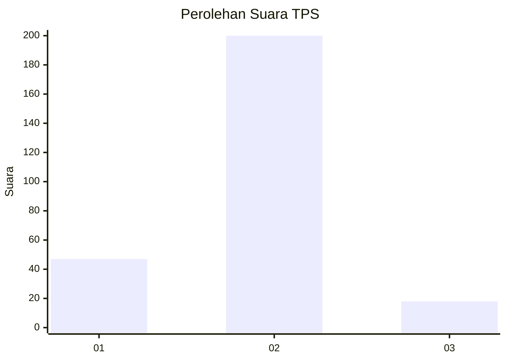
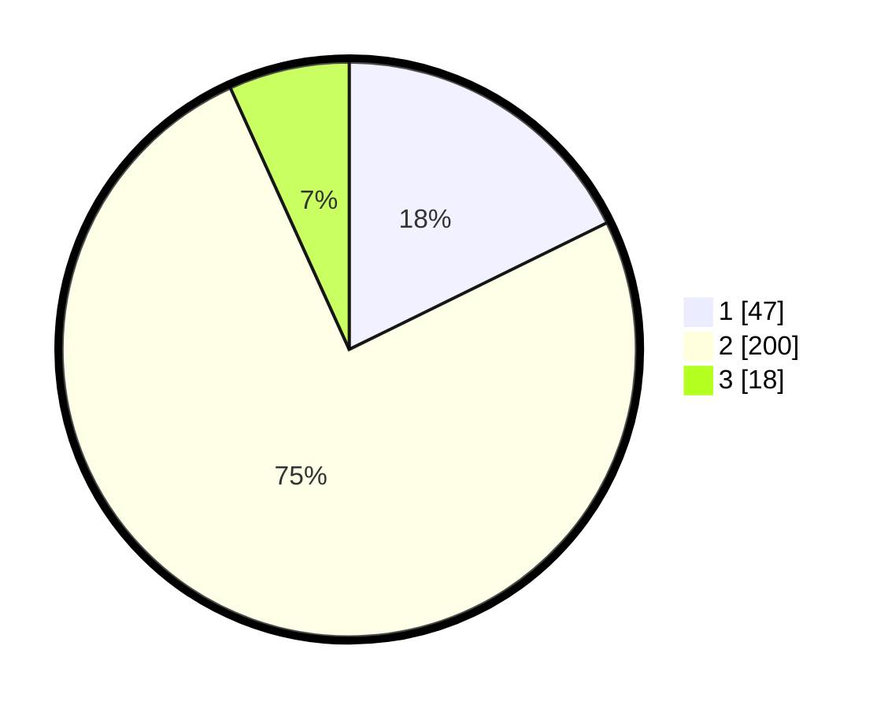

# Hasil

## Grafik

## Tabel

| No. | Nama Paslon    | Suara | Suara (raw) | Persentase |
|:--- |:-------------- | -----:| -----------:| ----------:|
| 1   | ANIES MUHAIMIN | 47    | [47][p-1]   | 17,74      |
| 2   | PRABOWO GIBRAN | 200   | [200][p-2]  | 75,47      |
| 3   | GANJAR MAHFUD  | 18    | [18][p-3]   | 6,79       |

[p-1]: https://github.com/gigit-pemilu/pemilu-2024-16-sumatera-selatan/blob/main/pilpres/hitung-suara/sub/16-sumatera-selatan/sub/06-musi-banyuasin/sub/01-sekayu/sub/2005-bandar-jaya/sub/005-tps/sub/paslon-1.txt
[p-2]: https://github.com/gigit-pemilu/pemilu-2024-16-sumatera-selatan/blob/main/pilpres/hitung-suara/sub/16-sumatera-selatan/sub/06-musi-banyuasin/sub/01-sekayu/sub/2005-bandar-jaya/sub/005-tps/sub/paslon-2.txt
[p-3]: https://github.com/gigit-pemilu/pemilu-2024-16-sumatera-selatan/blob/main/pilpres/hitung-suara/sub/16-sumatera-selatan/sub/06-musi-banyuasin/sub/01-sekayu/sub/2005-bandar-jaya/sub/005-tps/sub/paslon-3.txt

## Foto C Plano

https://sirekap-obj-formc.kpu.go.id/fd14/pemilu/ppwp/16/06/01/20/05/1606012005005-20240215-045148--ce4172a8-1db1-4edf-b038-ad97210a0239.jpg

https://sirekap-obj-formc.kpu.go.id/fd14/pemilu/ppwp/16/06/01/20/05/1606012005005-20240215-045301--7c420da3-9ecd-484c-b0c9-1f613197ce5f.jpg

https://sirekap-obj-formc.kpu.go.id/fd14/pemilu/ppwp/16/06/01/20/05/1606012005005-20240215-045445--17d29218-0d76-4cf5-a5f7-79353dd29596.jpg

## Metadata

| Key        | Value               |
| ---------- | ------------------- |
| Time Stamp | 2024-02-17 16:00:02 |

