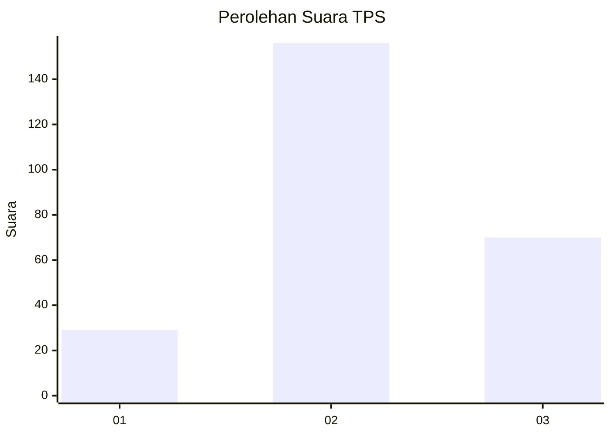
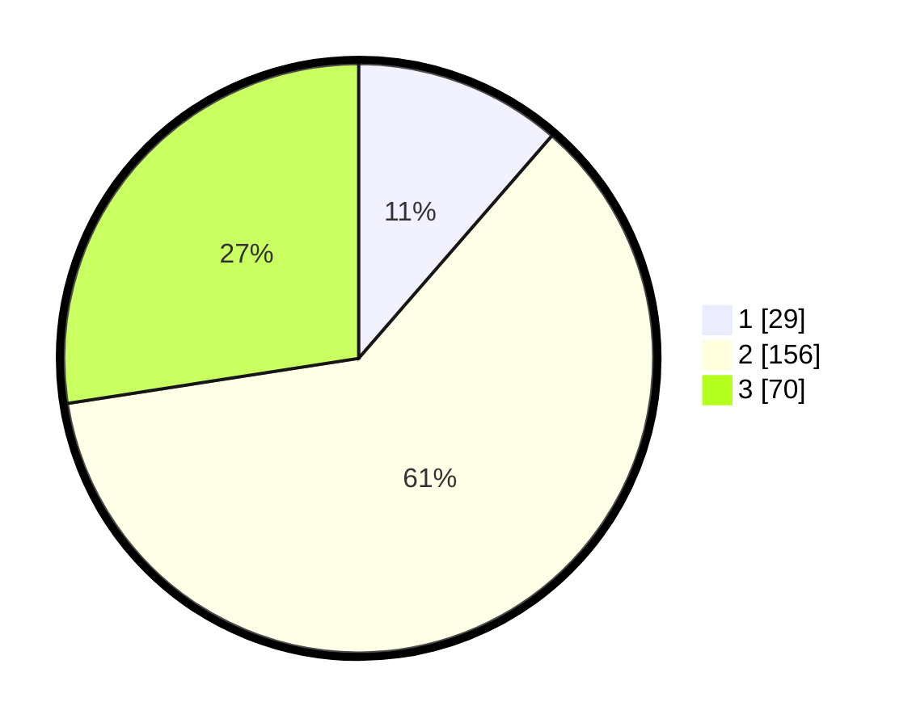

# Hasil

## Grafik

## Tabel

| No. | Nama Paslon    | Suara | Suara (raw) | Persentase |
|:--- |:-------------- | -----:| -----------:| ----------:|
| 1   | ANIES MUHAIMIN | 29    | [29][p-1]   | 11,37      |
| 2   | PRABOWO GIBRAN | 156   | [156][p-2]  | 61,18      |
| 3   | GANJAR MAHFUD  | 70    | [70][p-3]   | 27,45      |

[p-1]: https://github.com/gigit-pemilu/pemilu-2024-16-sumatera-selatan/blob/main/pilpres/hitung-suara/sub/16-sumatera-selatan/sub/06-musi-banyuasin/sub/01-sekayu/sub/2008-rimba-ukur/sub/001-tps/sub/paslon-1.txt
[p-2]: https://github.com/gigit-pemilu/pemilu-2024-16-sumatera-selatan/blob/main/pilpres/hitung-suara/sub/16-sumatera-selatan/sub/06-musi-banyuasin/sub/01-sekayu/sub/2008-rimba-ukur/sub/001-tps/sub/paslon-2.txt
[p-3]: https://github.com/gigit-pemilu/pemilu-2024-16-sumatera-selatan/blob/main/pilpres/hitung-suara/sub/16-sumatera-selatan/sub/06-musi-banyuasin/sub/01-sekayu/sub/2008-rimba-ukur/sub/001-tps/sub/paslon-3.txt

## Foto C Plano

https://sirekap-obj-formc.kpu.go.id/54f7/pemilu/ppwp/16/06/01/20/08/1606012008001-20240217-133635--305c9692-2640-4d96-aa94-b1089111b742.jpg

https://sirekap-obj-formc.kpu.go.id/54f7/pemilu/ppwp/16/06/01/20/08/1606012008001-20240217-133719--eedb4e59-97ce-421a-afc9-f9686ed90b16.jpg

https://sirekap-obj-formc.kpu.go.id/54f7/pemilu/ppwp/16/06/01/20/08/1606012008001-20240217-133829--278610be-678d-4a4e-a461-a0dcb8f83f06.jpg

## Metadata

| Key        | Value               |
| ---------- | ------------------- |
| Time Stamp | 2024-02-26 00:00:00 |

