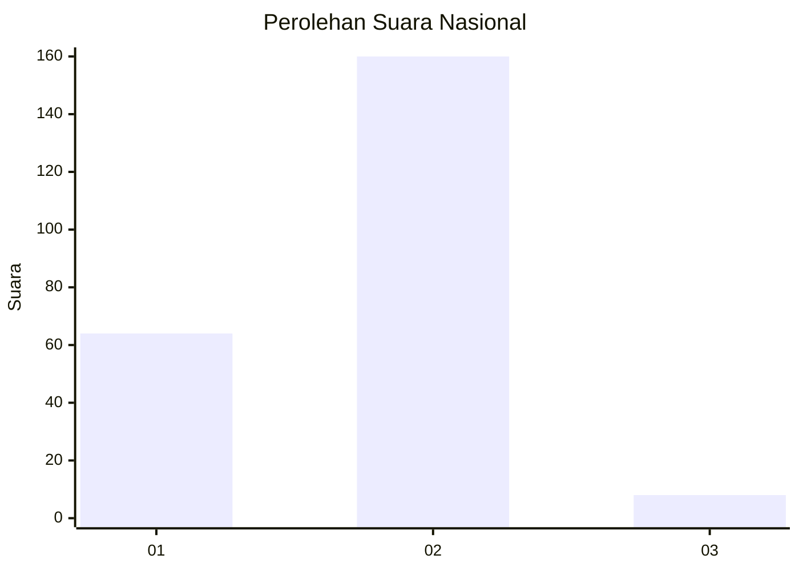
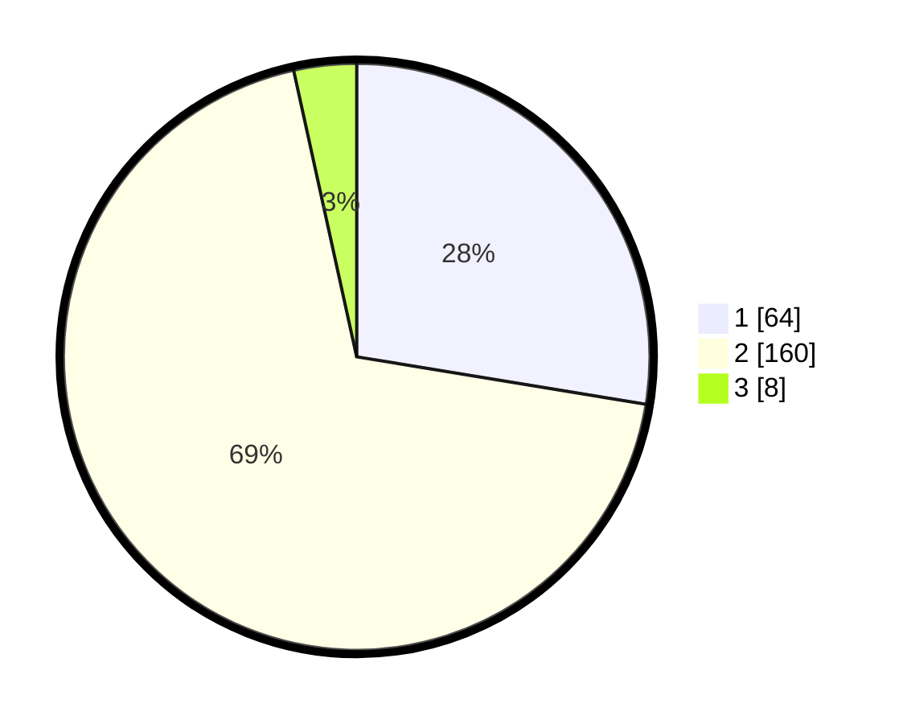

# Hasil

## Grafik

## Tabel

| No. | Nama Paslon    | Suara | Suara (raw) | Persentase |
|:--- |:-------------- | -----:| -----------:| ----------:|
| 1   | ANIES MUHAIMIN | 64    | [64][p-1]   | 27,59      |
| 2   | PRABOWO GIBRAN | 160   | [160][p-2]  | 68,97      |
| 3   | GANJAR MAHFUD  | 8     | [8][p-3]    | 3,45       |

[p-1]: https://github.com/gigit-pemilu/pemilu-2024/blob/main/pilpres/hitung-suara/sub/16-sumatera-selatan/sub/06-musi-banyuasin/sub/01-sekayu/sub/2013-lumpatan-2/sub/001-tps/sub/paslon-1.txt
[p-2]: https://github.com/gigit-pemilu/pemilu-2024/blob/main/pilpres/hitung-suara/sub/16-sumatera-selatan/sub/06-musi-banyuasin/sub/01-sekayu/sub/2013-lumpatan-2/sub/001-tps/sub/paslon-2.txt
[p-3]: https://github.com/gigit-pemilu/pemilu-2024/blob/main/pilpres/hitung-suara/sub/16-sumatera-selatan/sub/06-musi-banyuasin/sub/01-sekayu/sub/2013-lumpatan-2/sub/001-tps/sub/paslon-3.txt

## Foto C Plano

https://sirekap-obj-formc.kpu.go.id/eb21/pemilu/ppwp/16/06/01/20/13/1606012013001-20240217-221847--394e6e43-2149-4444-9566-e2a8068cc1c4.jpg

https://sirekap-obj-formc.kpu.go.id/eb21/pemilu/ppwp/16/06/01/20/13/1606012013001-20240215-211351--13fa1912-0e25-414f-bfd1-57c06773a6fd.jpg

https://sirekap-obj-formc.kpu.go.id/eb21/pemilu/ppwp/16/06/01/20/13/1606012013001-20240214-234724--dc2a7075-5d2e-46e3-bbe7-8b75c9f8c001.jpg

## Metadata

| Key        | Value               |
| ---------- | ------------------- |
| Time Stamp | 2024-02-19 06:16:00 |

