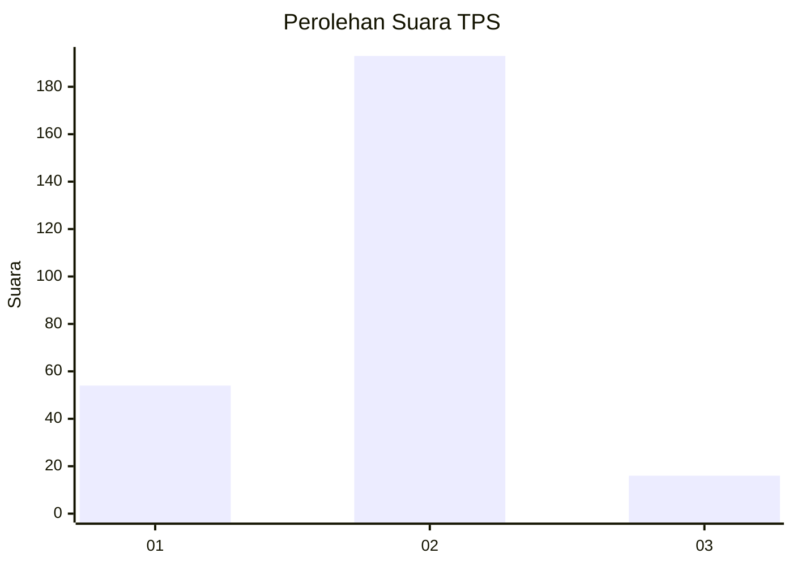

# Hasil

## Grafik

## Tabel

| No. | Nama Paslon    | Suara | Suara (raw) | Persentase |
|:--- |:-------------- | -----:| -----------:| ----------:|
| 1   | ANIES MUHAIMIN | 54    | [54][p-1]   | 20,53      |
| 2   | PRABOWO GIBRAN | 193   | [193][p-2]  | 73,38      |
| 3   | GANJAR MAHFUD  | 16    | [16][p-3]   | 6,08       |

[p-1]: https://github.com/gigit-pemilu/pemilu-2024-16-sumatera-selatan/blob/main/pilpres/hitung-suara/sub/16-sumatera-selatan/sub/06-musi-banyuasin/sub/01-sekayu/sub/2013-lumpatan-2/sub/004-tps/sub/paslon-1.txt
[p-2]: https://github.com/gigit-pemilu/pemilu-2024-16-sumatera-selatan/blob/main/pilpres/hitung-suara/sub/16-sumatera-selatan/sub/06-musi-banyuasin/sub/01-sekayu/sub/2013-lumpatan-2/sub/004-tps/sub/paslon-2.txt
[p-3]: https://github.com/gigit-pemilu/pemilu-2024-16-sumatera-selatan/blob/main/pilpres/hitung-suara/sub/16-sumatera-selatan/sub/06-musi-banyuasin/sub/01-sekayu/sub/2013-lumpatan-2/sub/004-tps/sub/paslon-3.txt

## Foto C Plano

https://sirekap-obj-formc.kpu.go.id/b424/pemilu/ppwp/16/06/01/20/13/1606012013004-20240214-192549--f36f1661-0c07-40a1-958b-1779be01f8c7.jpg

https://sirekap-obj-formc.kpu.go.id/b424/pemilu/ppwp/16/06/01/20/13/1606012013004-20240214-192753--f10f1c35-24eb-4432-bc00-d5539c2290e6.jpg

https://sirekap-obj-formc.kpu.go.id/b424/pemilu/ppwp/16/06/01/20/13/1606012013004-20240214-192939--c43b972e-6f48-4724-9c59-7185c3da9fdf.jpg

## Metadata

| Key        | Value               |
| ---------- | ------------------- |
| Time Stamp | 2024-02-16 14:00:34 |

