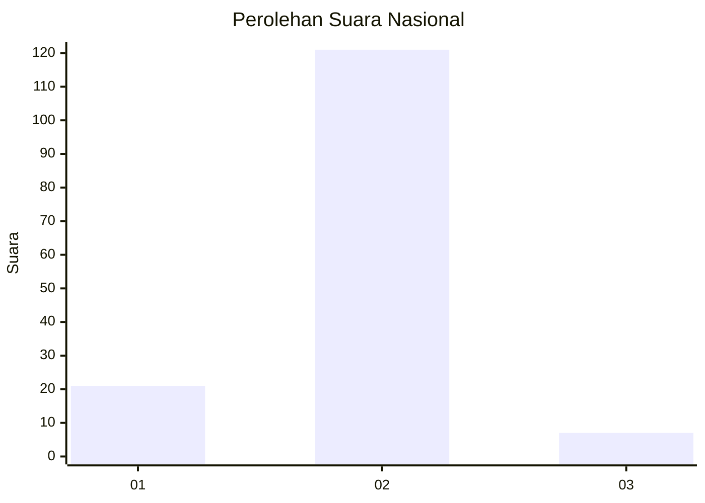
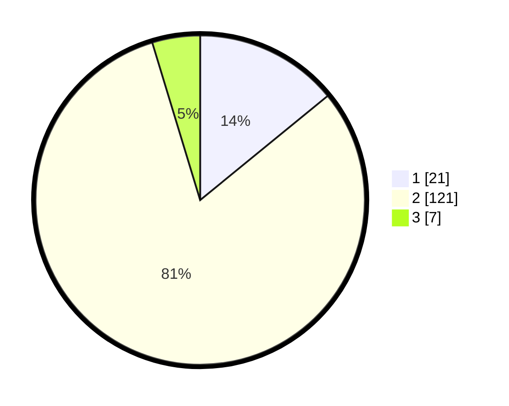

# Hasil

## Grafik

## Tabel

| No. | Nama Paslon    | Suara | Suara (raw) | Persentase |
|:--- |:-------------- | -----:| -----------:| ----------:|
| 1   | ANIES MUHAIMIN | 21    | [21][p-1]   | 14,09      |
| 2   | PRABOWO GIBRAN | 121   | [121][p-2]  | 81,21      |
| 3   | GANJAR MAHFUD  | 7     | [7][p-3]    | 4,70       |

[p-1]: https://github.com/gigit-pemilu/pemilu-2024/blob/main/pilpres/hitung-suara/sub/16-sumatera-selatan/sub/06-musi-banyuasin/sub/02-lais/sub/2001-danau-cala/sub/005-tps/sub/paslon-1.txt
[p-2]: https://github.com/gigit-pemilu/pemilu-2024/blob/main/pilpres/hitung-suara/sub/16-sumatera-selatan/sub/06-musi-banyuasin/sub/02-lais/sub/2001-danau-cala/sub/005-tps/sub/paslon-2.txt
[p-3]: https://github.com/gigit-pemilu/pemilu-2024/blob/main/pilpres/hitung-suara/sub/16-sumatera-selatan/sub/06-musi-banyuasin/sub/02-lais/sub/2001-danau-cala/sub/005-tps/sub/paslon-3.txt

## Foto C Plano

https://sirekap-obj-formc.kpu.go.id/3b94/pemilu/ppwp/16/06/02/20/01/1606022001005-20240217-201449--10b8e043-3239-4694-a415-4dab63d1c190.jpg

https://sirekap-obj-formc.kpu.go.id/3b94/pemilu/ppwp/16/06/02/20/01/1606022001005-20240217-201506--09010200-08d8-4cc2-ad41-6ba512106930.jpg

https://sirekap-obj-formc.kpu.go.id/3b94/pemilu/ppwp/16/06/02/20/01/1606022001005-20240217-201531--0b0cb519-61ac-486d-bd42-f39920556d00.jpg

## Metadata

| Key        | Value               |
| ---------- | ------------------- |
| Time Stamp | 2024-02-25 16:00:00 |

