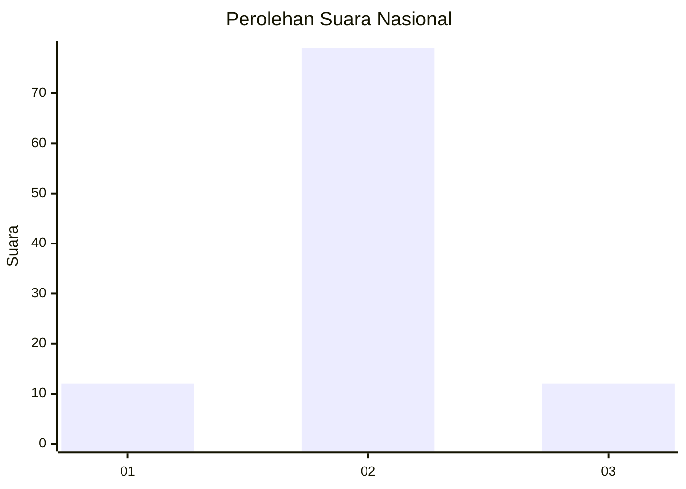
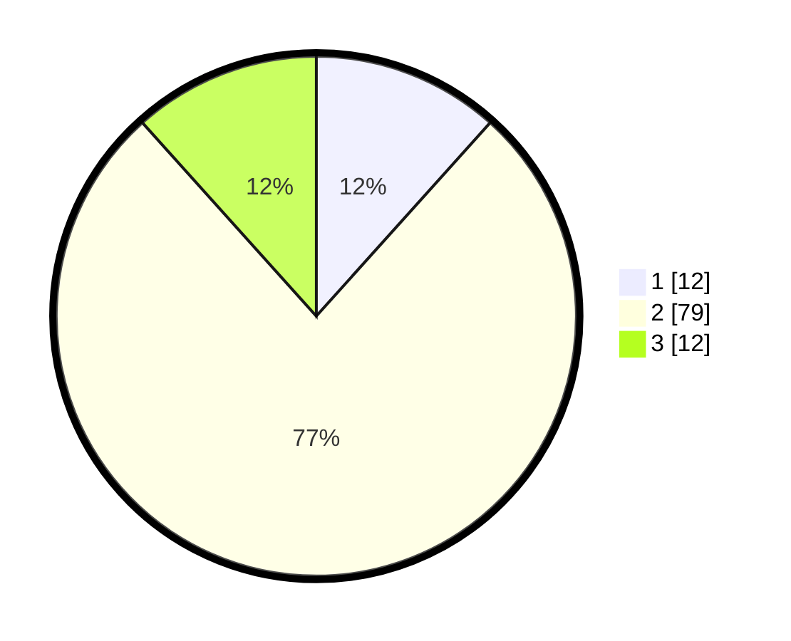

# Hasil

## Grafik

## Tabel

| No. | Nama Paslon    | Suara | Suara (raw) | Persentase |
|:--- |:-------------- | -----:| -----------:| ----------:|
| 1   | ANIES MUHAIMIN | 12    | [12][p-1]   | 11,65      |
| 2   | PRABOWO GIBRAN | 79    | [79][p-2]   | 76,70      |
| 3   | GANJAR MAHFUD  | 12    | [12][p-3]   | 11,65      |

[p-1]: https://github.com/gigit-pemilu/pemilu-2024/blob/main/pilpres/hitung-suara/sub/16-sumatera-selatan/sub/06-musi-banyuasin/sub/02-lais/sub/2002-rantau-keroya/sub/002-tps/sub/paslon-1.txt
[p-2]: https://github.com/gigit-pemilu/pemilu-2024/blob/main/pilpres/hitung-suara/sub/16-sumatera-selatan/sub/06-musi-banyuasin/sub/02-lais/sub/2002-rantau-keroya/sub/002-tps/sub/paslon-2.txt
[p-3]: https://github.com/gigit-pemilu/pemilu-2024/blob/main/pilpres/hitung-suara/sub/16-sumatera-selatan/sub/06-musi-banyuasin/sub/02-lais/sub/2002-rantau-keroya/sub/002-tps/sub/paslon-3.txt

## Foto C Plano

https://sirekap-obj-formc.kpu.go.id/602d/pemilu/ppwp/16/06/02/20/02/1606022002002-20240217-210623--91105000-b9d6-4042-ac5d-58e1fcc29caf.jpg

https://sirekap-obj-formc.kpu.go.id/602d/pemilu/ppwp/16/06/02/20/02/1606022002002-20240217-210706--bb37eeb1-1563-454a-b362-e6c0de44128f.jpg

https://sirekap-obj-formc.kpu.go.id/602d/pemilu/ppwp/16/06/02/20/02/1606022002002-20240217-210744--26f607d7-8a57-437d-8a91-fb98e9a30965.jpg

## Metadata

| Key        | Value               |
| ---------- | ------------------- |
| Time Stamp | 2024-02-25 21:00:00 |

