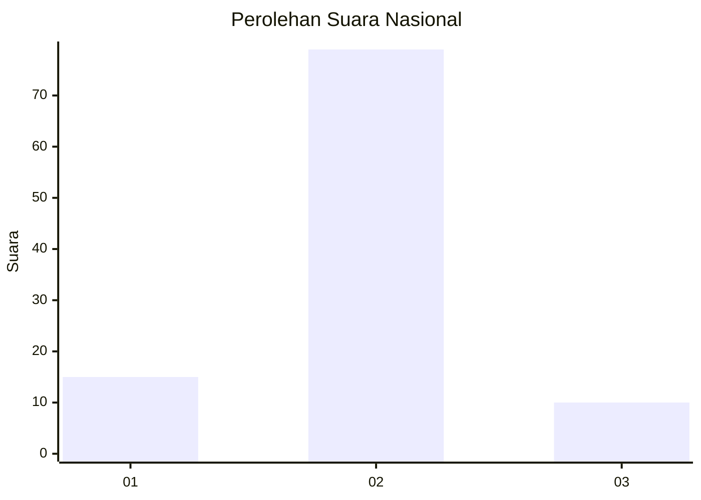
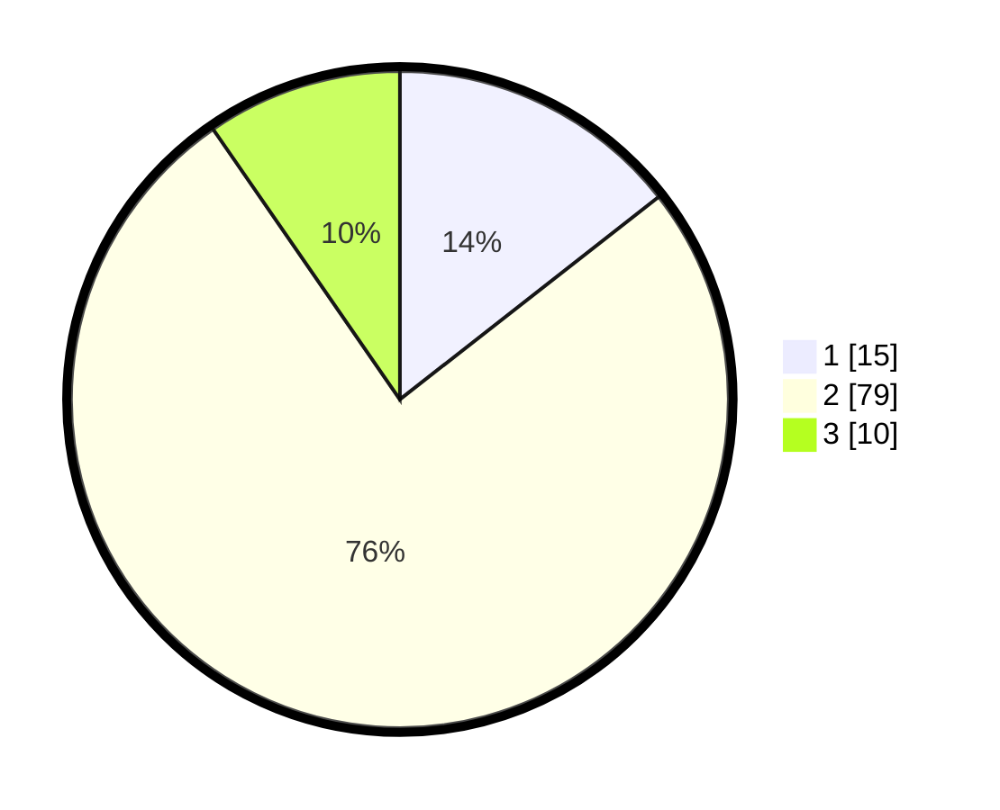

# Hasil

## Grafik

## Tabel

| No. | Nama Paslon    | Suara | Suara (raw) | Persentase |
|:--- |:-------------- | -----:| -----------:| ----------:|
| 1   | ANIES MUHAIMIN | 15    | [15][p-1]   | 14,42      |
| 2   | PRABOWO GIBRAN | 79    | [79][p-2]   | 75,96      |
| 3   | GANJAR MAHFUD  | 10    | [10][p-3]   | 9,62       |

[p-1]: https://github.com/gigit-pemilu/pemilu-2024/blob/main/pilpres/hitung-suara/sub/16-sumatera-selatan/sub/06-musi-banyuasin/sub/02-lais/sub/2002-rantau-keroya/sub/004-tps/sub/paslon-1.txt
[p-2]: https://github.com/gigit-pemilu/pemilu-2024/blob/main/pilpres/hitung-suara/sub/16-sumatera-selatan/sub/06-musi-banyuasin/sub/02-lais/sub/2002-rantau-keroya/sub/004-tps/sub/paslon-2.txt
[p-3]: https://github.com/gigit-pemilu/pemilu-2024/blob/main/pilpres/hitung-suara/sub/16-sumatera-selatan/sub/06-musi-banyuasin/sub/02-lais/sub/2002-rantau-keroya/sub/004-tps/sub/paslon-3.txt

## Foto C Plano

https://sirekap-obj-formc.kpu.go.id/f842/pemilu/ppwp/16/06/02/20/02/1606022002004-20240217-211101--9067f9db-6831-44d9-8704-c1a49b9223f8.jpg

https://sirekap-obj-formc.kpu.go.id/f842/pemilu/ppwp/16/06/02/20/02/1606022002004-20240217-211124--fe38052b-04d8-48e3-aa23-2be401906cb0.jpg

https://sirekap-obj-formc.kpu.go.id/f842/pemilu/ppwp/16/06/02/20/02/1606022002004-20240217-211151--51834c3f-cfcc-4601-8638-05d0b0b61920.jpg

## Metadata

| Key        | Value               |
| ---------- | ------------------- |
| Time Stamp | 2024-02-25 16:00:00 |

