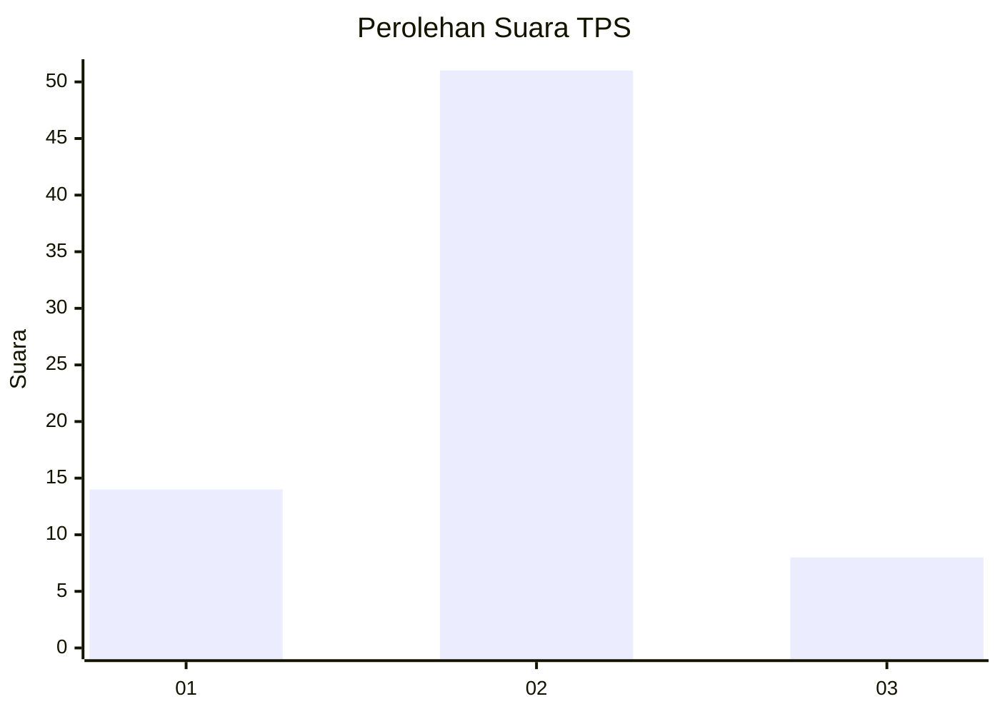
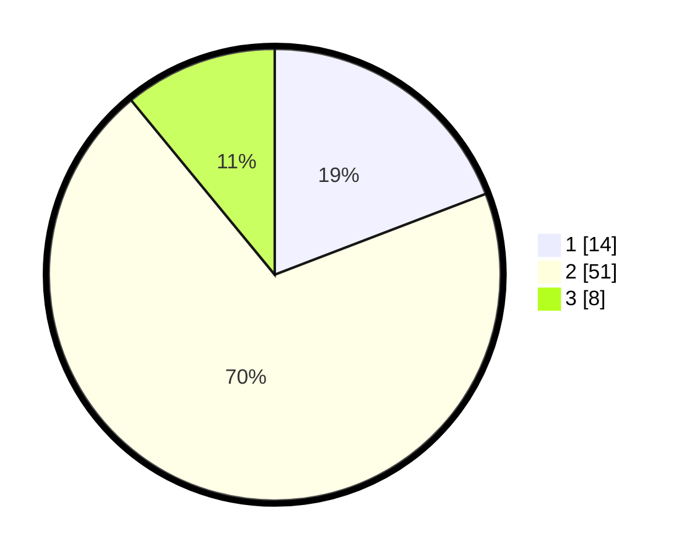

# Hasil

## Grafik

## Tabel

| No. | Nama Paslon    | Suara | Suara (raw) | Persentase |
|:--- |:-------------- | -----:| -----------:| ----------:|
| 1   | ANIES MUHAIMIN | 14    | [14][p-1]   | 19,18      |
| 2   | PRABOWO GIBRAN | 51    | [51][p-2]   | 69,86      |
| 3   | GANJAR MAHFUD  | 8     | [8][p-3]    | 10,96      |

[p-1]: https://github.com/gigit-pemilu/pemilu-2024-16-sumatera-selatan/blob/main/pilpres/hitung-suara/sub/16-sumatera-selatan/sub/06-musi-banyuasin/sub/02-lais/sub/2002-rantau-keroya/sub/005-tps/sub/paslon-1.txt
[p-2]: https://github.com/gigit-pemilu/pemilu-2024-16-sumatera-selatan/blob/main/pilpres/hitung-suara/sub/16-sumatera-selatan/sub/06-musi-banyuasin/sub/02-lais/sub/2002-rantau-keroya/sub/005-tps/sub/paslon-2.txt
[p-3]: https://github.com/gigit-pemilu/pemilu-2024-16-sumatera-selatan/blob/main/pilpres/hitung-suara/sub/16-sumatera-selatan/sub/06-musi-banyuasin/sub/02-lais/sub/2002-rantau-keroya/sub/005-tps/sub/paslon-3.txt

## Foto C Plano

https://sirekap-obj-formc.kpu.go.id/4d84/pemilu/ppwp/16/06/02/20/02/1606022002005-20240217-211405--8fad4480-3863-4f9b-9606-c60d1ffee8bf.jpg

https://sirekap-obj-formc.kpu.go.id/4d84/pemilu/ppwp/16/06/02/20/02/1606022002005-20240217-211317--bf6143a6-e8ce-4afe-a36b-223b28be16f8.jpg

https://sirekap-obj-formc.kpu.go.id/4d84/pemilu/ppwp/16/06/02/20/02/1606022002005-20240217-211338--ddbaa075-475f-41b3-ac44-86793cdbb005.jpg

## Metadata

| Key        | Value               |
| ---------- | ------------------- |
| Time Stamp | 2024-02-24 22:31:28 |

