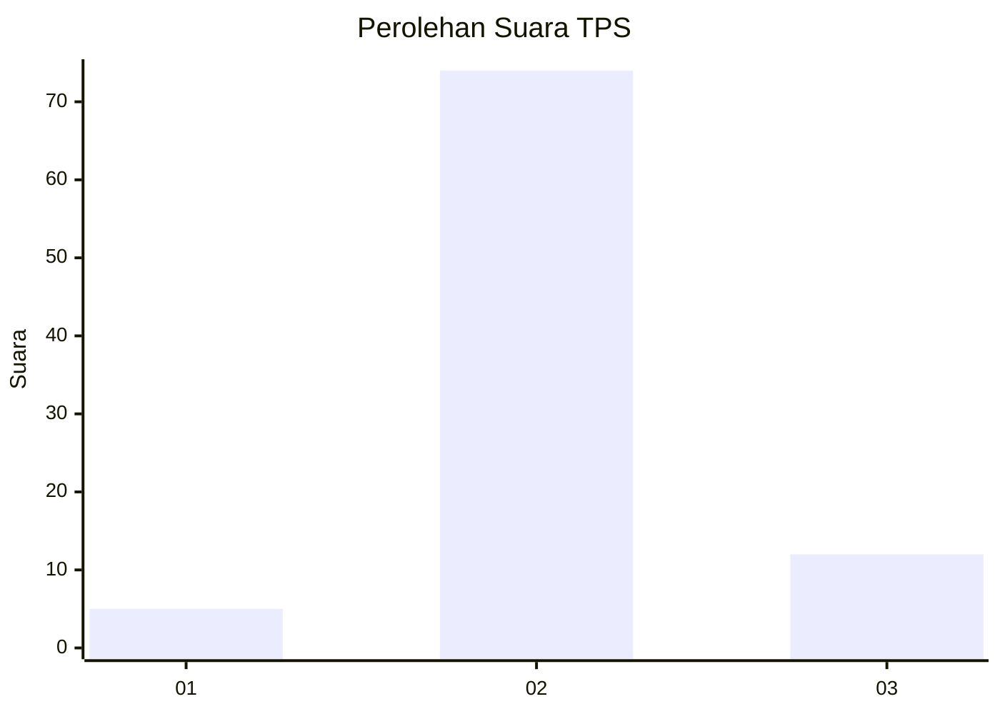
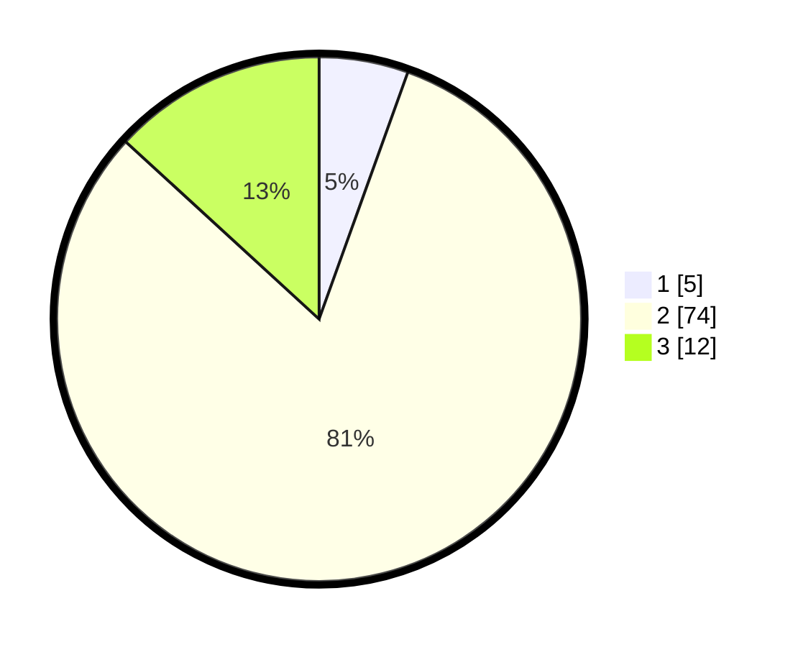

# Hasil

## Grafik

## Tabel

| No. | Nama Paslon    | Suara | Suara (raw) | Persentase |
|:--- |:-------------- | -----:| -----------:| ----------:|
| 1   | ANIES MUHAIMIN | 5     | [5][p-1]    | 5,49       |
| 2   | PRABOWO GIBRAN | 74    | [74][p-2]   | 81,32      |
| 3   | GANJAR MAHFUD  | 12    | [12][p-3]   | 13,19      |

[p-1]: https://github.com/gigit-pemilu/pemilu-2024-16-sumatera-selatan/blob/main/pilpres/hitung-suara/sub/16-sumatera-selatan/sub/06-musi-banyuasin/sub/02-lais/sub/2002-rantau-keroya/sub/008-tps/sub/paslon-1.txt
[p-2]: https://github.com/gigit-pemilu/pemilu-2024-16-sumatera-selatan/blob/main/pilpres/hitung-suara/sub/16-sumatera-selatan/sub/06-musi-banyuasin/sub/02-lais/sub/2002-rantau-keroya/sub/008-tps/sub/paslon-2.txt
[p-3]: https://github.com/gigit-pemilu/pemilu-2024-16-sumatera-selatan/blob/main/pilpres/hitung-suara/sub/16-sumatera-selatan/sub/06-musi-banyuasin/sub/02-lais/sub/2002-rantau-keroya/sub/008-tps/sub/paslon-3.txt

## Foto C Plano

https://sirekap-obj-formc.kpu.go.id/381e/pemilu/ppwp/16/06/02/20/02/1606022002008-20240217-212907--69c89a55-e0ba-4de3-b058-0514f34d0ed6.jpg

https://sirekap-obj-formc.kpu.go.id/381e/pemilu/ppwp/16/06/02/20/02/1606022002008-20240217-212935--a8938ce1-1f01-486e-9863-f665f058a471.jpg

https://sirekap-obj-formc.kpu.go.id/381e/pemilu/ppwp/16/06/02/20/02/1606022002008-20240217-213006--da3313be-11dc-40d8-a7ef-4ef9093216eb.jpg

## Metadata

| Key        | Value               |
| ---------- | ------------------- |
| Time Stamp | 2024-02-24 22:31:28 |

