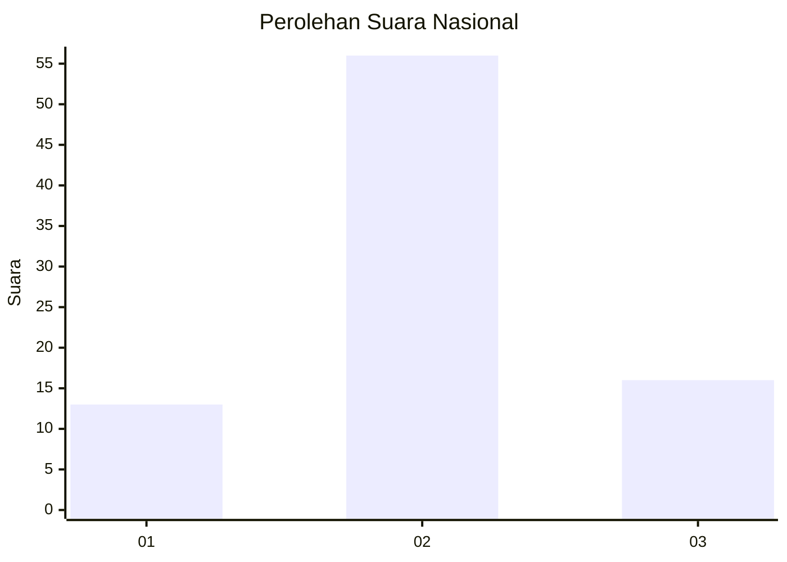
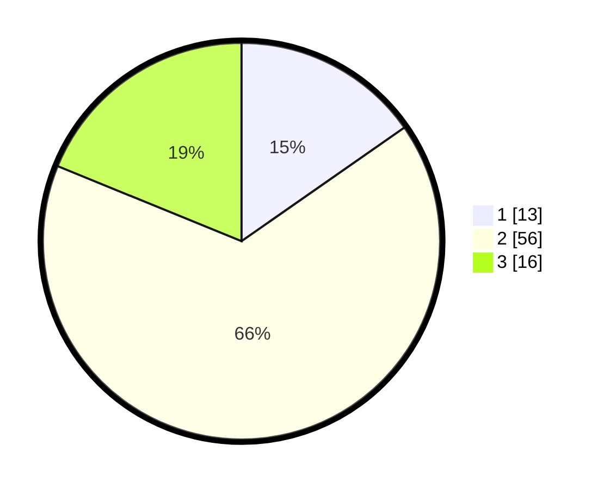

# Hasil

## Grafik

## Tabel

| No. | Nama Paslon    | Suara | Suara (raw) | Persentase |
|:--- |:-------------- | -----:| -----------:| ----------:|
| 1   | ANIES MUHAIMIN | 13    | [13][p-1]   | 15,29      |
| 2   | PRABOWO GIBRAN | 56    | [56][p-2]   | 65,88      |
| 3   | GANJAR MAHFUD  | 16    | [16][p-3]   | 18,82      |

[p-1]: https://github.com/gigit-pemilu/pemilu-2024/blob/main/pilpres/hitung-suara/sub/16-sumatera-selatan/sub/06-musi-banyuasin/sub/02-lais/sub/2002-rantau-keroya/sub/009-tps/sub/paslon-1.txt
[p-2]: https://github.com/gigit-pemilu/pemilu-2024/blob/main/pilpres/hitung-suara/sub/16-sumatera-selatan/sub/06-musi-banyuasin/sub/02-lais/sub/2002-rantau-keroya/sub/009-tps/sub/paslon-2.txt
[p-3]: https://github.com/gigit-pemilu/pemilu-2024/blob/main/pilpres/hitung-suara/sub/16-sumatera-selatan/sub/06-musi-banyuasin/sub/02-lais/sub/2002-rantau-keroya/sub/009-tps/sub/paslon-3.txt

## Foto C Plano

https://sirekap-obj-formc.kpu.go.id/cb92/pemilu/ppwp/16/06/02/20/02/1606022002009-20240217-213142--4f2eec37-b3fc-4344-b6dc-fe8089e5bfe6.jpg

https://sirekap-obj-formc.kpu.go.id/cb92/pemilu/ppwp/16/06/02/20/02/1606022002009-20240217-213214--459da93e-4291-4e14-b7f1-dd3c05e25d09.jpg

https://sirekap-obj-formc.kpu.go.id/cb92/pemilu/ppwp/16/06/02/20/02/1606022002009-20240217-213246--6aee9cd4-f7da-4eda-9b26-295620ca2c4d.jpg

## Metadata

| Key        | Value               |
| ---------- | ------------------- |
| Time Stamp | 2024-02-25 17:00:00 |

