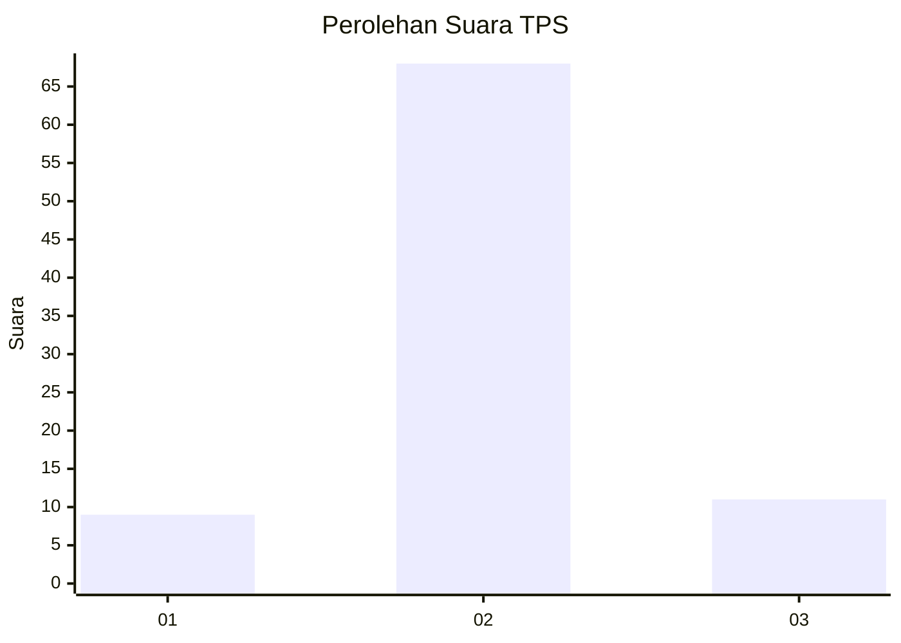
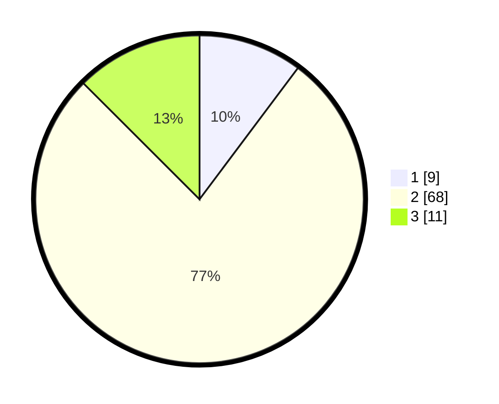

# Hasil

## Grafik

## Tabel

| No. | Nama Paslon    | Suara | Suara (raw) | Persentase |
|:--- |:-------------- | -----:| -----------:| ----------:|
| 1   | ANIES MUHAIMIN | 9     | [9][p-1]    | 10,23      |
| 2   | PRABOWO GIBRAN | 68    | [68][p-2]   | 77,27      |
| 3   | GANJAR MAHFUD  | 11    | [11][p-3]   | 12,50      |

[p-1]: https://github.com/gigit-pemilu/pemilu-2024-16-sumatera-selatan/blob/main/pilpres/hitung-suara/sub/16-sumatera-selatan/sub/06-musi-banyuasin/sub/02-lais/sub/2002-rantau-keroya/sub/010-tps/sub/paslon-1.txt
[p-2]: https://github.com/gigit-pemilu/pemilu-2024-16-sumatera-selatan/blob/main/pilpres/hitung-suara/sub/16-sumatera-selatan/sub/06-musi-banyuasin/sub/02-lais/sub/2002-rantau-keroya/sub/010-tps/sub/paslon-2.txt
[p-3]: https://github.com/gigit-pemilu/pemilu-2024-16-sumatera-selatan/blob/main/pilpres/hitung-suara/sub/16-sumatera-selatan/sub/06-musi-banyuasin/sub/02-lais/sub/2002-rantau-keroya/sub/010-tps/sub/paslon-3.txt

## Foto C Plano

https://sirekap-obj-formc.kpu.go.id/7fb5/pemilu/ppwp/16/06/02/20/02/1606022002010-20240217-213345--662170ef-9af0-46ea-a755-45956d82f4da.jpg

https://sirekap-obj-formc.kpu.go.id/7fb5/pemilu/ppwp/16/06/02/20/02/1606022002010-20240217-213414--06c11afc-d90e-4f53-ba06-2512f6bbdfe9.jpg

https://sirekap-obj-formc.kpu.go.id/7fb5/pemilu/ppwp/16/06/02/20/02/1606022002010-20240217-213440--a099106f-0dae-4a2c-ae12-9a508356cbbe.jpg

## Metadata

| Key        | Value               |
| ---------- | ------------------- |
| Time Stamp | 2024-02-25 18:00:00 |

