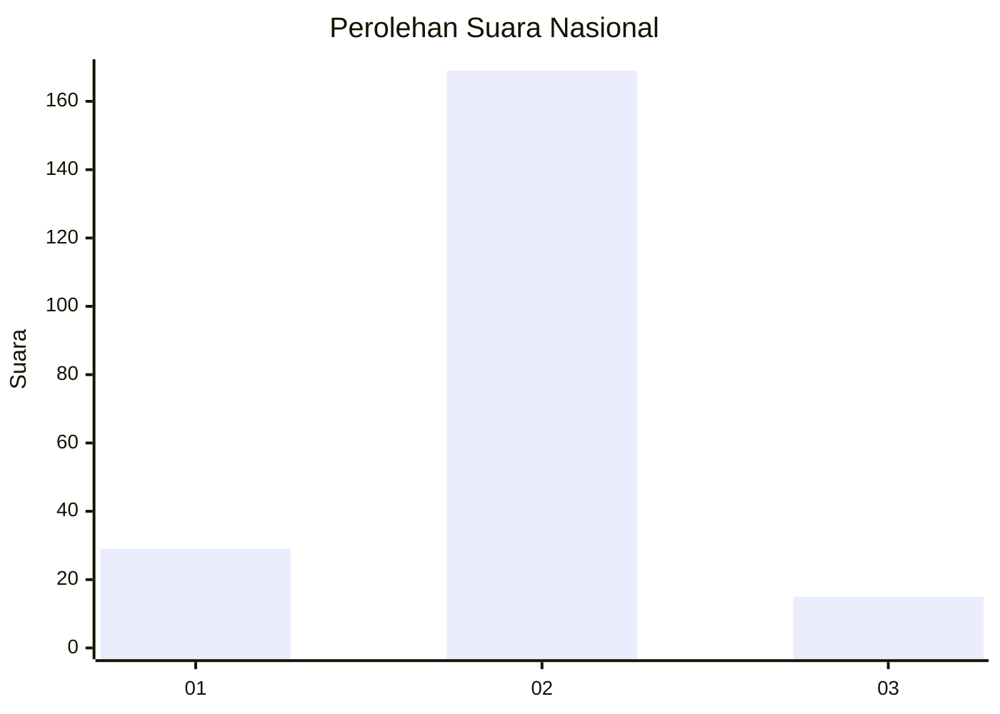
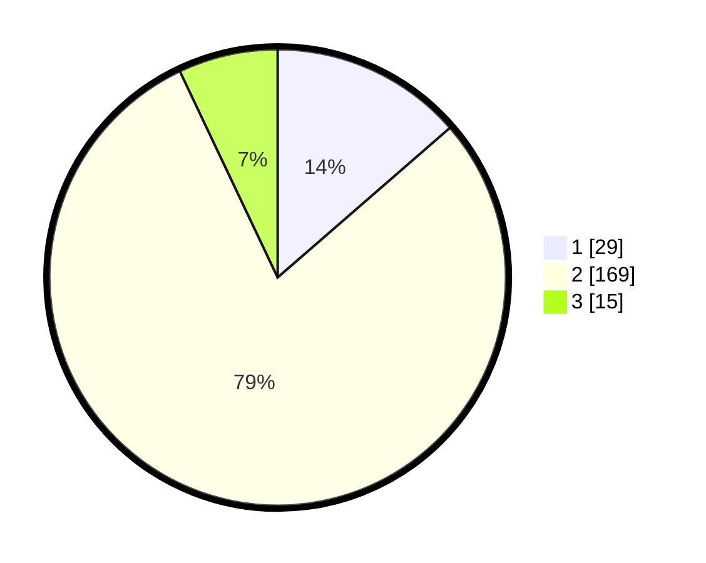

# Hasil

## Grafik

## Tabel

| No. | Nama Paslon    | Suara | Suara (raw) | Persentase |
|:--- |:-------------- | -----:| -----------:| ----------:|
| 1   | ANIES MUHAIMIN | 29    | [29][p-1]   | 13,62      |
| 2   | PRABOWO GIBRAN | 169   | [169][p-2]  | 79,34      |
| 3   | GANJAR MAHFUD  | 15    | [15][p-3]   | 7,04       |

[p-1]: https://github.com/gigit-pemilu/pemilu-2024/blob/main/pilpres/hitung-suara/sub/16-sumatera-selatan/sub/06-musi-banyuasin/sub/02-lais/sub/2003-tanjung-agung-timur/sub/005-tps/sub/paslon-1.txt
[p-2]: https://github.com/gigit-pemilu/pemilu-2024/blob/main/pilpres/hitung-suara/sub/16-sumatera-selatan/sub/06-musi-banyuasin/sub/02-lais/sub/2003-tanjung-agung-timur/sub/005-tps/sub/paslon-2.txt
[p-3]: https://github.com/gigit-pemilu/pemilu-2024/blob/main/pilpres/hitung-suara/sub/16-sumatera-selatan/sub/06-musi-banyuasin/sub/02-lais/sub/2003-tanjung-agung-timur/sub/005-tps/sub/paslon-3.txt

## Foto C Plano

https://sirekap-obj-formc.kpu.go.id/b990/pemilu/ppwp/16/06/02/20/03/1606022003005-20240217-215631--b1a3ef65-4c88-4520-bd35-014aa0e54ff4.jpg

https://sirekap-obj-formc.kpu.go.id/b990/pemilu/ppwp/16/06/02/20/03/1606022003005-20240217-215644--55b42c92-09ff-4207-82a1-f9c0bc21f289.jpg

https://sirekap-obj-formc.kpu.go.id/b990/pemilu/ppwp/16/06/02/20/03/1606022003005-20240217-215728--31b2ad8d-67f0-4262-ba5e-1e8514d76e65.jpg

## Metadata

| Key        | Value               |
| ---------- | ------------------- |
| Time Stamp | 2024-02-24 22:31:28 |

