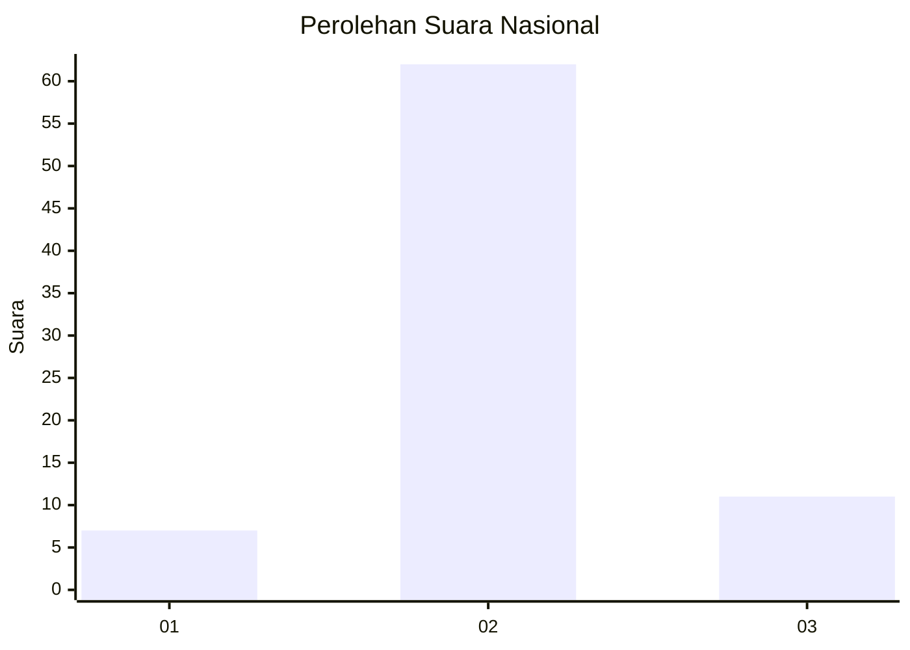
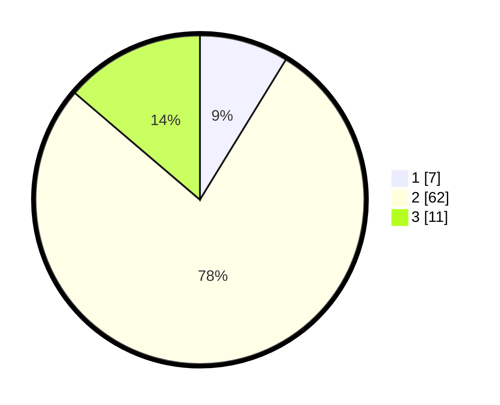

# Hasil

## Grafik

## Tabel

| No. | Nama Paslon    | Suara | Suara (raw) | Persentase |
|:--- |:-------------- | -----:| -----------:| ----------:|
| 1   | ANIES MUHAIMIN | 7     | [7][p-1]    | 8,75       |
| 2   | PRABOWO GIBRAN | 62    | [62][p-2]   | 77,50      |
| 3   | GANJAR MAHFUD  | 11    | [11][p-3]   | 13,75      |

[p-1]: https://github.com/gigit-pemilu/pemilu-2024/blob/main/pilpres/hitung-suara/sub/16-sumatera-selatan/sub/06-musi-banyuasin/sub/02-lais/sub/2003-tanjung-agung-timur/sub/007-tps/sub/paslon-1.txt
[p-2]: https://github.com/gigit-pemilu/pemilu-2024/blob/main/pilpres/hitung-suara/sub/16-sumatera-selatan/sub/06-musi-banyuasin/sub/02-lais/sub/2003-tanjung-agung-timur/sub/007-tps/sub/paslon-2.txt
[p-3]: https://github.com/gigit-pemilu/pemilu-2024/blob/main/pilpres/hitung-suara/sub/16-sumatera-selatan/sub/06-musi-banyuasin/sub/02-lais/sub/2003-tanjung-agung-timur/sub/007-tps/sub/paslon-3.txt

## Foto C Plano

https://sirekap-obj-formc.kpu.go.id/a784/pemilu/ppwp/16/06/02/20/03/1606022003007-20240217-220249--2d82d32e-7a95-463f-a016-3a0c100a2d71.jpg

https://sirekap-obj-formc.kpu.go.id/a784/pemilu/ppwp/16/06/02/20/03/1606022003007-20240217-220322--c7f7153c-33db-42cd-96e2-4476e4ff35fd.jpg

https://sirekap-obj-formc.kpu.go.id/a784/pemilu/ppwp/16/06/02/20/03/1606022003007-20240217-220357--2c01416b-dfef-4572-9f71-b5ac7a084305.jpg

## Metadata

| Key        | Value               |
| ---------- | ------------------- |
| Time Stamp | 2024-02-25 15:00:00 |

