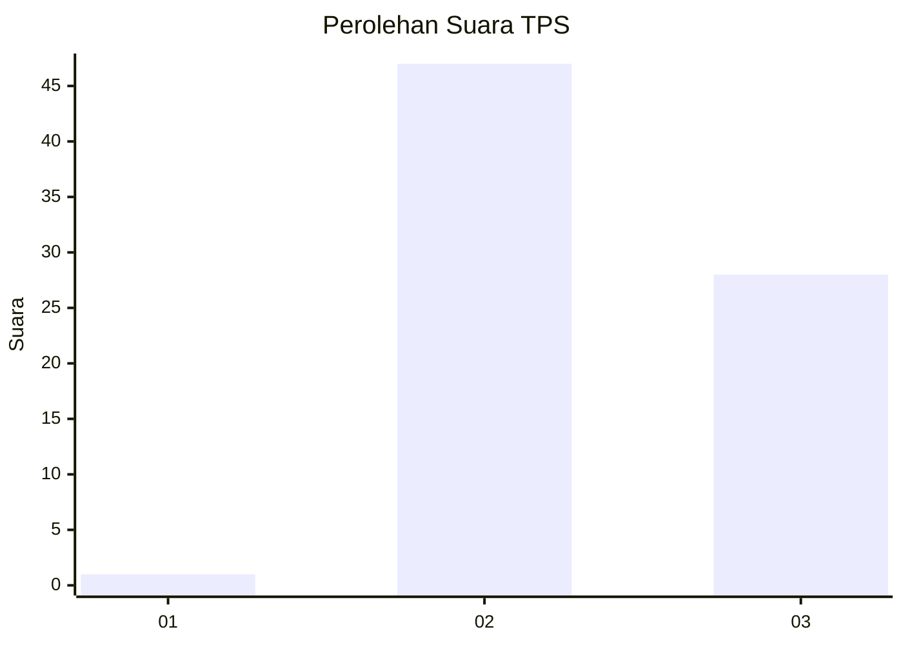
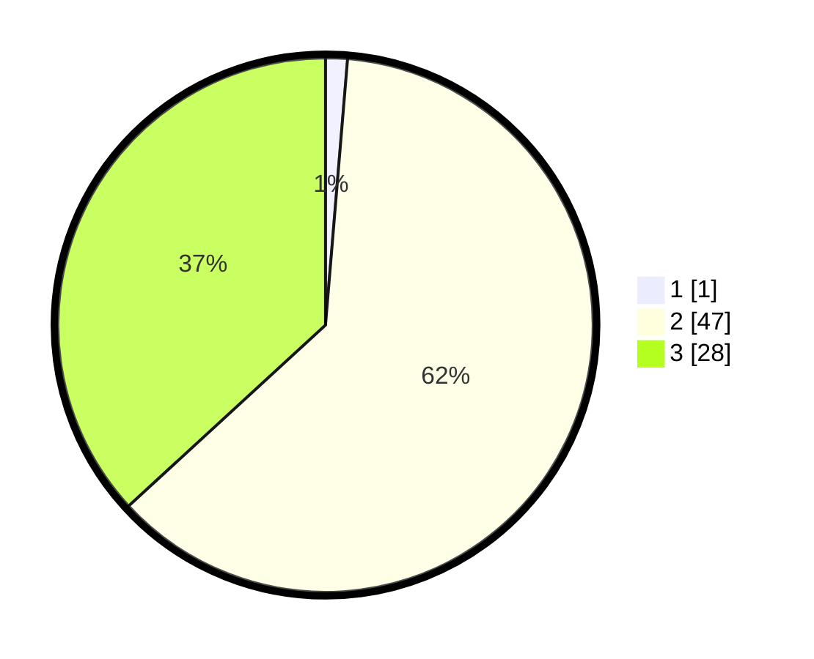

# Hasil

## Grafik

## Tabel

| No. | Nama Paslon    | Suara | Suara (raw) | Persentase |
|:--- |:-------------- | -----:| -----------:| ----------:|
| 1   | ANIES MUHAIMIN | 1     | [1][p-1]    | 1,32       |
| 2   | PRABOWO GIBRAN | 47    | [47][p-2]   | 61,84      |
| 3   | GANJAR MAHFUD  | 28    | [28][p-3]   | 36,84      |

[p-1]: https://github.com/gigit-pemilu/pemilu-2024-16-sumatera-selatan/blob/main/pilpres/hitung-suara/sub/16-sumatera-selatan/sub/06-musi-banyuasin/sub/02-lais/sub/2003-tanjung-agung-timur/sub/008-tps/sub/paslon-1.txt
[p-2]: https://github.com/gigit-pemilu/pemilu-2024-16-sumatera-selatan/blob/main/pilpres/hitung-suara/sub/16-sumatera-selatan/sub/06-musi-banyuasin/sub/02-lais/sub/2003-tanjung-agung-timur/sub/008-tps/sub/paslon-2.txt
[p-3]: https://github.com/gigit-pemilu/pemilu-2024-16-sumatera-selatan/blob/main/pilpres/hitung-suara/sub/16-sumatera-selatan/sub/06-musi-banyuasin/sub/02-lais/sub/2003-tanjung-agung-timur/sub/008-tps/sub/paslon-3.txt

## Foto C Plano

https://sirekap-obj-formc.kpu.go.id/4726/pemilu/ppwp/16/06/02/20/03/1606022003008-20240217-220430--e86695f0-0b54-4020-bac0-63676f4880d1.jpg

https://sirekap-obj-formc.kpu.go.id/4726/pemilu/ppwp/16/06/02/20/03/1606022003008-20240217-220448--01f28be9-4aad-4ac0-b807-e7cdbd5c0311.jpg

https://sirekap-obj-formc.kpu.go.id/4726/pemilu/ppwp/16/06/02/20/03/1606022003008-20240217-220642--34bcb575-e714-4edb-a8a2-b11389848632.jpg

## Metadata

| Key        | Value               |
| ---------- | ------------------- |
| Time Stamp | 2024-02-25 12:00:00 |

