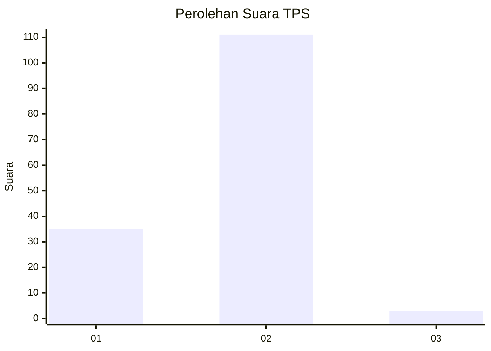
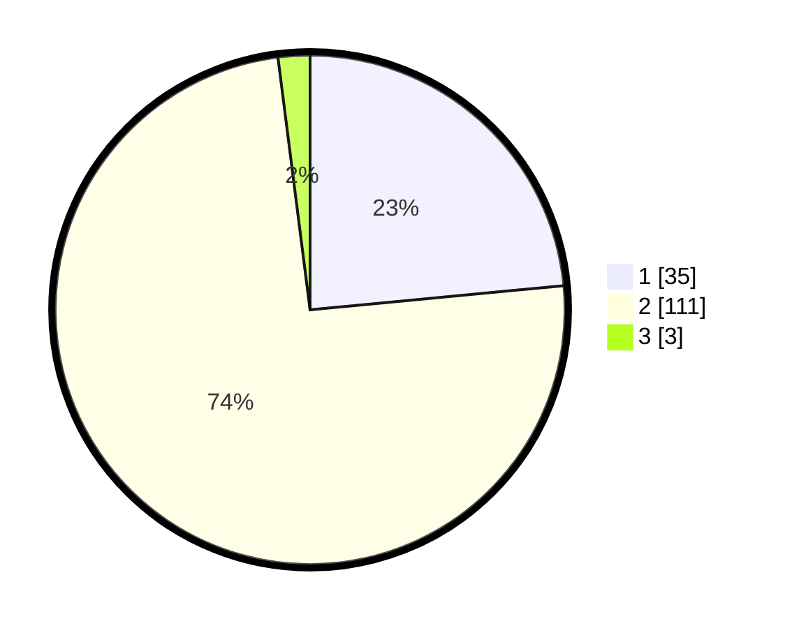

# Hasil

## Grafik

## Tabel

| No. | Nama Paslon    | Suara | Suara (raw) | Persentase |
|:--- |:-------------- | -----:| -----------:| ----------:|
| 1   | ANIES MUHAIMIN | 35    | [35][p-1]   | 23,49      |
| 2   | PRABOWO GIBRAN | 111   | [111][p-2]  | 74,50      |
| 3   | GANJAR MAHFUD  | 3     | [3][p-3]    | 2,01       |

[p-1]: https://github.com/gigit-pemilu/pemilu-2024-16-sumatera-selatan/blob/main/pilpres/hitung-suara/sub/16-sumatera-selatan/sub/06-musi-banyuasin/sub/02-lais/sub/2007-epil/sub/014-tps/sub/paslon-1.txt
[p-2]: https://github.com/gigit-pemilu/pemilu-2024-16-sumatera-selatan/blob/main/pilpres/hitung-suara/sub/16-sumatera-selatan/sub/06-musi-banyuasin/sub/02-lais/sub/2007-epil/sub/014-tps/sub/paslon-2.txt
[p-3]: https://github.com/gigit-pemilu/pemilu-2024-16-sumatera-selatan/blob/main/pilpres/hitung-suara/sub/16-sumatera-selatan/sub/06-musi-banyuasin/sub/02-lais/sub/2007-epil/sub/014-tps/sub/paslon-3.txt

## Foto C Plano

https://sirekap-obj-formc.kpu.go.id/3269/pemilu/ppwp/16/06/02/20/07/1606022007014-20240218-095656--792cebe0-985a-4c6c-97fa-f244cbdd07b3.jpg

https://sirekap-obj-formc.kpu.go.id/3269/pemilu/ppwp/16/06/02/20/07/1606022007014-20240218-095710--28536baf-ddb0-40a5-bc35-ed2960e21cf9.jpg

https://sirekap-obj-formc.kpu.go.id/3269/pemilu/ppwp/16/06/02/20/07/1606022007014-20240218-095745--bddfc445-c0c9-48ba-b3b7-4f74c90d2414.jpg

## Metadata

| Key        | Value               |
| ---------- | ------------------- |
| Time Stamp | 2024-02-24 22:31:28 |

