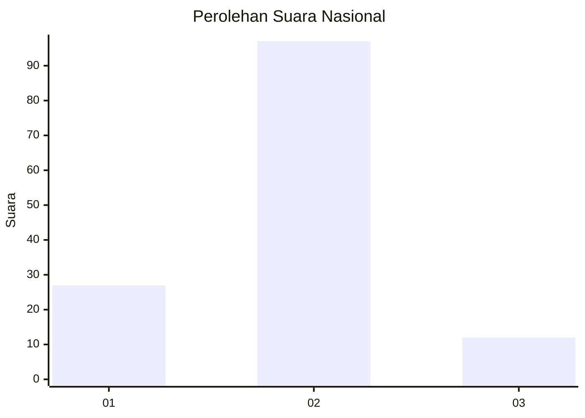
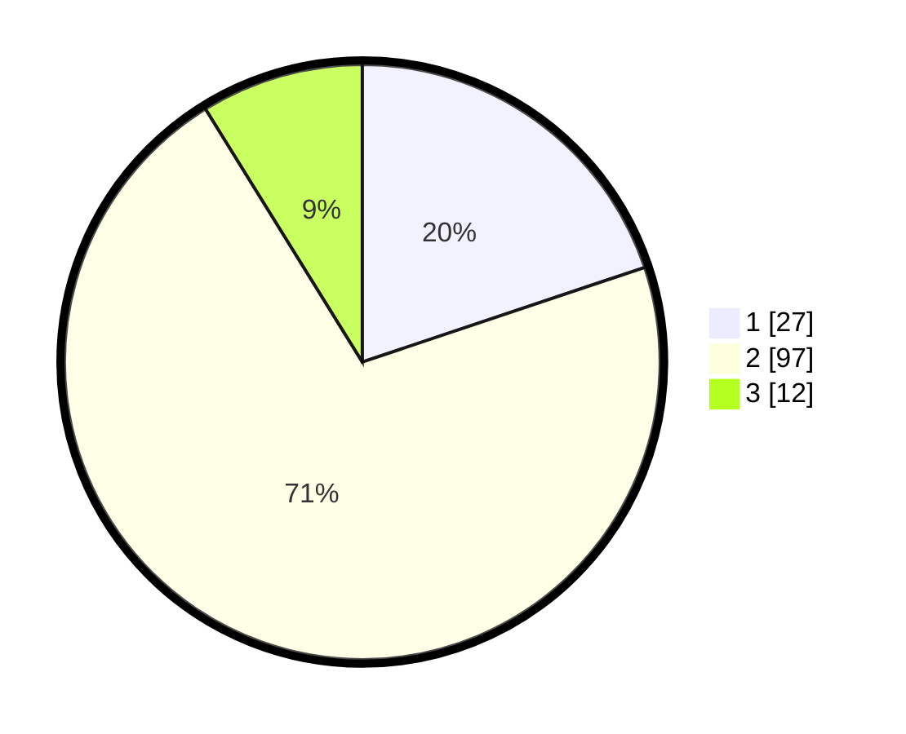

# Hasil

## Grafik

## Tabel

| No. | Nama Paslon    | Suara | Suara (raw) | Persentase |
|:--- |:-------------- | -----:| -----------:| ----------:|
| 1   | ANIES MUHAIMIN | 27    | [27][p-1]   | 19,85      |
| 2   | PRABOWO GIBRAN | 97    | [97][p-2]   | 71,32      |
| 3   | GANJAR MAHFUD  | 12    | [12][p-3]   | 8,82       |

[p-1]: https://github.com/gigit-pemilu/pemilu-2024/blob/main/pilpres/hitung-suara/sub/16-sumatera-selatan/sub/06-musi-banyuasin/sub/02-lais/sub/2007-epil/sub/016-tps/sub/paslon-1.txt
[p-2]: https://github.com/gigit-pemilu/pemilu-2024/blob/main/pilpres/hitung-suara/sub/16-sumatera-selatan/sub/06-musi-banyuasin/sub/02-lais/sub/2007-epil/sub/016-tps/sub/paslon-2.txt
[p-3]: https://github.com/gigit-pemilu/pemilu-2024/blob/main/pilpres/hitung-suara/sub/16-sumatera-selatan/sub/06-musi-banyuasin/sub/02-lais/sub/2007-epil/sub/016-tps/sub/paslon-3.txt

## Foto C Plano

https://sirekap-obj-formc.kpu.go.id/67a6/pemilu/ppwp/16/06/02/20/07/1606022007016-20240218-100325--47712147-2dc1-488b-854b-f13e22528aab.jpg

https://sirekap-obj-formc.kpu.go.id/67a6/pemilu/ppwp/16/06/02/20/07/1606022007016-20240218-100356--29688b23-5ee0-4543-ba40-7b46fd1abc28.jpg

https://sirekap-obj-formc.kpu.go.id/67a6/pemilu/ppwp/16/06/02/20/07/1606022007016-20240218-100416--afc60f4c-547a-4900-ab88-0d28f0a68833.jpg

## Metadata

| Key        | Value               |
| ---------- | ------------------- |
| Time Stamp | 2024-02-24 22:31:28 |

