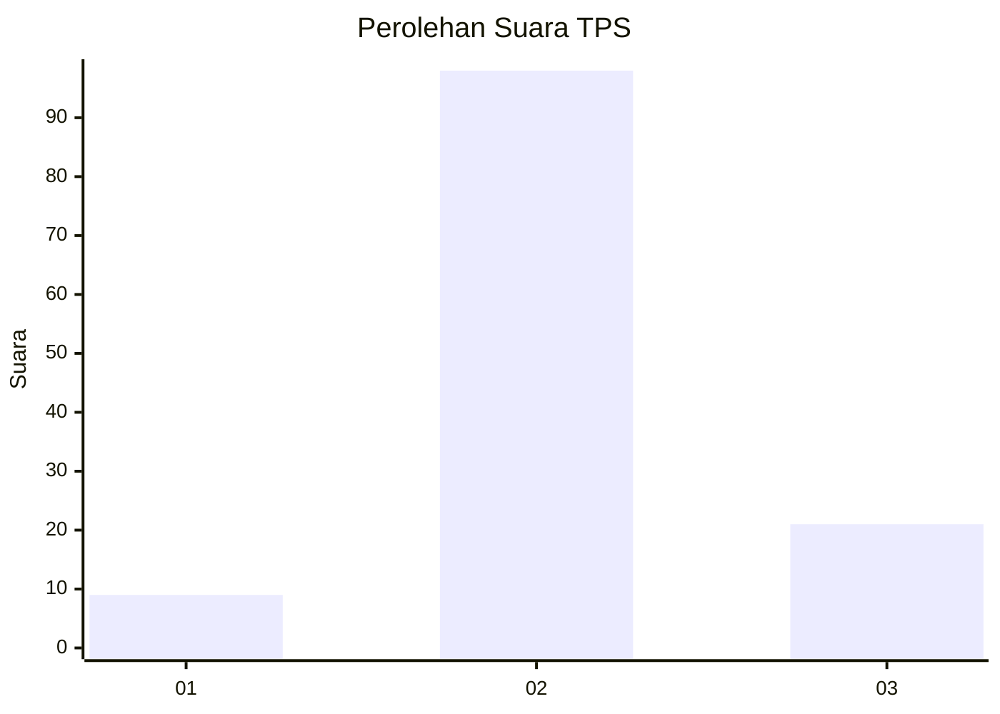
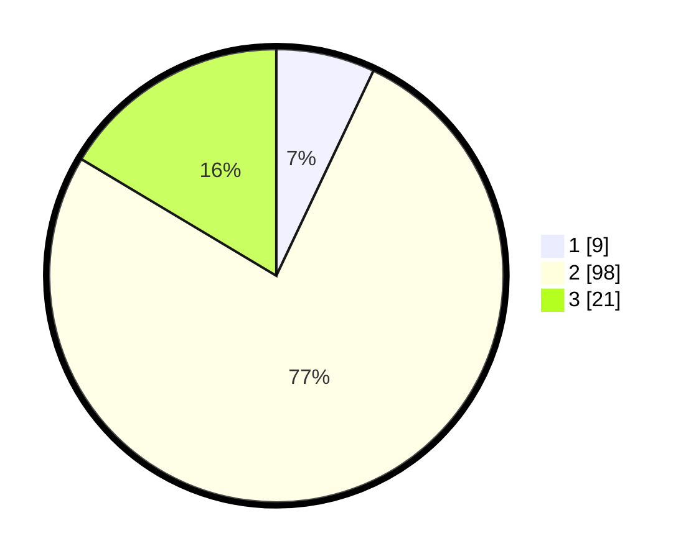

# Hasil

## Grafik

## Tabel

| No. | Nama Paslon    | Suara | Suara (raw) | Persentase |
|:--- |:-------------- | -----:| -----------:| ----------:|
| 1   | ANIES MUHAIMIN | 9     | [9][p-1]    | 7,03       |
| 2   | PRABOWO GIBRAN | 98    | [98][p-2]   | 76,56      |
| 3   | GANJAR MAHFUD  | 21    | [21][p-3]   | 16,41      |

[p-1]: https://github.com/gigit-pemilu/pemilu-2024-16-sumatera-selatan/blob/main/pilpres/hitung-suara/sub/16-sumatera-selatan/sub/06-musi-banyuasin/sub/02-lais/sub/2009-teluk-kijing-i/sub/015-tps/sub/paslon-1.txt
[p-2]: https://github.com/gigit-pemilu/pemilu-2024-16-sumatera-selatan/blob/main/pilpres/hitung-suara/sub/16-sumatera-selatan/sub/06-musi-banyuasin/sub/02-lais/sub/2009-teluk-kijing-i/sub/015-tps/sub/paslon-2.txt
[p-3]: https://github.com/gigit-pemilu/pemilu-2024-16-sumatera-selatan/blob/main/pilpres/hitung-suara/sub/16-sumatera-selatan/sub/06-musi-banyuasin/sub/02-lais/sub/2009-teluk-kijing-i/sub/015-tps/sub/paslon-3.txt

## Foto C Plano

https://sirekap-obj-formc.kpu.go.id/f873/pemilu/ppwp/16/06/02/20/09/1606022009015-20240218-105221--72a1547b-61ad-4c36-a114-eca3f863138e.jpg

https://sirekap-obj-formc.kpu.go.id/f873/pemilu/ppwp/16/06/02/20/09/1606022009015-20240218-105237--243fce59-f5ec-468e-a939-67f0c675aedc.jpg

https://sirekap-obj-formc.kpu.go.id/f873/pemilu/ppwp/16/06/02/20/09/1606022009015-20240218-105301--9a122577-8ceb-4cdb-9d40-77a8669ab8cb.jpg

## Metadata

| Key        | Value               |
| ---------- | ------------------- |
| Time Stamp | 2024-02-24 22:31:28 |

