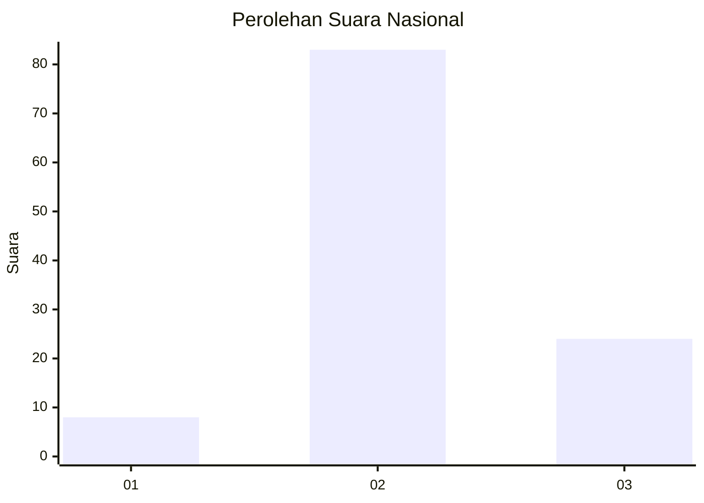

# Hasil

## Grafik

## Tabel

| No. | Nama Paslon    | Suara | Suara (raw) | Persentase |
|:--- |:-------------- | -----:| -----------:| ----------:|
| 1   | ANIES MUHAIMIN | 8     | [8][p-1]    | 6,96       |
| 2   | PRABOWO GIBRAN | 83    | [83][p-2]   | 72,17      |
| 3   | GANJAR MAHFUD  | 24    | [24][p-3]   | 20,87      |

[p-1]: https://github.com/gigit-pemilu/pemilu-2024/blob/main/pilpres/hitung-suara/sub/16-sumatera-selatan/sub/06-musi-banyuasin/sub/02-lais/sub/2009-teluk-kijing-i/sub/016-tps/sub/paslon-1.txt
[p-2]: https://github.com/gigit-pemilu/pemilu-2024/blob/main/pilpres/hitung-suara/sub/16-sumatera-selatan/sub/06-musi-banyuasin/sub/02-lais/sub/2009-teluk-kijing-i/sub/016-tps/sub/paslon-2.txt
[p-3]: https://github.com/gigit-pemilu/pemilu-2024/blob/main/pilpres/hitung-suara/sub/16-sumatera-selatan/sub/06-musi-banyuasin/sub/02-lais/sub/2009-teluk-kijing-i/sub/016-tps/sub/paslon-3.txt

## Foto C Plano

https://sirekap-obj-formc.kpu.go.id/ef75/pemilu/ppwp/16/06/02/20/09/1606022009016-20240218-105344--5e5d9aae-c4a3-40af-a822-c74261a61855.jpg

https://sirekap-obj-formc.kpu.go.id/ef75/pemilu/ppwp/16/06/02/20/09/1606022009016-20240224-040555--5e6580bf-fa34-4459-a77b-0df497809121.jpg

https://sirekap-obj-formc.kpu.go.id/ef75/pemilu/ppwp/16/06/02/20/09/1606022009016-20240218-105425--fd3ba3f0-bcfe-4997-ada8-850a3fd7c277.jpg

## Metadata

| Key        | Value               |
| ---------- | ------------------- |
| Time Stamp | 2024-02-25 01:00:00 |

