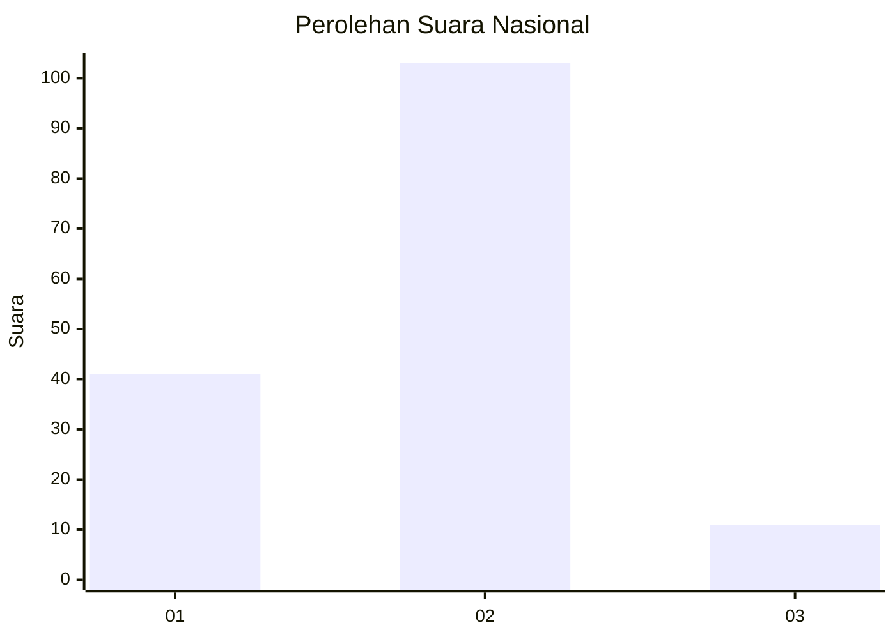
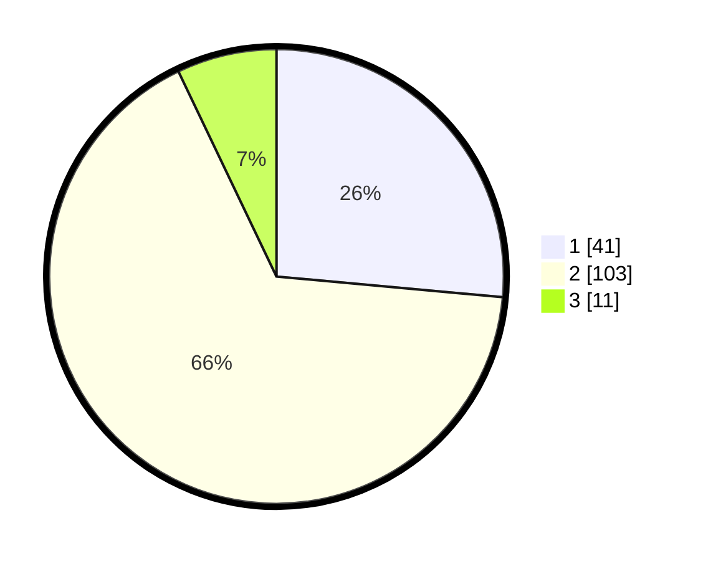

# Hasil

## Grafik

## Tabel

| No. | Nama Paslon    | Suara | Suara (raw) | Persentase |
|:--- |:-------------- | -----:| -----------:| ----------:|
| 1   | ANIES MUHAIMIN | 41    | [41][p-1]   | 26,45      |
| 2   | PRABOWO GIBRAN | 103   | [103][p-2]  | 66,45      |
| 3   | GANJAR MAHFUD  | 11    | [11][p-3]   | 7,10       |

[p-1]: https://github.com/gigit-pemilu/pemilu-2024/blob/main/pilpres/hitung-suara/sub/16-sumatera-selatan/sub/06-musi-banyuasin/sub/02-lais/sub/2010-teluk-kijing-ii/sub/002-tps/sub/paslon-1.txt
[p-2]: https://github.com/gigit-pemilu/pemilu-2024/blob/main/pilpres/hitung-suara/sub/16-sumatera-selatan/sub/06-musi-banyuasin/sub/02-lais/sub/2010-teluk-kijing-ii/sub/002-tps/sub/paslon-2.txt
[p-3]: https://github.com/gigit-pemilu/pemilu-2024/blob/main/pilpres/hitung-suara/sub/16-sumatera-selatan/sub/06-musi-banyuasin/sub/02-lais/sub/2010-teluk-kijing-ii/sub/002-tps/sub/paslon-3.txt

## Foto C Plano

https://sirekap-obj-formc.kpu.go.id/fb7f/pemilu/ppwp/16/06/02/20/10/1606022010002-20240218-111032--1ead7878-46ef-46a2-9897-45d358aa36c0.jpg

https://sirekap-obj-formc.kpu.go.id/fb7f/pemilu/ppwp/16/06/02/20/10/1606022010002-20240218-111049--6c7b3e6e-3e26-43e7-9bf7-9d089387127f.jpg

https://sirekap-obj-formc.kpu.go.id/fb7f/pemilu/ppwp/16/06/02/20/10/1606022010002-20240218-111122--4cd339d3-257e-40dc-837f-0b14e2c854e1.jpg

## Metadata

| Key        | Value               |
| ---------- | ------------------- |
| Time Stamp | 2024-02-25 14:00:00 |

