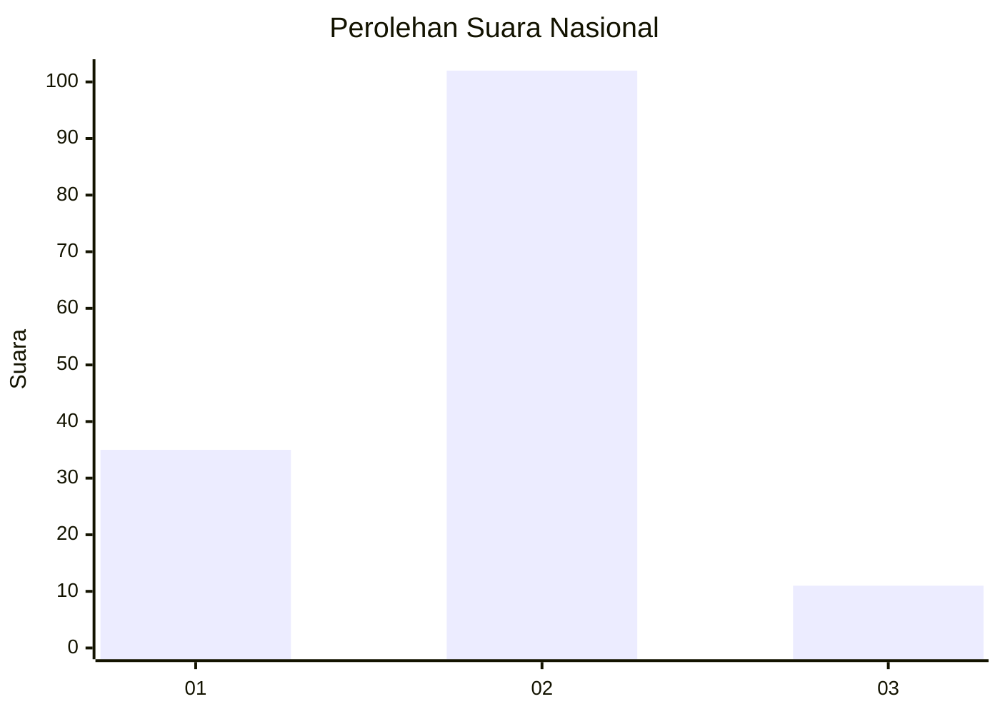
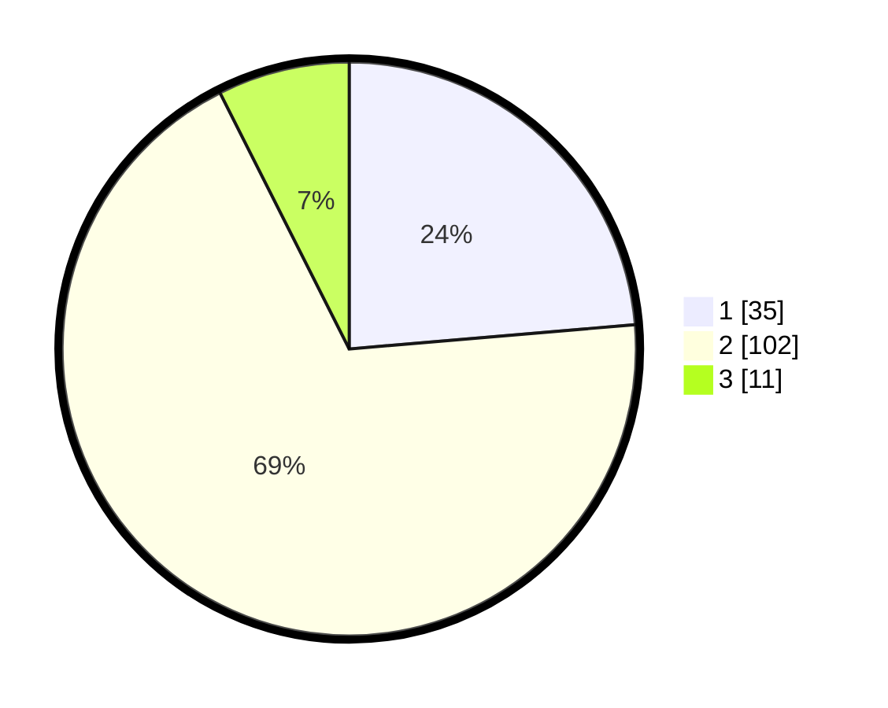

# Hasil

## Grafik

## Tabel

| No. | Nama Paslon    | Suara | Suara (raw) | Persentase |
|:--- |:-------------- | -----:| -----------:| ----------:|
| 1   | ANIES MUHAIMIN | 35    | [35][p-1]   | 23,65      |
| 2   | PRABOWO GIBRAN | 102   | [102][p-2]  | 68,92      |
| 3   | GANJAR MAHFUD  | 11    | [11][p-3]   | 7,43       |

[p-1]: https://github.com/gigit-pemilu/pemilu-2024/blob/main/pilpres/hitung-suara/sub/16-sumatera-selatan/sub/06-musi-banyuasin/sub/02-lais/sub/2010-teluk-kijing-ii/sub/003-tps/sub/paslon-1.txt
[p-2]: https://github.com/gigit-pemilu/pemilu-2024/blob/main/pilpres/hitung-suara/sub/16-sumatera-selatan/sub/06-musi-banyuasin/sub/02-lais/sub/2010-teluk-kijing-ii/sub/003-tps/sub/paslon-2.txt
[p-3]: https://github.com/gigit-pemilu/pemilu-2024/blob/main/pilpres/hitung-suara/sub/16-sumatera-selatan/sub/06-musi-banyuasin/sub/02-lais/sub/2010-teluk-kijing-ii/sub/003-tps/sub/paslon-3.txt

## Foto C Plano

https://sirekap-obj-formc.kpu.go.id/d955/pemilu/ppwp/16/06/02/20/10/1606022010003-20240218-111221--540ef79c-5a4c-462a-8ffe-50643e48b18a.jpg

https://sirekap-obj-formc.kpu.go.id/d955/pemilu/ppwp/16/06/02/20/10/1606022010003-20240218-111303--b286cd70-4b17-44d4-8dcc-8659127b6b67.jpg

https://sirekap-obj-formc.kpu.go.id/d955/pemilu/ppwp/16/06/02/20/10/1606022010003-20240218-111317--f459ff2c-59ca-4496-a31d-b88031496928.jpg

## Metadata

| Key        | Value               |
| ---------- | ------------------- |
| Time Stamp | 2024-02-24 23:00:00 |

