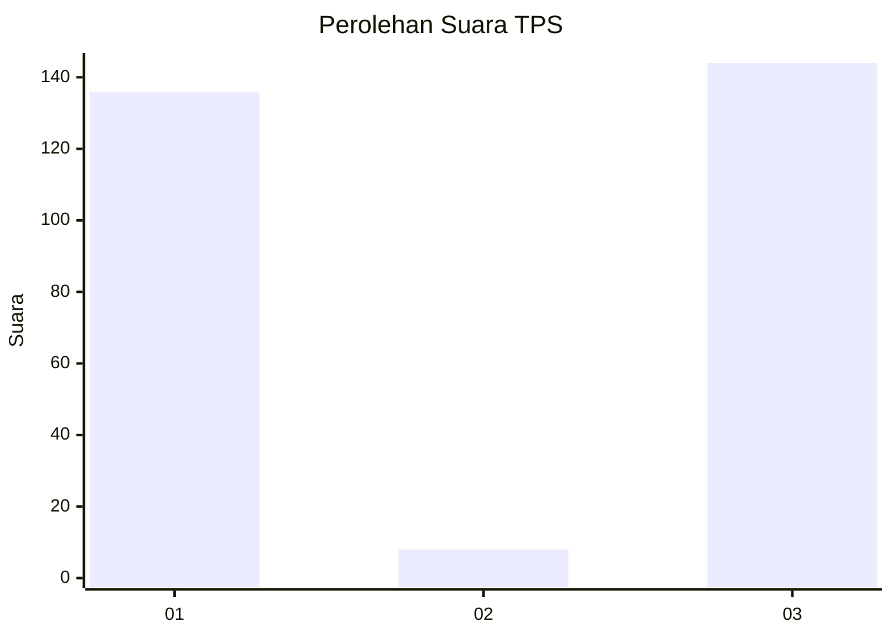
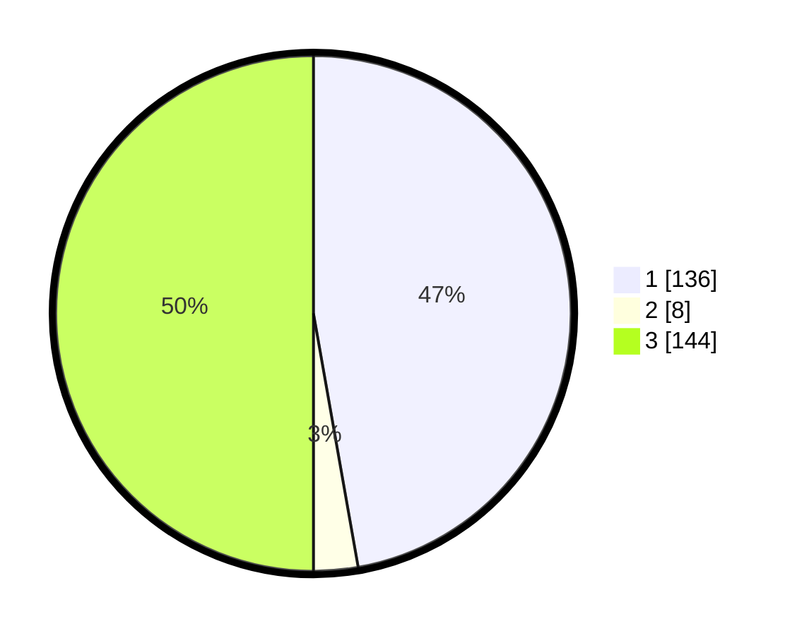

# Hasil

## Grafik

## Tabel

| No. | Nama Paslon    | Suara | Suara (raw) | Persentase |
|:--- |:-------------- | -----:| -----------:| ----------:|
| 1   | ANIES MUHAIMIN | 136   | [136][p-1]  | 47,22      |
| 2   | PRABOWO GIBRAN | 8     | [8][p-2]    | 2,78       |
| 3   | GANJAR MAHFUD  | 144   | [144][p-3]  | 50,00      |

[p-1]: https://github.com/gigit-pemilu/pemilu-2024-16-sumatera-selatan/blob/main/pilpres/hitung-suara/sub/16-sumatera-selatan/sub/06-musi-banyuasin/sub/02-lais/sub/2010-teluk-kijing-ii/sub/004-tps/sub/paslon-1.txt
[p-2]: https://github.com/gigit-pemilu/pemilu-2024-16-sumatera-selatan/blob/main/pilpres/hitung-suara/sub/16-sumatera-selatan/sub/06-musi-banyuasin/sub/02-lais/sub/2010-teluk-kijing-ii/sub/004-tps/sub/paslon-2.txt
[p-3]: https://github.com/gigit-pemilu/pemilu-2024-16-sumatera-selatan/blob/main/pilpres/hitung-suara/sub/16-sumatera-selatan/sub/06-musi-banyuasin/sub/02-lais/sub/2010-teluk-kijing-ii/sub/004-tps/sub/paslon-3.txt

## Foto C Plano

https://sirekap-obj-formc.kpu.go.id/4e75/pemilu/ppwp/16/06/02/20/10/1606022010004-20240214-190131--cd80ba7e-10d6-4d80-9a1e-a19a3eac034d.jpg

https://sirekap-obj-formc.kpu.go.id/4e75/pemilu/ppwp/16/06/02/20/10/1606022010004-20240214-200744--30d0b41d-3fd5-4b66-a5ac-752761282c47.jpg

https://sirekap-obj-formc.kpu.go.id/4e75/pemilu/ppwp/16/06/02/20/10/1606022010004-20240214-191150--c54835e3-a1c5-4dc0-87db-1e4a46c7a296.jpg

## Metadata

| Key        | Value               |
| ---------- | ------------------- |
| Time Stamp | 2024-02-15 20:30:46 |

## DATA PEMILIH TETAP

Jumlah pemilih dalam DPT: **202**.
 * L: **103**.
 * P: **99**.

## DATA PENGGUNA HAK PILIH

Jumlah pengguna hak pilih dalam DPT: **139**.
 * L: **68**.
 * P: **71**.

Jumlah pengguna hak pilih dalam DPTb: **0**.
 * L: **0**.
 * P: **0**.

Jumlah pengguna hak pilih dalam DPK: **5**.
 * L: **3**.
 * P: **2**.

Jumlah pengguna hak pilih: **144**.
 * L: **71**.
 * P: **73**.

## JUMLAH SUARA SAH DAN TIDAK SAH

JUMLAH SELURUH SUARA SAH: **45**.

JUMLAH SUARA TIDAK SAH: **77**.

JUMLAH SELURUH SUARA SAH DAN SUARA TIDAK SAH: **14**.

