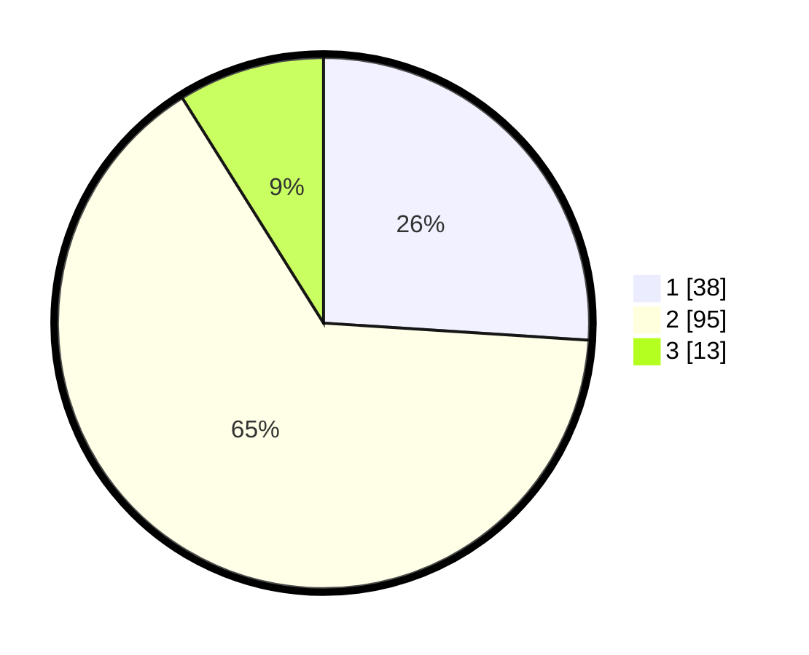

# Hasil

## Grafik

## Tabel

| No. | Nama Paslon    | Suara | Suara (raw) | Persentase |
|:--- |:-------------- | -----:| -----------:| ----------:|
| 1   | ANIES MUHAIMIN | 38    | [38][p-1]   | 26,03      |
| 2   | PRABOWO GIBRAN | 95    | [95][p-2]   | 65,07      |
| 3   | GANJAR MAHFUD  | 13    | [13][p-3]   | 8,90       |

[p-1]: https://github.com/gigit-pemilu/pemilu-2024-16-sumatera-selatan/blob/main/pilpres/hitung-suara/sub/16-sumatera-selatan/sub/06-musi-banyuasin/sub/02-lais/sub/2010-teluk-kijing-ii/sub/006-tps/sub/paslon-1.txt
[p-2]: https://github.com/gigit-pemilu/pemilu-2024-16-sumatera-selatan/blob/main/pilpres/hitung-suara/sub/16-sumatera-selatan/sub/06-musi-banyuasin/sub/02-lais/sub/2010-teluk-kijing-ii/sub/006-tps/sub/paslon-2.txt
[p-3]: https://github.com/gigit-pemilu/pemilu-2024-16-sumatera-selatan/blob/main/pilpres/hitung-suara/sub/16-sumatera-selatan/sub/06-musi-banyuasin/sub/02-lais/sub/2010-teluk-kijing-ii/sub/006-tps/sub/paslon-3.txt

## Foto C Plano

https://sirekap-obj-formc.kpu.go.id/f81a/pemilu/ppwp/16/06/02/20/10/1606022010006-20240218-110424--867bab0c-9013-43f4-97f2-67f25e47d75f.jpg

https://sirekap-obj-formc.kpu.go.id/f81a/pemilu/ppwp/16/06/02/20/10/1606022010006-20240218-110437--f6085756-00ef-4975-b97c-635fb5c3bcae.jpg

https://sirekap-obj-formc.kpu.go.id/f81a/pemilu/ppwp/16/06/02/20/10/1606022010006-20240218-110450--87569312-ad2a-4432-baf9-62edc10ac109.jpg

## Metadata

| Key        | Value               |
| ---------- | ------------------- |
| Time Stamp | 2024-02-25 15:00:00 |

