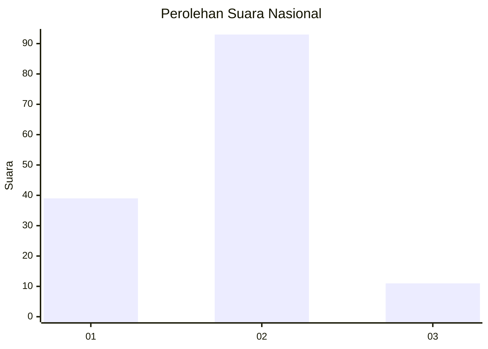
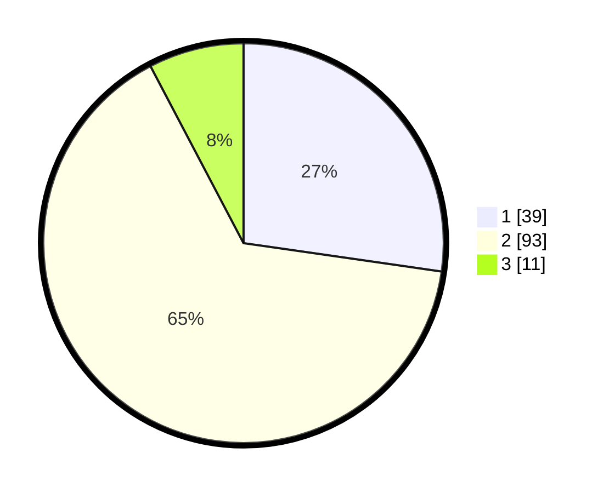

# Hasil

## Grafik

## Tabel

| No. | Nama Paslon    | Suara | Suara (raw) | Persentase |
|:--- |:-------------- | -----:| -----------:| ----------:|
| 1   | ANIES MUHAIMIN | 39    | [39][p-1]   | 27,27      |
| 2   | PRABOWO GIBRAN | 93    | [93][p-2]   | 65,03      |
| 3   | GANJAR MAHFUD  | 11    | [11][p-3]   | 7,69       |

[p-1]: https://github.com/gigit-pemilu/pemilu-2024/blob/main/pilpres/hitung-suara/sub/16-sumatera-selatan/sub/06-musi-banyuasin/sub/02-lais/sub/2010-teluk-kijing-ii/sub/010-tps/sub/paslon-1.txt
[p-2]: https://github.com/gigit-pemilu/pemilu-2024/blob/main/pilpres/hitung-suara/sub/16-sumatera-selatan/sub/06-musi-banyuasin/sub/02-lais/sub/2010-teluk-kijing-ii/sub/010-tps/sub/paslon-2.txt
[p-3]: https://github.com/gigit-pemilu/pemilu-2024/blob/main/pilpres/hitung-suara/sub/16-sumatera-selatan/sub/06-musi-banyuasin/sub/02-lais/sub/2010-teluk-kijing-ii/sub/010-tps/sub/paslon-3.txt

## Foto C Plano

https://sirekap-obj-formc.kpu.go.id/7eb0/pemilu/ppwp/16/06/02/20/10/1606022010010-20240218-112431--fef528cb-52a3-440b-b679-f167d356e22a.jpg

https://sirekap-obj-formc.kpu.go.id/7eb0/pemilu/ppwp/16/06/02/20/10/1606022010010-20240218-112806--91b4a09f-ff82-48f7-bccf-dfd64dc2c7cd.jpg

https://sirekap-obj-formc.kpu.go.id/7eb0/pemilu/ppwp/16/06/02/20/10/1606022010010-20240218-112838--fd144394-d18c-43cb-a5a8-e3cf2e8d5c28.jpg

## Metadata

| Key        | Value               |
| ---------- | ------------------- |
| Time Stamp | 2024-02-25 17:00:00 |

