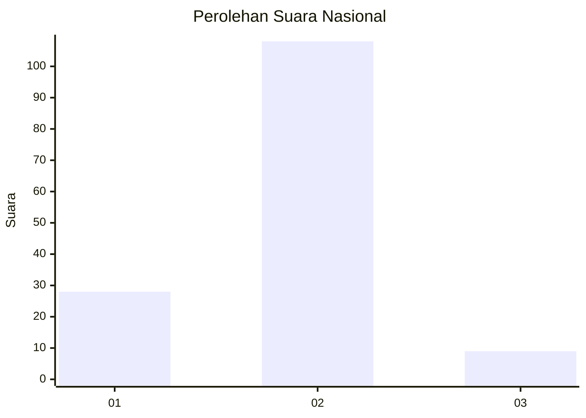
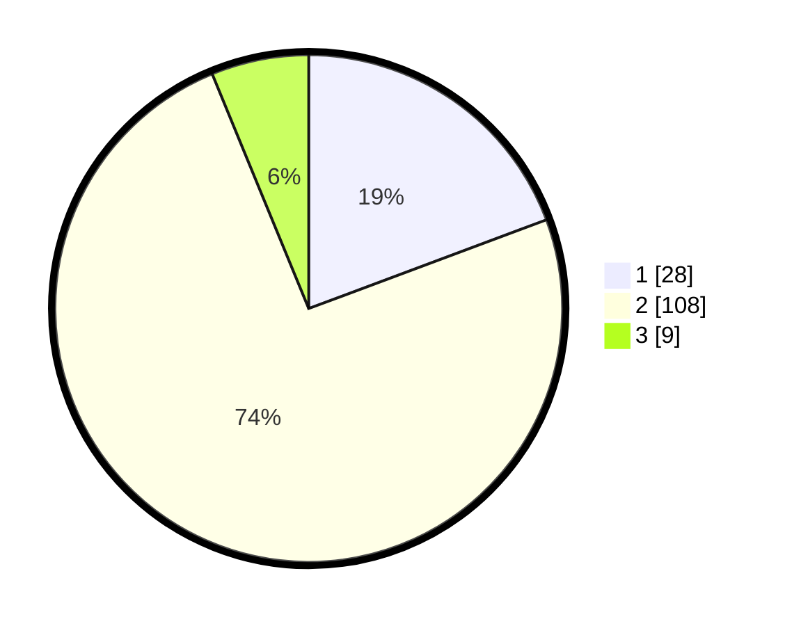

# Hasil

## Grafik

## Tabel

| No. | Nama Paslon    | Suara | Suara (raw) | Persentase |
|:--- |:-------------- | -----:| -----------:| ----------:|
| 1   | ANIES MUHAIMIN | 28    | [28][p-1]   | 19,31      |
| 2   | PRABOWO GIBRAN | 108   | [108][p-2]  | 74,48      |
| 3   | GANJAR MAHFUD  | 9     | [9][p-3]    | 6,21       |

[p-1]: https://github.com/gigit-pemilu/pemilu-2024/blob/main/pilpres/hitung-suara/sub/16-sumatera-selatan/sub/06-musi-banyuasin/sub/02-lais/sub/2010-teluk-kijing-ii/sub/012-tps/sub/paslon-1.txt
[p-2]: https://github.com/gigit-pemilu/pemilu-2024/blob/main/pilpres/hitung-suara/sub/16-sumatera-selatan/sub/06-musi-banyuasin/sub/02-lais/sub/2010-teluk-kijing-ii/sub/012-tps/sub/paslon-2.txt
[p-3]: https://github.com/gigit-pemilu/pemilu-2024/blob/main/pilpres/hitung-suara/sub/16-sumatera-selatan/sub/06-musi-banyuasin/sub/02-lais/sub/2010-teluk-kijing-ii/sub/012-tps/sub/paslon-3.txt

## Foto C Plano

https://sirekap-obj-formc.kpu.go.id/49cd/pemilu/ppwp/16/06/02/20/10/1606022010012-20240218-114724--6716c33a-8ecf-4e58-af10-376b8b53b276.jpg

https://sirekap-obj-formc.kpu.go.id/49cd/pemilu/ppwp/16/06/02/20/10/1606022010012-20240218-114746--ef9bc508-58fd-404e-9072-a77d97933f22.jpg

https://sirekap-obj-formc.kpu.go.id/49cd/pemilu/ppwp/16/06/02/20/10/1606022010012-20240218-114811--33f7baeb-c7b9-4497-9b17-ffb1f77f04e8.jpg

## Metadata

| Key        | Value               |
| ---------- | ------------------- |
| Time Stamp | 2024-02-24 22:31:28 |

