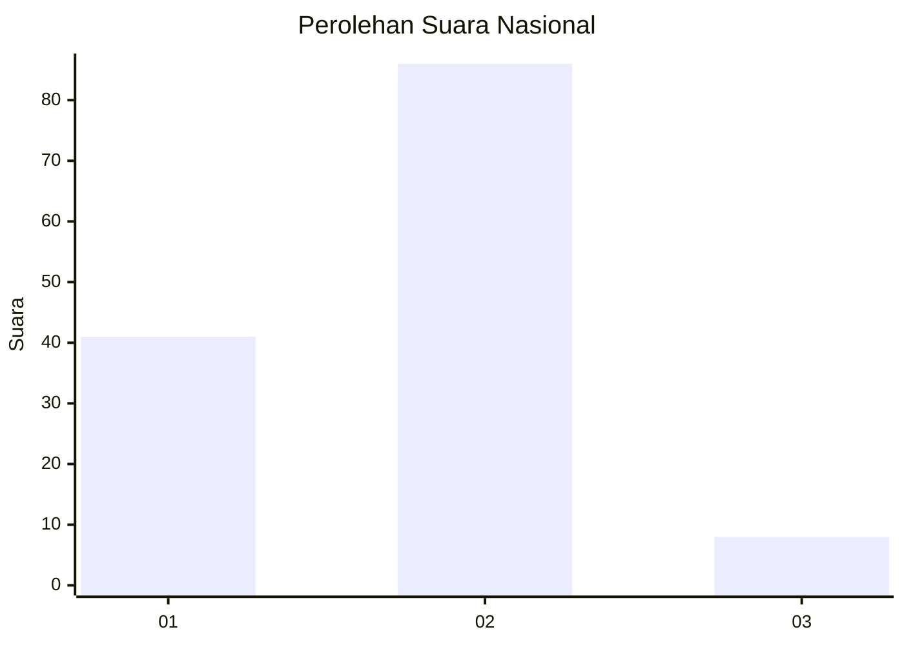
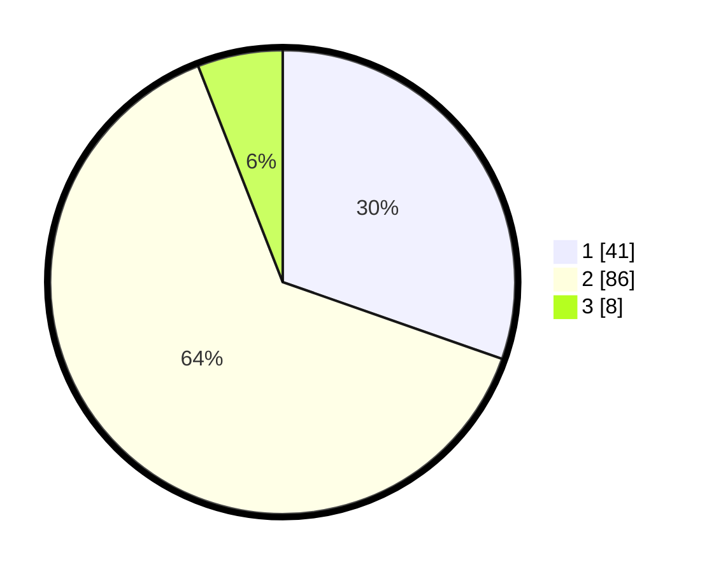

# Hasil

## Grafik

## Tabel

| No. | Nama Paslon    | Suara | Suara (raw) | Persentase |
|:--- |:-------------- | -----:| -----------:| ----------:|
| 1   | ANIES MUHAIMIN | 41    | [41][p-1]   | 30,37      |
| 2   | PRABOWO GIBRAN | 86    | [86][p-2]   | 63,70      |
| 3   | GANJAR MAHFUD  | 8     | [8][p-3]    | 5,93       |

[p-1]: https://github.com/gigit-pemilu/pemilu-2024/blob/main/pilpres/hitung-suara/sub/16-sumatera-selatan/sub/06-musi-banyuasin/sub/02-lais/sub/2010-teluk-kijing-ii/sub/017-tps/sub/paslon-1.txt
[p-2]: https://github.com/gigit-pemilu/pemilu-2024/blob/main/pilpres/hitung-suara/sub/16-sumatera-selatan/sub/06-musi-banyuasin/sub/02-lais/sub/2010-teluk-kijing-ii/sub/017-tps/sub/paslon-2.txt
[p-3]: https://github.com/gigit-pemilu/pemilu-2024/blob/main/pilpres/hitung-suara/sub/16-sumatera-selatan/sub/06-musi-banyuasin/sub/02-lais/sub/2010-teluk-kijing-ii/sub/017-tps/sub/paslon-3.txt

## Foto C Plano

https://sirekap-obj-formc.kpu.go.id/e08b/pemilu/ppwp/16/06/02/20/10/1606022010017-20240218-115947--5a626074-d8ae-47f0-8338-394d3845301c.jpg

https://sirekap-obj-formc.kpu.go.id/e08b/pemilu/ppwp/16/06/02/20/10/1606022010017-20240218-120000--0a40e0c4-f01a-4816-8d80-5ad63cd0b46a.jpg

https://sirekap-obj-formc.kpu.go.id/e08b/pemilu/ppwp/16/06/02/20/10/1606022010017-20240218-120032--2bc0f907-5ff2-4fe9-b621-4c29a53e29cd.jpg

## Metadata

| Key        | Value               |
| ---------- | ------------------- |
| Time Stamp | 2024-02-25 16:00:00 |

