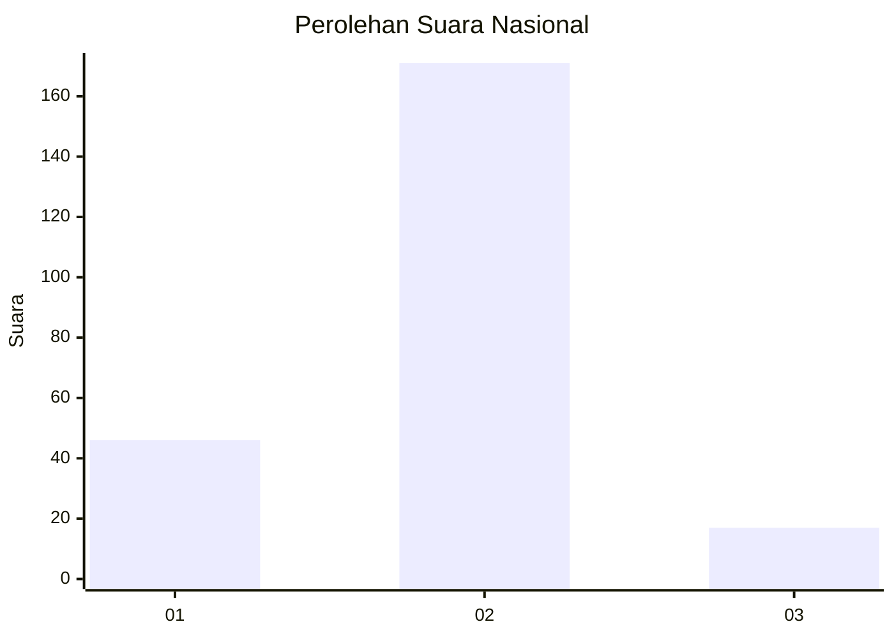
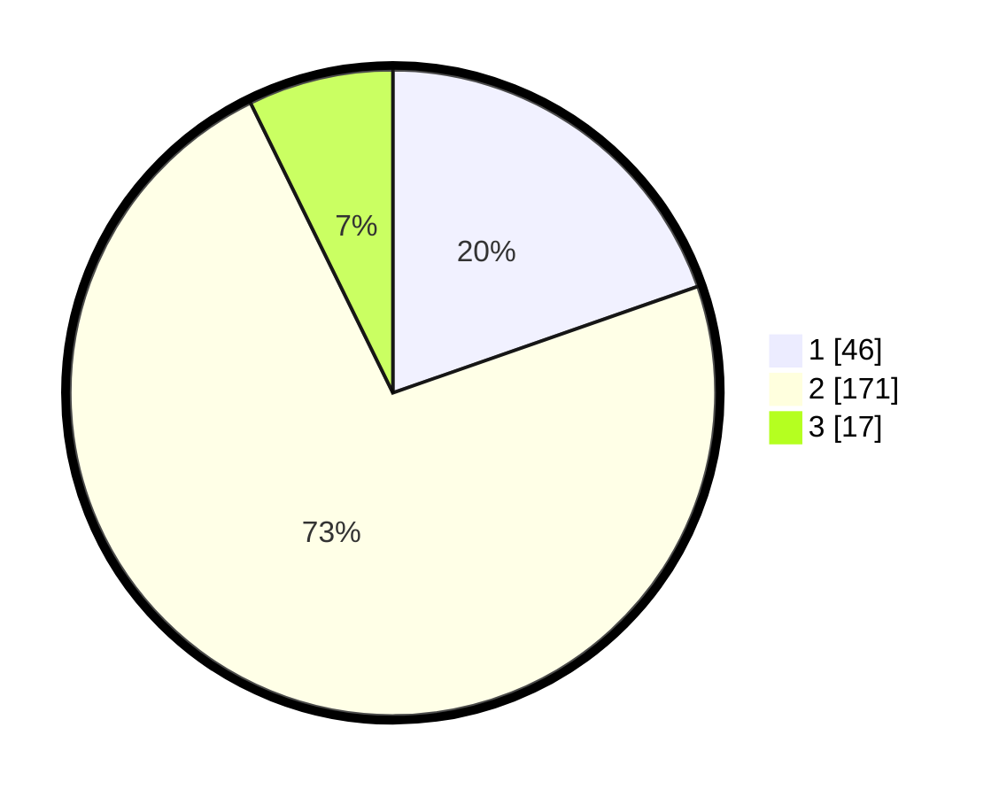

# Hasil

## Grafik

## Tabel

| No. | Nama Paslon    | Suara | Suara (raw) | Persentase |
|:--- |:-------------- | -----:| -----------:| ----------:|
| 1   | ANIES MUHAIMIN | 46    | [46][p-1]   | 19,66      |
| 2   | PRABOWO GIBRAN | 171   | [171][p-2]  | 73,08      |
| 3   | GANJAR MAHFUD  | 17    | [17][p-3]   | 7,26       |

[p-1]: https://github.com/gigit-pemilu/pemilu-2024/blob/main/pilpres/hitung-suara/sub/16-sumatera-selatan/sub/06-musi-banyuasin/sub/02-lais/sub/2013-tanjung-agung-barat/sub/002-tps/sub/paslon-1.txt
[p-2]: https://github.com/gigit-pemilu/pemilu-2024/blob/main/pilpres/hitung-suara/sub/16-sumatera-selatan/sub/06-musi-banyuasin/sub/02-lais/sub/2013-tanjung-agung-barat/sub/002-tps/sub/paslon-2.txt
[p-3]: https://github.com/gigit-pemilu/pemilu-2024/blob/main/pilpres/hitung-suara/sub/16-sumatera-selatan/sub/06-musi-banyuasin/sub/02-lais/sub/2013-tanjung-agung-barat/sub/002-tps/sub/paslon-3.txt

## Foto C Plano

https://sirekap-obj-formc.kpu.go.id/69dc/pemilu/ppwp/16/06/02/20/13/1606022013002-20240218-150147--29b5b7e1-edcc-423e-9ec2-f896cd76fa1a.jpg

https://sirekap-obj-formc.kpu.go.id/69dc/pemilu/ppwp/16/06/02/20/13/1606022013002-20240218-150203--da065e8d-cde1-44cf-8d17-b359b7d01f4d.jpg

https://sirekap-obj-formc.kpu.go.id/69dc/pemilu/ppwp/16/06/02/20/13/1606022013002-20240218-150237--d80ef339-cba9-42da-a1a4-e80aa969ddb4.jpg

## Metadata

| Key        | Value               |
| ---------- | ------------------- |
| Time Stamp | 2024-02-25 16:00:00 |

