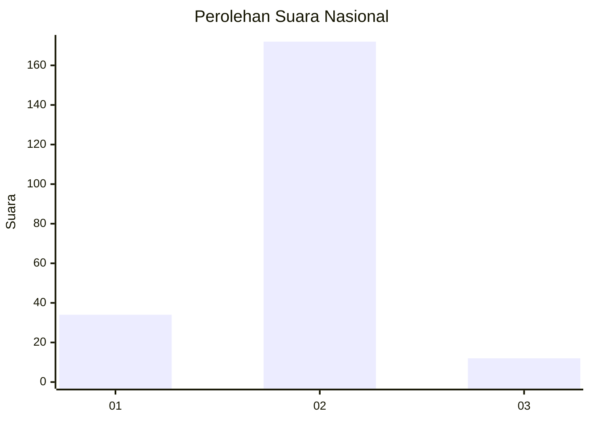
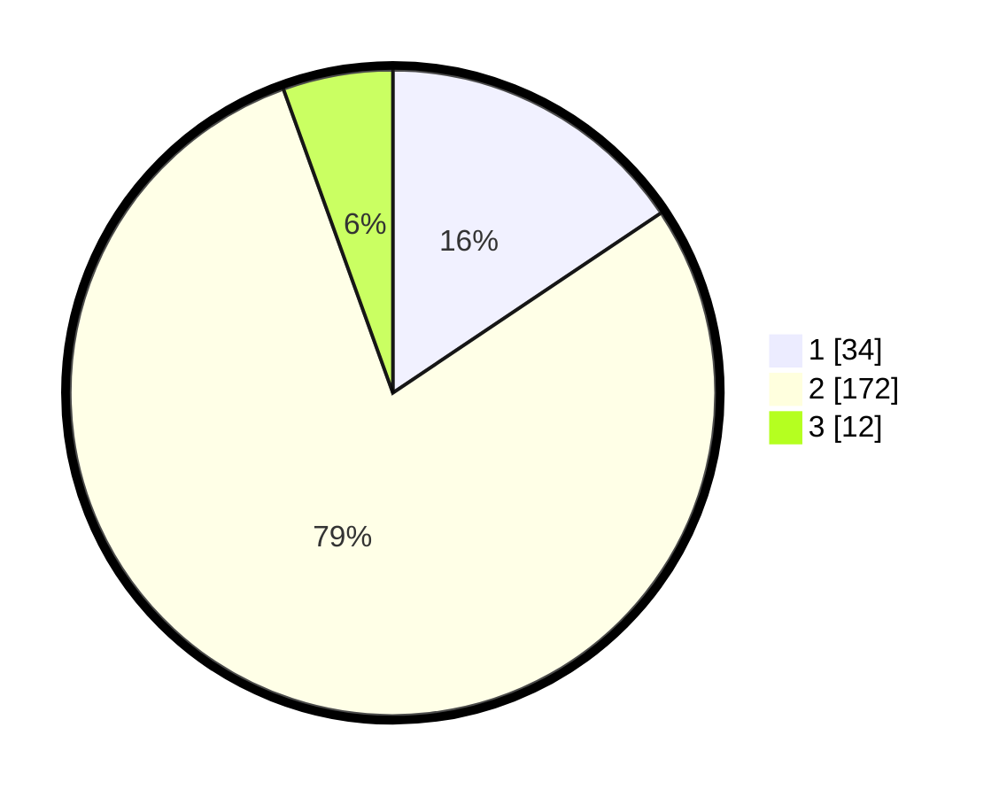

# Hasil

## Grafik

## Tabel

| No. | Nama Paslon    | Suara | Suara (raw) | Persentase |
|:--- |:-------------- | -----:| -----------:| ----------:|
| 1   | ANIES MUHAIMIN | 34    | [34][p-1]   | 15,60      |
| 2   | PRABOWO GIBRAN | 172   | [172][p-2]  | 78,90      |
| 3   | GANJAR MAHFUD  | 12    | [12][p-3]   | 5,50       |

[p-1]: https://github.com/gigit-pemilu/pemilu-2024/blob/main/pilpres/hitung-suara/sub/16-sumatera-selatan/sub/06-musi-banyuasin/sub/02-lais/sub/2013-tanjung-agung-barat/sub/004-tps/sub/paslon-1.txt
[p-2]: https://github.com/gigit-pemilu/pemilu-2024/blob/main/pilpres/hitung-suara/sub/16-sumatera-selatan/sub/06-musi-banyuasin/sub/02-lais/sub/2013-tanjung-agung-barat/sub/004-tps/sub/paslon-2.txt
[p-3]: https://github.com/gigit-pemilu/pemilu-2024/blob/main/pilpres/hitung-suara/sub/16-sumatera-selatan/sub/06-musi-banyuasin/sub/02-lais/sub/2013-tanjung-agung-barat/sub/004-tps/sub/paslon-3.txt

## Foto C Plano

https://sirekap-obj-formc.kpu.go.id/b4bf/pemilu/ppwp/16/06/02/20/13/1606022013004-20240218-151108--67ad699a-be88-4158-9850-365cc5f27826.jpg

https://sirekap-obj-formc.kpu.go.id/b4bf/pemilu/ppwp/16/06/02/20/13/1606022013004-20240218-151135--fdcd73ce-8c50-4d9e-bbe0-3cc121c6a146.jpg

https://sirekap-obj-formc.kpu.go.id/b4bf/pemilu/ppwp/16/06/02/20/13/1606022013004-20240218-151347--11e89d89-4253-4144-be60-f04d2ec42cad.jpg

## Metadata

| Key        | Value               |
| ---------- | ------------------- |
| Time Stamp | 2024-02-25 00:00:00 |

