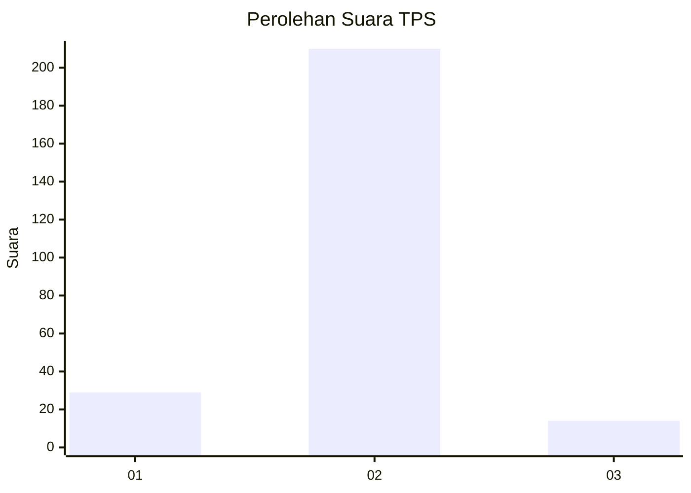
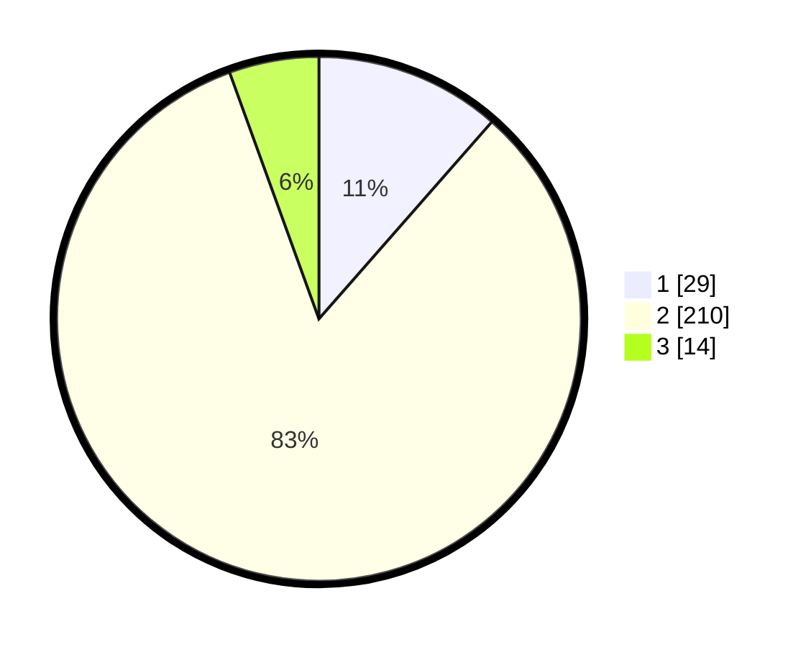

# Hasil

## Grafik

## Tabel

| No. | Nama Paslon    | Suara | Suara (raw) | Persentase |
|:--- |:-------------- | -----:| -----------:| ----------:|
| 1   | ANIES MUHAIMIN | 29    | [29][p-1]   | 11,46      |
| 2   | PRABOWO GIBRAN | 210   | [210][p-2]  | 83,00      |
| 3   | GANJAR MAHFUD  | 14    | [14][p-3]   | 5,53       |

[p-1]: https://github.com/gigit-pemilu/pemilu-2024-16-sumatera-selatan/blob/main/pilpres/hitung-suara/sub/16-sumatera-selatan/sub/06-musi-banyuasin/sub/02-lais/sub/2013-tanjung-agung-barat/sub/005-tps/sub/paslon-1.txt
[p-2]: https://github.com/gigit-pemilu/pemilu-2024-16-sumatera-selatan/blob/main/pilpres/hitung-suara/sub/16-sumatera-selatan/sub/06-musi-banyuasin/sub/02-lais/sub/2013-tanjung-agung-barat/sub/005-tps/sub/paslon-2.txt
[p-3]: https://github.com/gigit-pemilu/pemilu-2024-16-sumatera-selatan/blob/main/pilpres/hitung-suara/sub/16-sumatera-selatan/sub/06-musi-banyuasin/sub/02-lais/sub/2013-tanjung-agung-barat/sub/005-tps/sub/paslon-3.txt

## Foto C Plano

https://sirekap-obj-formc.kpu.go.id/21b2/pemilu/ppwp/16/06/02/20/13/1606022013005-20240218-145656--ab7aa411-75d4-4ab5-a99d-91b3f921d3f8.jpg

https://sirekap-obj-formc.kpu.go.id/21b2/pemilu/ppwp/16/06/02/20/13/1606022013005-20240218-145717--41de64c0-c69d-4a3c-b2e3-1901e7fe3b90.jpg

https://sirekap-obj-formc.kpu.go.id/21b2/pemilu/ppwp/16/06/02/20/13/1606022013005-20240218-145739--290a5ef5-49ea-4c6d-8d37-5e0b76f97fdc.jpg

## Metadata

| Key        | Value               |
| ---------- | ------------------- |
| Time Stamp | 2024-02-25 17:00:00 |

