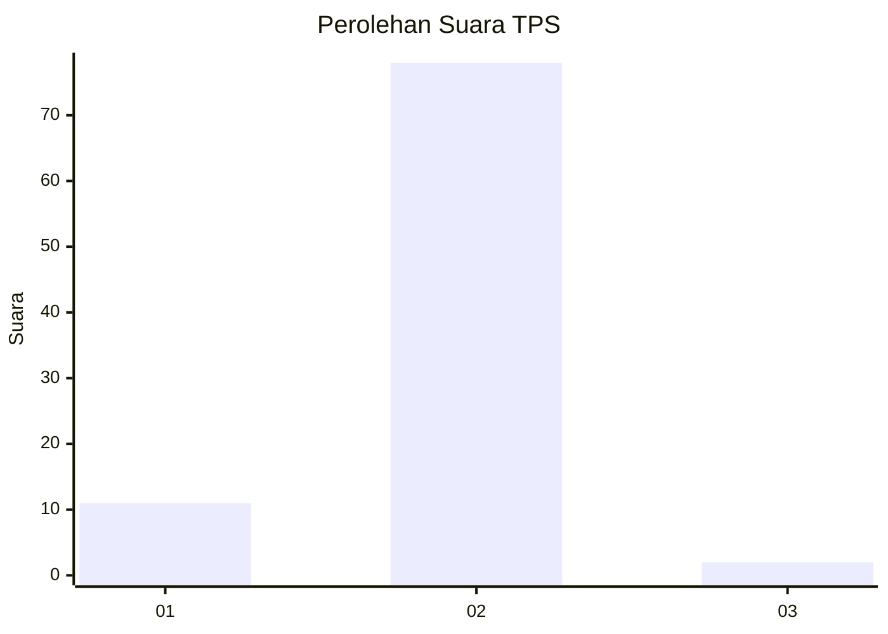
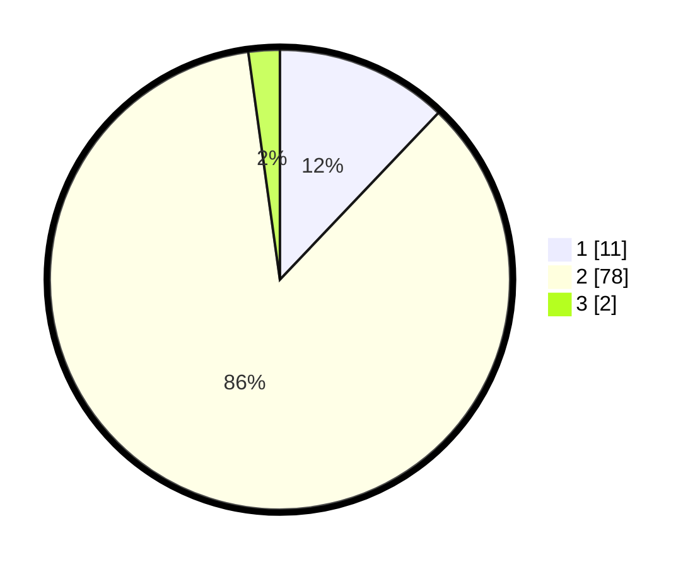

# Hasil

## Grafik

## Tabel

| No. | Nama Paslon    | Suara | Suara (raw) | Persentase |
|:--- |:-------------- | -----:| -----------:| ----------:|
| 1   | ANIES MUHAIMIN | 11    | [11][p-1]   | 12,09      |
| 2   | PRABOWO GIBRAN | 78    | [78][p-2]   | 85,71      |
| 3   | GANJAR MAHFUD  | 2     | [2][p-3]    | 2,20       |

[p-1]: https://github.com/gigit-pemilu/pemilu-2024-16-sumatera-selatan/blob/main/pilpres/hitung-suara/sub/16-sumatera-selatan/sub/06-musi-banyuasin/sub/02-lais/sub/2013-tanjung-agung-barat/sub/006-tps/sub/paslon-1.txt
[p-2]: https://github.com/gigit-pemilu/pemilu-2024-16-sumatera-selatan/blob/main/pilpres/hitung-suara/sub/16-sumatera-selatan/sub/06-musi-banyuasin/sub/02-lais/sub/2013-tanjung-agung-barat/sub/006-tps/sub/paslon-2.txt
[p-3]: https://github.com/gigit-pemilu/pemilu-2024-16-sumatera-selatan/blob/main/pilpres/hitung-suara/sub/16-sumatera-selatan/sub/06-musi-banyuasin/sub/02-lais/sub/2013-tanjung-agung-barat/sub/006-tps/sub/paslon-3.txt

## Foto C Plano

https://sirekap-obj-formc.kpu.go.id/1146/pemilu/ppwp/16/06/02/20/13/1606022013006-20240218-145500--07e3fa49-0388-4738-9c70-3e480767ffeb.jpg

https://sirekap-obj-formc.kpu.go.id/1146/pemilu/ppwp/16/06/02/20/13/1606022013006-20240218-145535--44bb5704-e4e0-4541-9a2f-0608340b9a70.jpg

https://sirekap-obj-formc.kpu.go.id/1146/pemilu/ppwp/16/06/02/20/13/1606022013006-20240218-145547--18eb9d0b-2876-40eb-a8a8-f3cdf5c0f6b5.jpg

## Metadata

| Key        | Value               |
| ---------- | ------------------- |
| Time Stamp | 2024-02-24 22:31:28 |

