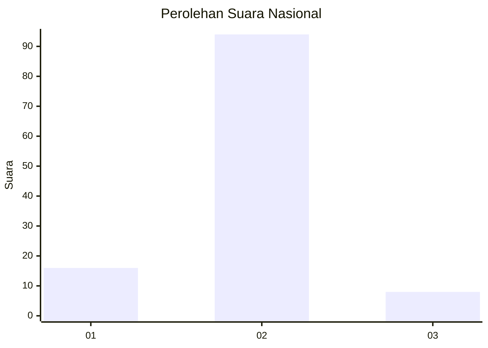
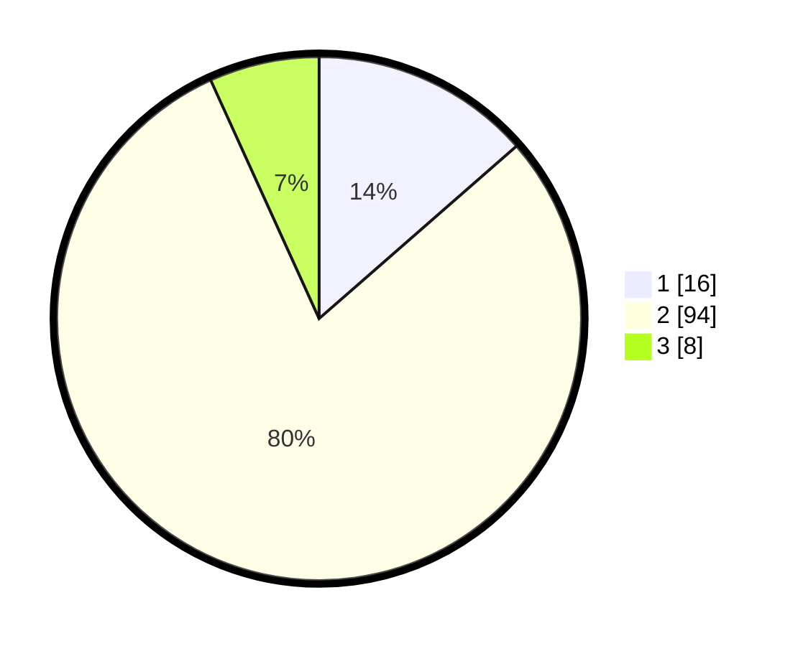

# Hasil

## Grafik

## Tabel

| No. | Nama Paslon    | Suara | Suara (raw) | Persentase |
|:--- |:-------------- | -----:| -----------:| ----------:|
| 1   | ANIES MUHAIMIN | 16    | [16][p-1]   | 13,56      |
| 2   | PRABOWO GIBRAN | 94    | [94][p-2]   | 79,66      |
| 3   | GANJAR MAHFUD  | 8     | [8][p-3]    | 6,78       |

[p-1]: https://github.com/gigit-pemilu/pemilu-2024/blob/main/pilpres/hitung-suara/sub/16-sumatera-selatan/sub/06-musi-banyuasin/sub/02-lais/sub/2013-tanjung-agung-barat/sub/007-tps/sub/paslon-1.txt
[p-2]: https://github.com/gigit-pemilu/pemilu-2024/blob/main/pilpres/hitung-suara/sub/16-sumatera-selatan/sub/06-musi-banyuasin/sub/02-lais/sub/2013-tanjung-agung-barat/sub/007-tps/sub/paslon-2.txt
[p-3]: https://github.com/gigit-pemilu/pemilu-2024/blob/main/pilpres/hitung-suara/sub/16-sumatera-selatan/sub/06-musi-banyuasin/sub/02-lais/sub/2013-tanjung-agung-barat/sub/007-tps/sub/paslon-3.txt

## Foto C Plano

https://sirekap-obj-formc.kpu.go.id/8990/pemilu/ppwp/16/06/02/20/13/1606022013007-20240218-150548--6995984b-7577-4d21-950f-a8026dcc8bdb.jpg

https://sirekap-obj-formc.kpu.go.id/8990/pemilu/ppwp/16/06/02/20/13/1606022013007-20240218-150634--b573941e-3972-4779-a141-ffb7390df411.jpg

https://sirekap-obj-formc.kpu.go.id/8990/pemilu/ppwp/16/06/02/20/13/1606022013007-20240218-150710--52239901-f43b-4d56-9e2a-9d39ce3dea24.jpg

## Metadata

| Key        | Value               |
| ---------- | ------------------- |
| Time Stamp | 2024-02-25 16:00:00 |

