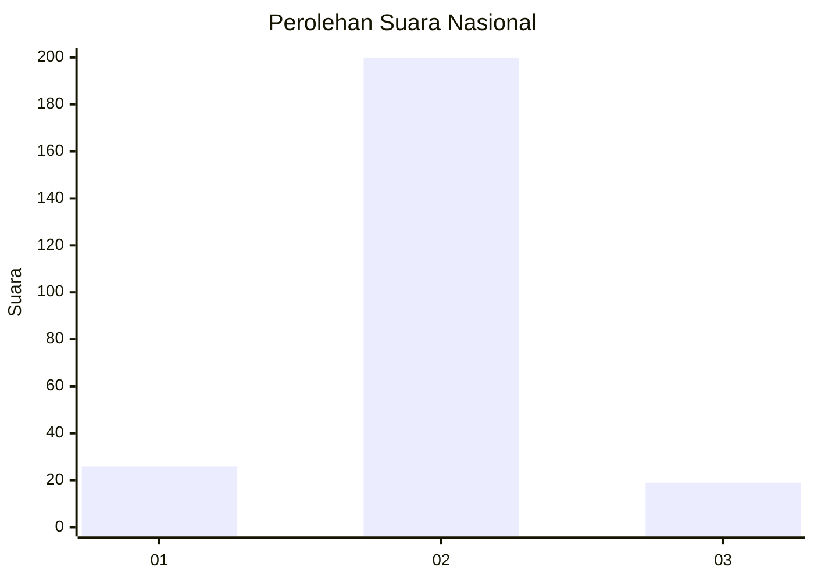
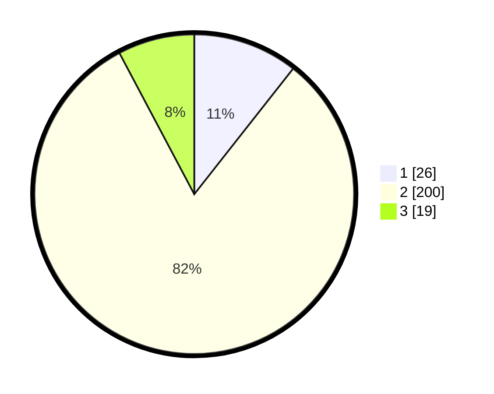

# Hasil

## Grafik

## Tabel

| No. | Nama Paslon    | Suara | Suara (raw) | Persentase |
|:--- |:-------------- | -----:| -----------:| ----------:|
| 1   | ANIES MUHAIMIN | 26    | [26][p-1]   | 10,61      |
| 2   | PRABOWO GIBRAN | 200   | [200][p-2]  | 81,63      |
| 3   | GANJAR MAHFUD  | 19    | [19][p-3]   | 7,76       |

[p-1]: https://github.com/gigit-pemilu/pemilu-2024/blob/main/pilpres/hitung-suara/sub/16-sumatera-selatan/sub/06-musi-banyuasin/sub/02-lais/sub/2014-tanjung-agung-selatan/sub/003-tps/sub/paslon-1.txt
[p-2]: https://github.com/gigit-pemilu/pemilu-2024/blob/main/pilpres/hitung-suara/sub/16-sumatera-selatan/sub/06-musi-banyuasin/sub/02-lais/sub/2014-tanjung-agung-selatan/sub/003-tps/sub/paslon-2.txt
[p-3]: https://github.com/gigit-pemilu/pemilu-2024/blob/main/pilpres/hitung-suara/sub/16-sumatera-selatan/sub/06-musi-banyuasin/sub/02-lais/sub/2014-tanjung-agung-selatan/sub/003-tps/sub/paslon-3.txt

## Foto C Plano

https://sirekap-obj-formc.kpu.go.id/8c41/pemilu/ppwp/16/06/02/20/14/1606022014003-20240218-144631--8500ca8f-934e-4aab-af7a-ebd59fb419d9.jpg

https://sirekap-obj-formc.kpu.go.id/8c41/pemilu/ppwp/16/06/02/20/14/1606022014003-20240218-144705--912b2612-9374-4b68-9592-ec264f912069.jpg

https://sirekap-obj-formc.kpu.go.id/8c41/pemilu/ppwp/16/06/02/20/14/1606022014003-20240218-144718--eb52fbf7-dd07-4032-90ae-3eac2ee0efb1.jpg

## Metadata

| Key        | Value               |
| ---------- | ------------------- |
| Time Stamp | 2024-02-25 11:00:00 |

