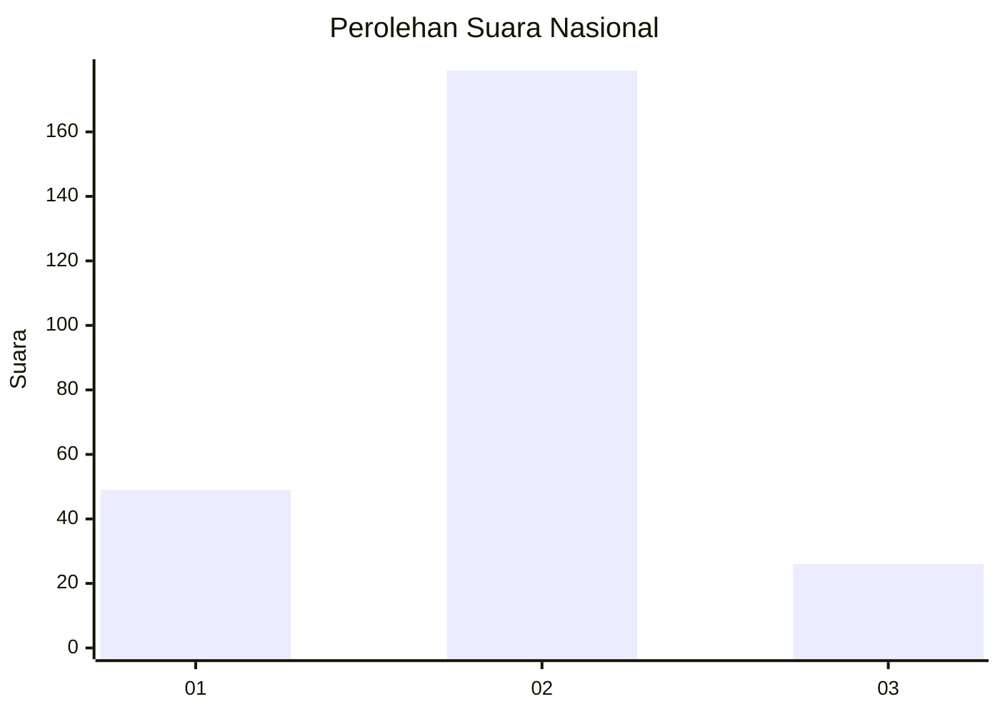
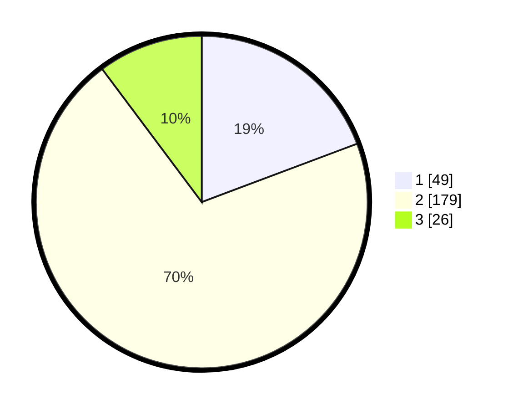

# Hasil

## Grafik

## Tabel

| No. | Nama Paslon    | Suara | Suara (raw) | Persentase |
|:--- |:-------------- | -----:| -----------:| ----------:|
| 1   | ANIES MUHAIMIN | 49    | [49][p-1]   | 19,29      |
| 2   | PRABOWO GIBRAN | 179   | [179][p-2]  | 70,47      |
| 3   | GANJAR MAHFUD  | 26    | [26][p-3]   | 10,24      |

[p-1]: https://github.com/gigit-pemilu/pemilu-2024/blob/main/pilpres/hitung-suara/sub/16-sumatera-selatan/sub/06-musi-banyuasin/sub/02-lais/sub/2015-lais-utara/sub/004-tps/sub/paslon-1.txt
[p-2]: https://github.com/gigit-pemilu/pemilu-2024/blob/main/pilpres/hitung-suara/sub/16-sumatera-selatan/sub/06-musi-banyuasin/sub/02-lais/sub/2015-lais-utara/sub/004-tps/sub/paslon-2.txt
[p-3]: https://github.com/gigit-pemilu/pemilu-2024/blob/main/pilpres/hitung-suara/sub/16-sumatera-selatan/sub/06-musi-banyuasin/sub/02-lais/sub/2015-lais-utara/sub/004-tps/sub/paslon-3.txt

## Foto C Plano

https://sirekap-obj-formc.kpu.go.id/dc06/pemilu/ppwp/16/06/02/20/15/1606022015004-20240217-155253--436e7fae-6490-45eb-a365-8033584790d9.jpg

https://sirekap-obj-formc.kpu.go.id/dc06/pemilu/ppwp/16/06/02/20/15/1606022015004-20240217-155310--71b68697-1be6-423c-b363-cb3b6f254395.jpg

https://sirekap-obj-formc.kpu.go.id/dc06/pemilu/ppwp/16/06/02/20/15/1606022015004-20240217-155325--92076228-3236-4c36-a6a6-4d5d6070d3f3.jpg

## Metadata

| Key        | Value               |
| ---------- | ------------------- |
| Time Stamp | 2024-02-25 22:00:00 |

