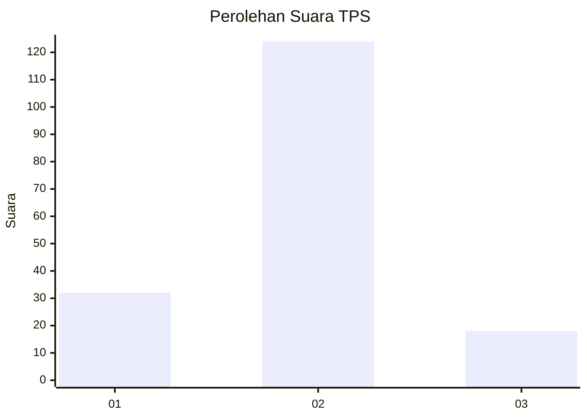
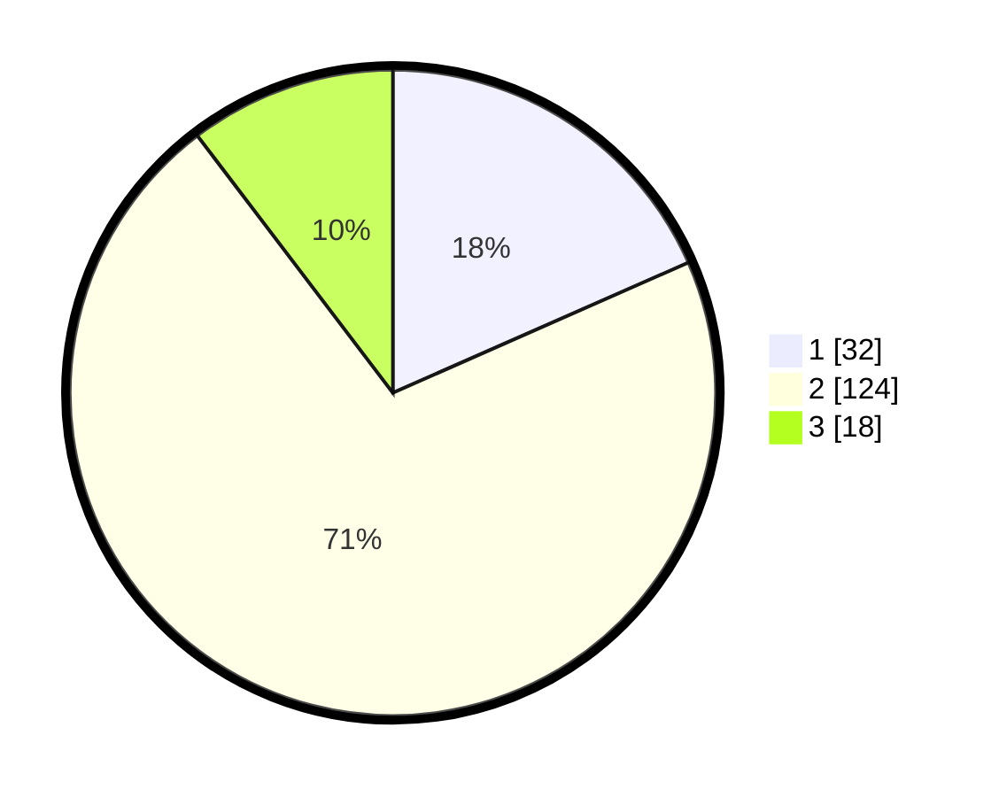

# Hasil

## Grafik

## Tabel

| No. | Nama Paslon    | Suara | Suara (raw) | Persentase |
|:--- |:-------------- | -----:| -----------:| ----------:|
| 1   | ANIES MUHAIMIN | 32    | [32][p-1]   | 18,39      |
| 2   | PRABOWO GIBRAN | 124   | [124][p-2]  | 71,26      |
| 3   | GANJAR MAHFUD  | 18    | [18][p-3]   | 10,34      |

[p-1]: https://github.com/gigit-pemilu/pemilu-2024-16-sumatera-selatan/blob/main/pilpres/hitung-suara/sub/16-sumatera-selatan/sub/06-musi-banyuasin/sub/03-sungai-keruh/sub/2015-keramat-jaya/sub/003-tps/sub/paslon-1.txt
[p-2]: https://github.com/gigit-pemilu/pemilu-2024-16-sumatera-selatan/blob/main/pilpres/hitung-suara/sub/16-sumatera-selatan/sub/06-musi-banyuasin/sub/03-sungai-keruh/sub/2015-keramat-jaya/sub/003-tps/sub/paslon-2.txt
[p-3]: https://github.com/gigit-pemilu/pemilu-2024-16-sumatera-selatan/blob/main/pilpres/hitung-suara/sub/16-sumatera-selatan/sub/06-musi-banyuasin/sub/03-sungai-keruh/sub/2015-keramat-jaya/sub/003-tps/sub/paslon-3.txt

## Foto C Plano

https://sirekap-obj-formc.kpu.go.id/ae14/pemilu/ppwp/16/06/03/20/15/1606032015003-20240215-015305--c4d4b2a6-518c-42b8-9988-285da3e922f8.jpg

https://sirekap-obj-formc.kpu.go.id/ae14/pemilu/ppwp/16/06/03/20/15/1606032015003-20240217-185809--45058652-27dd-43f4-a1f0-89dbef06b758.jpg

https://sirekap-obj-formc.kpu.go.id/ae14/pemilu/ppwp/16/06/03/20/15/1606032015003-20240217-185808--fc19efc5-2cfb-4a19-bd5c-82e1c3674750.jpg

## Metadata

| Key        | Value               |
| ---------- | ------------------- |
| Time Stamp | 2024-02-24 22:31:28 |

## DATA PEMILIH TETAP

Jumlah pemilih dalam DPT: **324**.
 * L: **30**.
 * P: **383**.

## DATA PENGGUNA HAK PILIH

Jumlah pengguna hak pilih dalam DPT: **584**.
 * L: **600**.
 * P: **884**.

Jumlah pengguna hak pilih dalam DPTb: **800**.
 * L: **80**.
 * P: **0**.

Jumlah pengguna hak pilih dalam DPK: **0**.
 * L: **0**.
 * P: **80**.

Jumlah pengguna hak pilih: **684**.
 * L: **0**.
 * P: **84**.

## JUMLAH SUARA SAH DAN TIDAK SAH

JUMLAH SELURUH SUARA SAH: **0**.

JUMLAH SUARA TIDAK SAH: **0**.

JUMLAH SELURUH SUARA SAH DAN SUARA TIDAK SAH: **0**.

