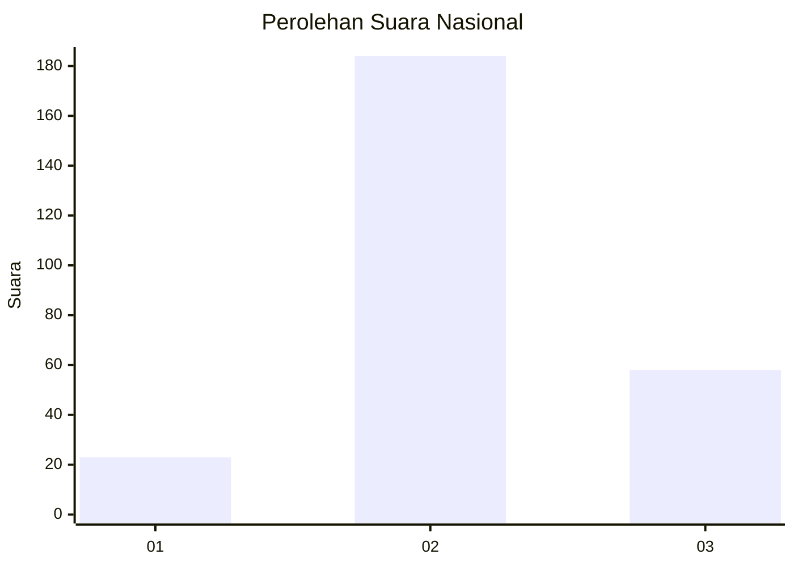
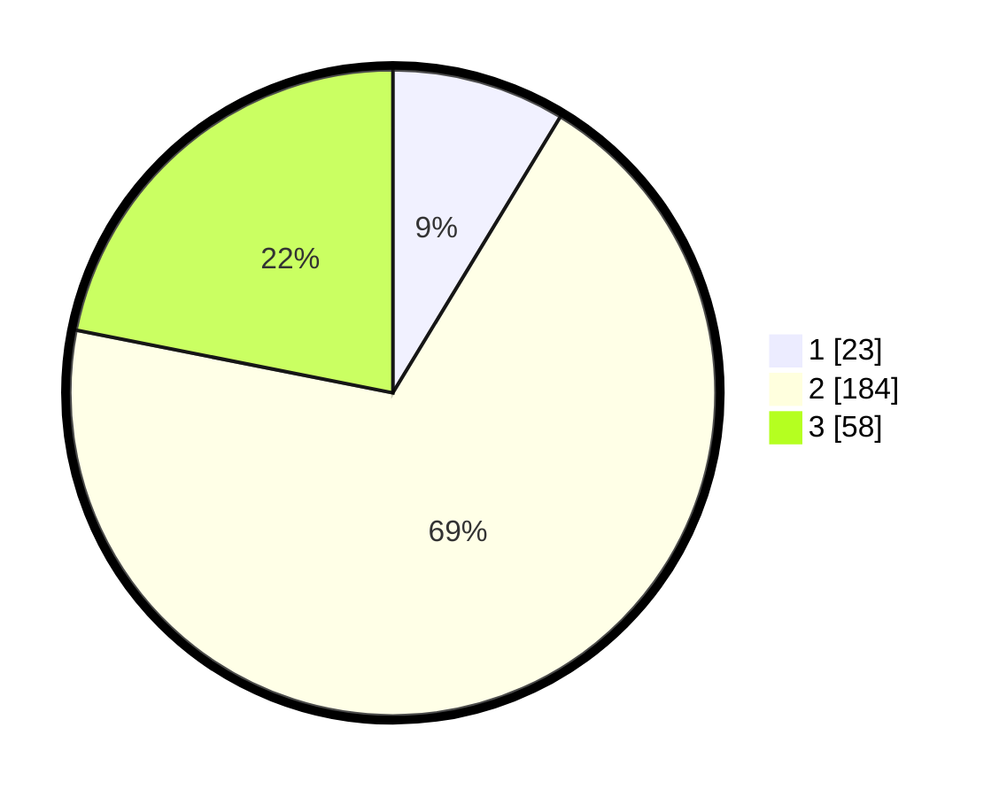

# Hasil

## Grafik

## Tabel

| No. | Nama Paslon    | Suara | Suara (raw) | Persentase |
|:--- |:-------------- | -----:| -----------:| ----------:|
| 1   | ANIES MUHAIMIN | 23    | [23][p-1]   | 8,68       |
| 2   | PRABOWO GIBRAN | 184   | [184][p-2]  | 69,43      |
| 3   | GANJAR MAHFUD  | 58    | [58][p-3]   | 21,89      |

[p-1]: https://github.com/gigit-pemilu/pemilu-2024/blob/main/pilpres/hitung-suara/sub/16-sumatera-selatan/sub/06-musi-banyuasin/sub/04-batang-hari-leko/sub/2001-bukit-sejahtera/sub/002-tps/sub/paslon-1.txt
[p-2]: https://github.com/gigit-pemilu/pemilu-2024/blob/main/pilpres/hitung-suara/sub/16-sumatera-selatan/sub/06-musi-banyuasin/sub/04-batang-hari-leko/sub/2001-bukit-sejahtera/sub/002-tps/sub/paslon-2.txt
[p-3]: https://github.com/gigit-pemilu/pemilu-2024/blob/main/pilpres/hitung-suara/sub/16-sumatera-selatan/sub/06-musi-banyuasin/sub/04-batang-hari-leko/sub/2001-bukit-sejahtera/sub/002-tps/sub/paslon-3.txt

## Foto C Plano

https://sirekap-obj-formc.kpu.go.id/2562/pemilu/ppwp/16/06/04/20/01/1606042001002-20240215-032242--5b4cb8f2-cce1-4c0c-84c4-4e80f153708a.jpg

https://sirekap-obj-formc.kpu.go.id/2562/pemilu/ppwp/16/06/04/20/01/1606042001002-20240215-032326--f0d61d61-c307-4bfa-95a9-ed96e3d12a9c.jpg

https://sirekap-obj-formc.kpu.go.id/2562/pemilu/ppwp/16/06/04/20/01/1606042001002-20240215-032415--c940d97c-9a7c-4706-a6f9-f50a43b6c24b.jpg

## Metadata

| Key        | Value               |
| ---------- | ------------------- |
| Time Stamp | 2024-02-15 12:00:28 |

## DATA PEMILIH TETAP

Jumlah pemilih dalam DPT: **292**.
 * L: **147**.
 * P: **145**.

## DATA PENGGUNA HAK PILIH

Jumlah pengguna hak pilih dalam DPT: **269**.
 * L: **133**.
 * P: **136**.

Jumlah pengguna hak pilih dalam DPTb: **0**.
 * L: **0**.
 * P: **0**.

Jumlah pengguna hak pilih dalam DPK: **0**.
 * L: **0**.
 * P: **0**.

Jumlah pengguna hak pilih: **269**.
 * L: **133**.
 * P: **136**.

## JUMLAH SUARA SAH DAN TIDAK SAH

JUMLAH SELURUH SUARA SAH: **265**.

JUMLAH SUARA TIDAK SAH: **4**.

JUMLAH SELURUH SUARA SAH DAN SUARA TIDAK SAH: **269**.

