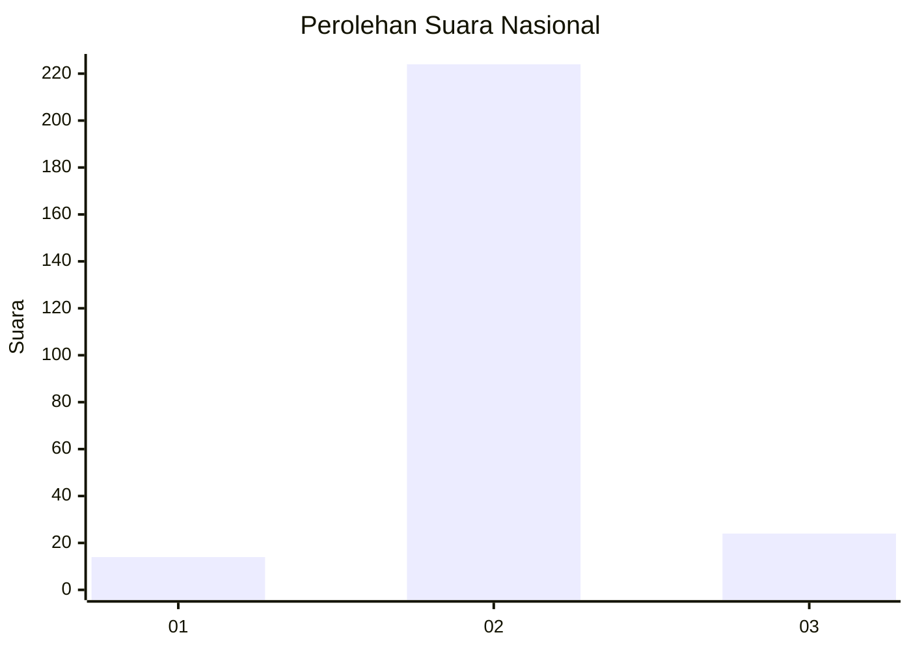
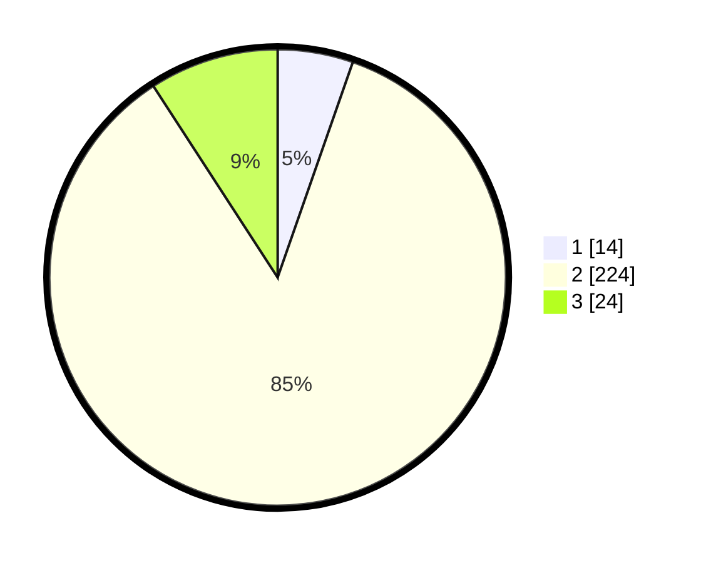

# Hasil

## Grafik

## Tabel

| No. | Nama Paslon    | Suara | Suara (raw) | Persentase |
|:--- |:-------------- | -----:| -----------:| ----------:|
| 1   | ANIES MUHAIMIN | 14    | [14][p-1]   | 5,34       |
| 2   | PRABOWO GIBRAN | 224   | [224][p-2]  | 85,50      |
| 3   | GANJAR MAHFUD  | 24    | [24][p-3]   | 9,16       |

[p-1]: https://github.com/gigit-pemilu/pemilu-2024/blob/main/pilpres/hitung-suara/sub/16-sumatera-selatan/sub/06-musi-banyuasin/sub/04-batang-hari-leko/sub/2001-bukit-sejahtera/sub/003-tps/sub/paslon-1.txt
[p-2]: https://github.com/gigit-pemilu/pemilu-2024/blob/main/pilpres/hitung-suara/sub/16-sumatera-selatan/sub/06-musi-banyuasin/sub/04-batang-hari-leko/sub/2001-bukit-sejahtera/sub/003-tps/sub/paslon-2.txt
[p-3]: https://github.com/gigit-pemilu/pemilu-2024/blob/main/pilpres/hitung-suara/sub/16-sumatera-selatan/sub/06-musi-banyuasin/sub/04-batang-hari-leko/sub/2001-bukit-sejahtera/sub/003-tps/sub/paslon-3.txt

## Foto C Plano

https://sirekap-obj-formc.kpu.go.id/6f85/pemilu/ppwp/16/06/04/20/01/1606042001003-20240216-103151--9f483ed8-1b5c-413a-99a7-f5663b513672.jpg

https://sirekap-obj-formc.kpu.go.id/6f85/pemilu/ppwp/16/06/04/20/01/1606042001003-20240216-103152--cbca9ee9-9e16-427d-8258-2d5328447230.jpg

https://sirekap-obj-formc.kpu.go.id/6f85/pemilu/ppwp/16/06/04/20/01/1606042001003-20240216-103152--0fa48e7e-9d58-4ec4-80ff-ee849a276c57.jpg

## Metadata

| Key        | Value               |
| ---------- | ------------------- |
| Time Stamp | 2024-02-16 12:51:22 |

## DATA PEMILIH TETAP

Jumlah pemilih dalam DPT: **292**.
 * L: **151**.
 * P: **141**.

## DATA PENGGUNA HAK PILIH

Jumlah pengguna hak pilih dalam DPT: **265**.
 * L: **135**.
 * P: **130**.

Jumlah pengguna hak pilih dalam DPTb: **0**.
 * L: **0**.
 * P: **0**.

Jumlah pengguna hak pilih dalam DPK: **0**.
 * L: **0**.
 * P: **0**.

Jumlah pengguna hak pilih: **265**.
 * L: **135**.
 * P: **130**.

## JUMLAH SUARA SAH DAN TIDAK SAH

JUMLAH SELURUH SUARA SAH: **262**.

JUMLAH SUARA TIDAK SAH: **3**.

JUMLAH SELURUH SUARA SAH DAN SUARA TIDAK SAH: **265**.

