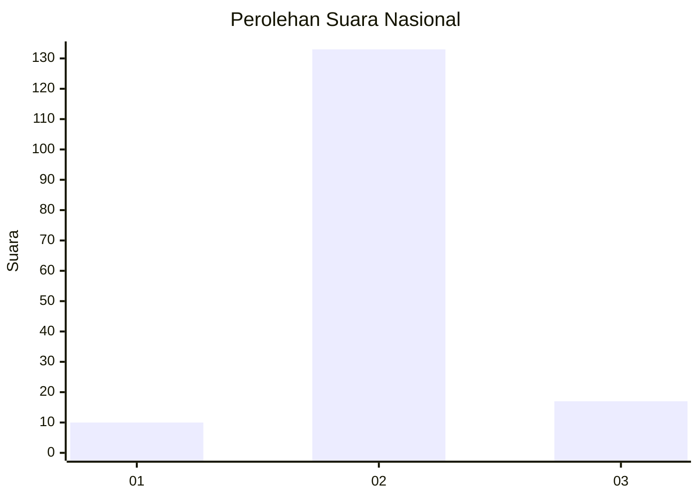
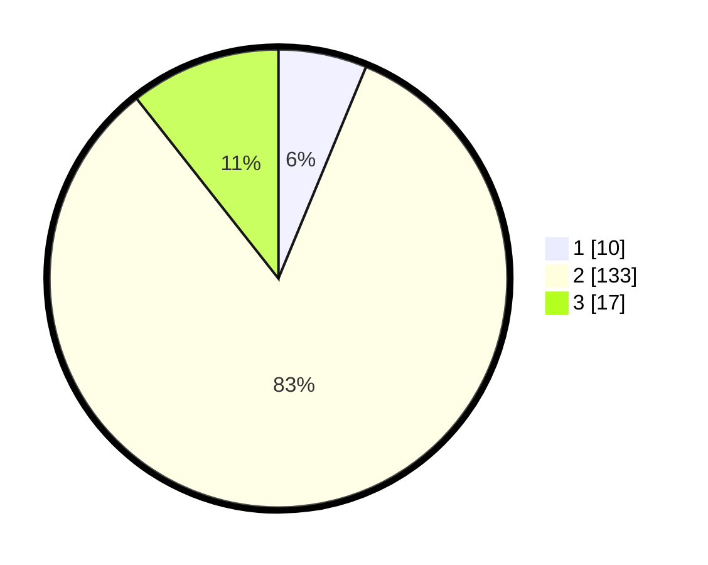

# Hasil

## Grafik

## Tabel

| No. | Nama Paslon    | Suara | Suara (raw) | Persentase |
|:--- |:-------------- | -----:| -----------:| ----------:|
| 1   | ANIES MUHAIMIN | 10    | [10][p-1]   | 6,25       |
| 2   | PRABOWO GIBRAN | 133   | [133][p-2]  | 83,13      |
| 3   | GANJAR MAHFUD  | 17    | [17][p-3]   | 10,63      |

[p-1]: https://github.com/gigit-pemilu/pemilu-2024/blob/main/pilpres/hitung-suara/sub/16-sumatera-selatan/sub/06-musi-banyuasin/sub/04-batang-hari-leko/sub/2002-bukit-pangkuasan/sub/002-tps/sub/paslon-1.txt
[p-2]: https://github.com/gigit-pemilu/pemilu-2024/blob/main/pilpres/hitung-suara/sub/16-sumatera-selatan/sub/06-musi-banyuasin/sub/04-batang-hari-leko/sub/2002-bukit-pangkuasan/sub/002-tps/sub/paslon-2.txt
[p-3]: https://github.com/gigit-pemilu/pemilu-2024/blob/main/pilpres/hitung-suara/sub/16-sumatera-selatan/sub/06-musi-banyuasin/sub/04-batang-hari-leko/sub/2002-bukit-pangkuasan/sub/002-tps/sub/paslon-3.txt

## Foto C Plano

https://sirekap-obj-formc.kpu.go.id/263d/pemilu/ppwp/16/06/04/20/02/1606042002002-20240218-104951--abe8c2bf-0962-484e-8935-ad0619474316.jpg

https://sirekap-obj-formc.kpu.go.id/263d/pemilu/ppwp/16/06/04/20/02/1606042002002-20240218-104607--286e5368-0d06-4c57-ad17-6e5788642447.jpg

https://sirekap-obj-formc.kpu.go.id/263d/pemilu/ppwp/16/06/04/20/02/1606042002002-20240218-104704--cc1390d0-8afb-46ed-ab44-84c6887f0e47.jpg

## Metadata

| Key        | Value               |
| ---------- | ------------------- |
| Time Stamp | 2024-02-19 06:16:00 |

