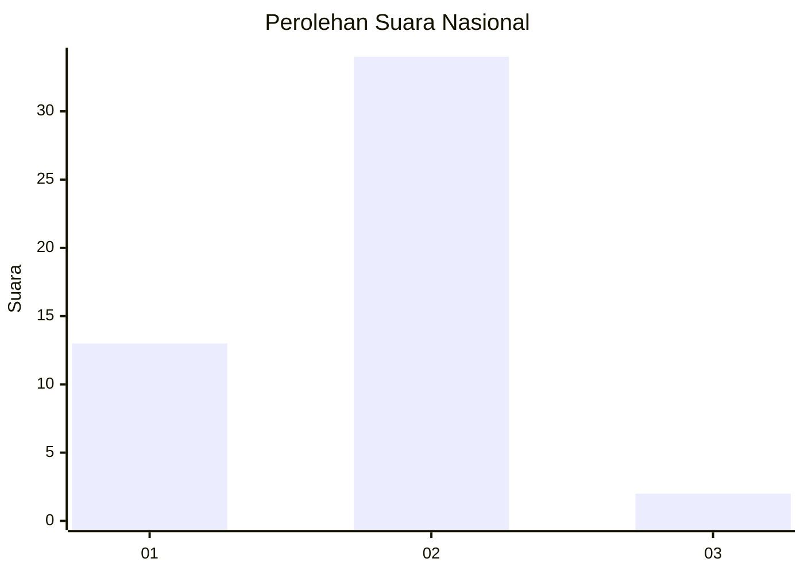
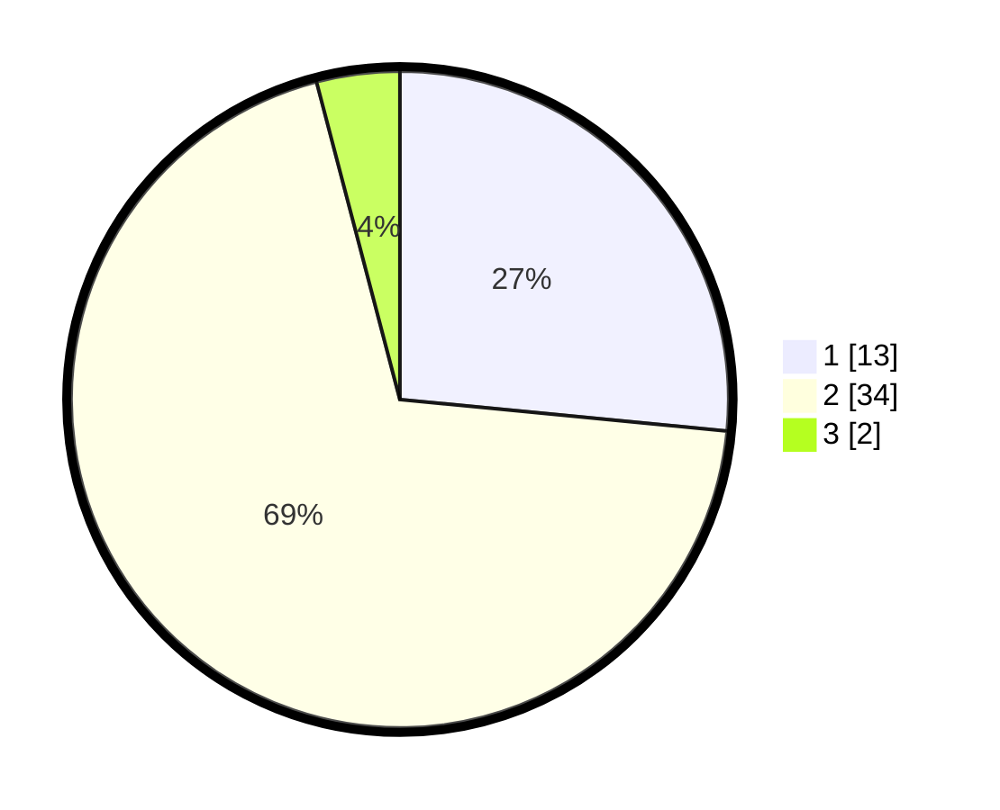

# Hasil

## Grafik

## Tabel

| No. | Nama Paslon    | Suara | Suara (raw) | Persentase |
|:--- |:-------------- | -----:| -----------:| ----------:|
| 1   | ANIES MUHAIMIN | 13    | [13][p-1]   | 26,53      |
| 2   | PRABOWO GIBRAN | 34    | [34][p-2]   | 69,39      |
| 3   | GANJAR MAHFUD  | 2     | [2][p-3]    | 4,08       |

[p-1]: https://github.com/gigit-pemilu/pemilu-2024/blob/main/pilpres/hitung-suara/sub/16-sumatera-selatan/sub/06-musi-banyuasin/sub/04-batang-hari-leko/sub/2004-talang-leban/sub/006-tps/sub/paslon-1.txt
[p-2]: https://github.com/gigit-pemilu/pemilu-2024/blob/main/pilpres/hitung-suara/sub/16-sumatera-selatan/sub/06-musi-banyuasin/sub/04-batang-hari-leko/sub/2004-talang-leban/sub/006-tps/sub/paslon-2.txt
[p-3]: https://github.com/gigit-pemilu/pemilu-2024/blob/main/pilpres/hitung-suara/sub/16-sumatera-selatan/sub/06-musi-banyuasin/sub/04-batang-hari-leko/sub/2004-talang-leban/sub/006-tps/sub/paslon-3.txt

## Foto C Plano

https://sirekap-obj-formc.kpu.go.id/7923/pemilu/ppwp/16/06/04/20/04/1606042004006-20240215-104310--c4a360c9-dee4-4af1-92a4-a20ab1b2878d.jpg

https://sirekap-obj-formc.kpu.go.id/7923/pemilu/ppwp/16/06/04/20/04/1606042004006-20240215-104352--abef2db8-77b0-4969-87f3-c3d5645737d2.jpg

https://sirekap-obj-formc.kpu.go.id/7923/pemilu/ppwp/16/06/04/20/04/1606042004006-20240214-155656--4ce14cb9-79df-4f7b-8271-286211696ce8.jpg

## Metadata

| Key        | Value               |
| ---------- | ------------------- |
| Time Stamp | 2024-02-19 06:16:00 |

## DATA PEMILIH TETAP

Jumlah pemilih dalam DPT: **80**.
 * L: **42**.
 * P: **38**.

## DATA PENGGUNA HAK PILIH

Jumlah pengguna hak pilih dalam DPT: **46**.
 * L: **23**.
 * P: **23**.

Jumlah pengguna hak pilih dalam DPTb: **4**.
 * L: **2**.
 * P: **2**.

Jumlah pengguna hak pilih dalam DPK: **0**.
 * L: **0**.
 * P: **0**.

Jumlah pengguna hak pilih: **50**.
 * L: **25**.
 * P: **25**.

## JUMLAH SUARA SAH DAN TIDAK SAH

JUMLAH SELURUH SUARA SAH: **49**.

JUMLAH SUARA TIDAK SAH: **1**.

JUMLAH SELURUH SUARA SAH DAN SUARA TIDAK SAH: **50**.

