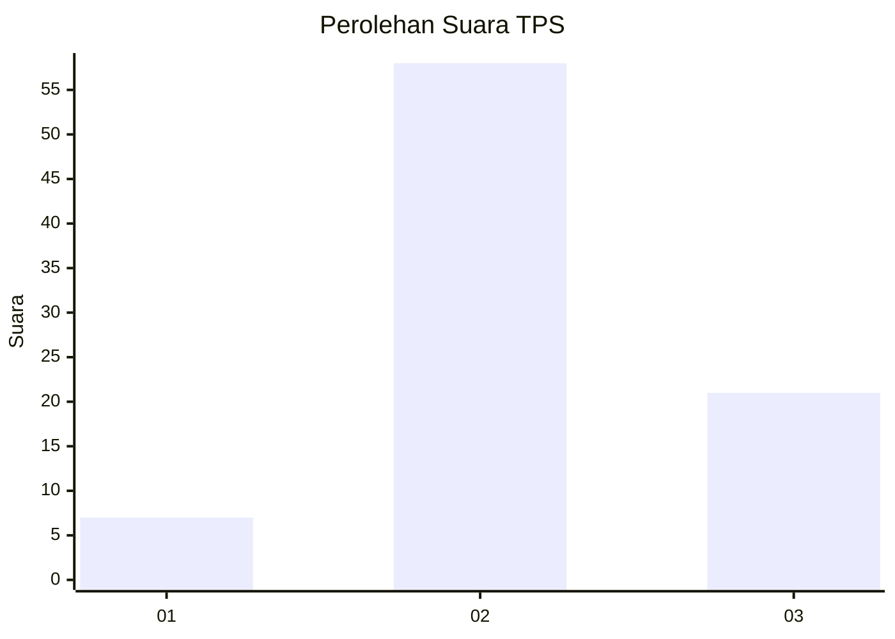
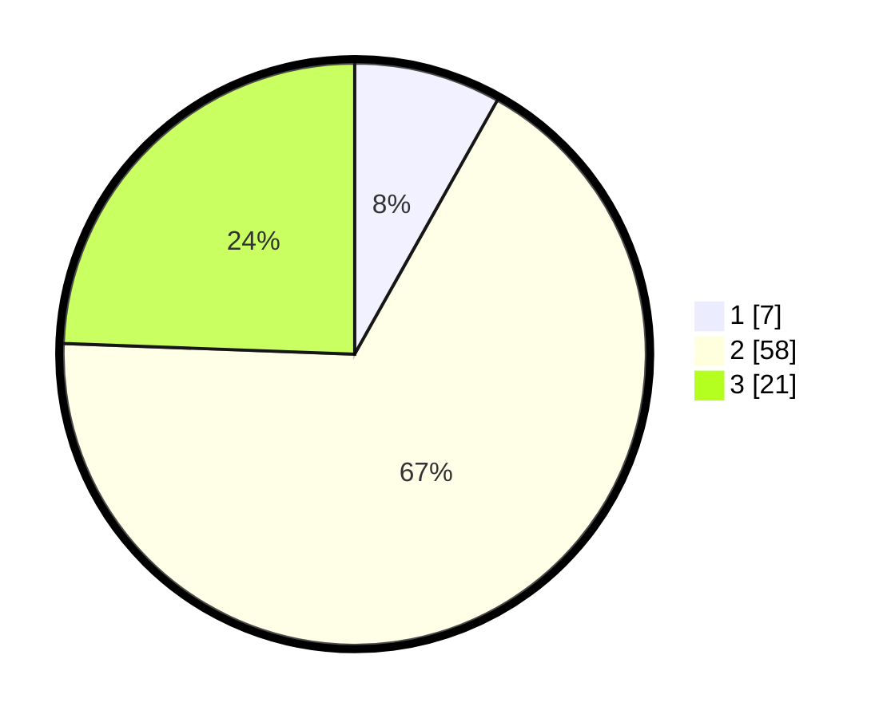

# Hasil

## Grafik

## Tabel

| No. | Nama Paslon    | Suara | Suara (raw) | Persentase |
|:--- |:-------------- | -----:| -----------:| ----------:|
| 1   | ANIES MUHAIMIN | 7     | [7][p-1]    | 8,14       |
| 2   | PRABOWO GIBRAN | 58    | [58][p-2]   | 67,44      |
| 3   | GANJAR MAHFUD  | 21    | [21][p-3]   | 24,42      |

[p-1]: https://github.com/gigit-pemilu/pemilu-2024-16-sumatera-selatan/blob/main/pilpres/hitung-suara/sub/16-sumatera-selatan/sub/06-musi-banyuasin/sub/04-batang-hari-leko/sub/2005-talang-buluh/sub/002-tps/sub/paslon-1.txt
[p-2]: https://github.com/gigit-pemilu/pemilu-2024-16-sumatera-selatan/blob/main/pilpres/hitung-suara/sub/16-sumatera-selatan/sub/06-musi-banyuasin/sub/04-batang-hari-leko/sub/2005-talang-buluh/sub/002-tps/sub/paslon-2.txt
[p-3]: https://github.com/gigit-pemilu/pemilu-2024-16-sumatera-selatan/blob/main/pilpres/hitung-suara/sub/16-sumatera-selatan/sub/06-musi-banyuasin/sub/04-batang-hari-leko/sub/2005-talang-buluh/sub/002-tps/sub/paslon-3.txt

## Foto C Plano

https://sirekap-obj-formc.kpu.go.id/a1d6/pemilu/ppwp/16/06/04/20/05/1606042005002-20240217-184804--dc4f128c-13ec-4b46-93e5-b2514ae8b798.jpg

https://sirekap-obj-formc.kpu.go.id/a1d6/pemilu/ppwp/16/06/04/20/05/1606042005002-20240217-185030--b13a3669-e7bd-4ada-9935-7d2011ce4266.jpg

https://sirekap-obj-formc.kpu.go.id/a1d6/pemilu/ppwp/16/06/04/20/05/1606042005002-20240217-185217--04ed594a-948b-4653-b08c-f5feead421d0.jpg

## Metadata

| Key        | Value               |
| ---------- | ------------------- |
| Time Stamp | 2024-02-17 19:00:04 |

## DATA PEMILIH TETAP

Jumlah pemilih dalam DPT: **126**.
 * L: **74**.
 * P: **52**.

## DATA PENGGUNA HAK PILIH

Jumlah pengguna hak pilih dalam DPT: **98**.
 * L: **54**.
 * P: **44**.

Jumlah pengguna hak pilih dalam DPTb: **0**.
 * L: **88**.
 * P: **0**.

Jumlah pengguna hak pilih dalam DPK: **0**.
 * L: **0**.
 * P: **0**.

Jumlah pengguna hak pilih: **98**.
 * L: **54**.
 * P: **44**.

## JUMLAH SUARA SAH DAN TIDAK SAH

JUMLAH SELURUH SUARA SAH: **86**.

JUMLAH SUARA TIDAK SAH: **12**.

JUMLAH SELURUH SUARA SAH DAN SUARA TIDAK SAH: **98**.

