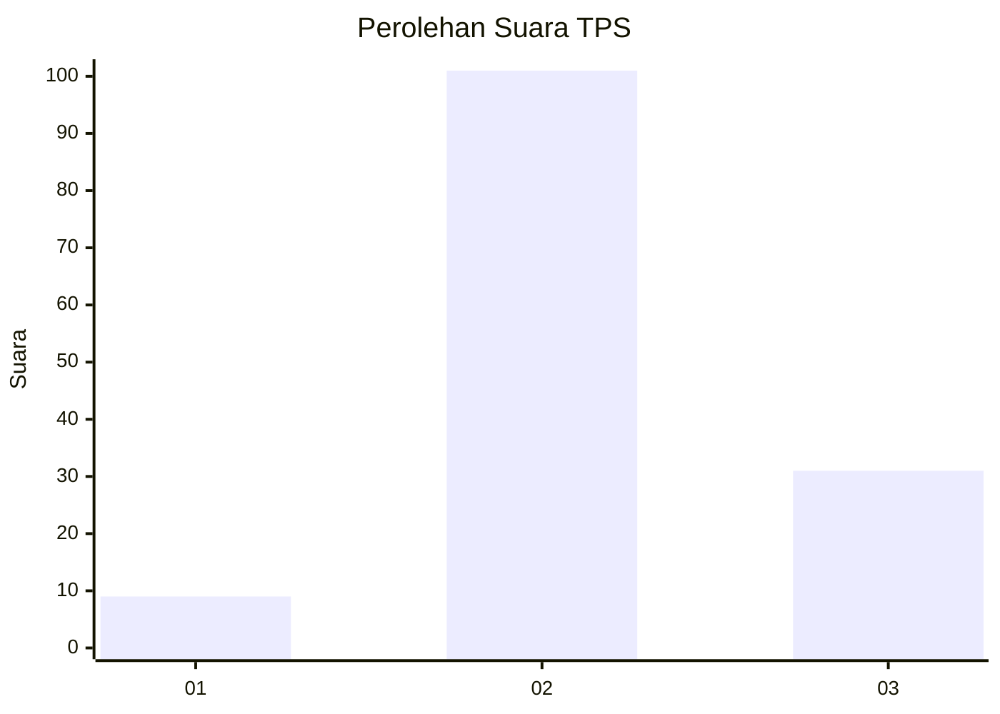

# Hasil

## Grafik

## Tabel

| No. | Nama Paslon    | Suara | Suara (raw) | Persentase |
|:--- |:-------------- | -----:| -----------:| ----------:|
| 1   | ANIES MUHAIMIN | 9     | [9][p-1]    | 6,38       |
| 2   | PRABOWO GIBRAN | 101   | [101][p-2]  | 71,63      |
| 3   | GANJAR MAHFUD  | 31    | [31][p-3]   | 21,99      |

[p-1]: https://github.com/gigit-pemilu/pemilu-2024-16-sumatera-selatan/blob/main/pilpres/hitung-suara/sub/16-sumatera-selatan/sub/06-musi-banyuasin/sub/04-batang-hari-leko/sub/2005-talang-buluh/sub/003-tps/sub/paslon-1.txt
[p-2]: https://github.com/gigit-pemilu/pemilu-2024-16-sumatera-selatan/blob/main/pilpres/hitung-suara/sub/16-sumatera-selatan/sub/06-musi-banyuasin/sub/04-batang-hari-leko/sub/2005-talang-buluh/sub/003-tps/sub/paslon-2.txt
[p-3]: https://github.com/gigit-pemilu/pemilu-2024-16-sumatera-selatan/blob/main/pilpres/hitung-suara/sub/16-sumatera-selatan/sub/06-musi-banyuasin/sub/04-batang-hari-leko/sub/2005-talang-buluh/sub/003-tps/sub/paslon-3.txt

## Foto C Plano

https://sirekap-obj-formc.kpu.go.id/8aab/pemilu/ppwp/16/06/04/20/05/1606042005003-20240215-175428--aa9aadc2-84dd-4e28-a000-f718e7b636df.jpg

https://sirekap-obj-formc.kpu.go.id/8aab/pemilu/ppwp/16/06/04/20/05/1606042005003-20240215-161400--47a58453-43c8-4e1e-9e25-05ddfd566315.jpg

https://sirekap-obj-formc.kpu.go.id/8aab/pemilu/ppwp/16/06/04/20/05/1606042005003-20240215-141657--7c3aa3c5-539c-4b07-970f-2fecc90d8c95.jpg

## Metadata

| Key        | Value               |
| ---------- | ------------------- |
| Time Stamp | 2024-02-24 22:31:28 |

