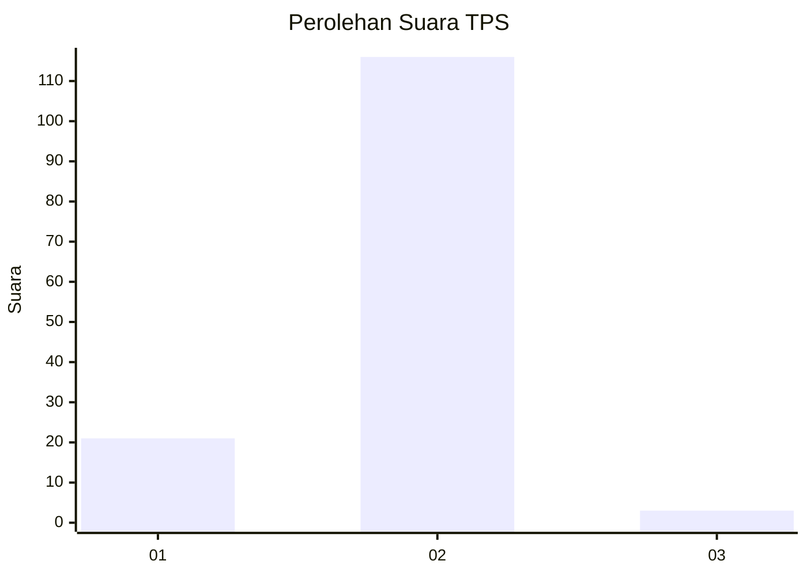
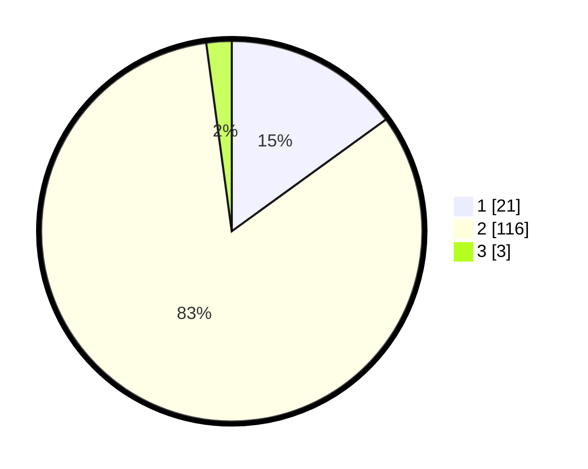

# Hasil

## Grafik

## Tabel

| No. | Nama Paslon    | Suara | Suara (raw) | Persentase |
|:--- |:-------------- | -----:| -----------:| ----------:|
| 1   | ANIES MUHAIMIN | 21    | [21][p-1]   | 15,00      |
| 2   | PRABOWO GIBRAN | 116   | [116][p-2]  | 82,86      |
| 3   | GANJAR MAHFUD  | 3     | [3][p-3]    | 2,14       |

[p-1]: https://github.com/gigit-pemilu/pemilu-2024-16-sumatera-selatan/blob/main/pilpres/hitung-suara/sub/16-sumatera-selatan/sub/06-musi-banyuasin/sub/04-batang-hari-leko/sub/2012-tanjung-bali/sub/001-tps/sub/paslon-1.txt
[p-2]: https://github.com/gigit-pemilu/pemilu-2024-16-sumatera-selatan/blob/main/pilpres/hitung-suara/sub/16-sumatera-selatan/sub/06-musi-banyuasin/sub/04-batang-hari-leko/sub/2012-tanjung-bali/sub/001-tps/sub/paslon-2.txt
[p-3]: https://github.com/gigit-pemilu/pemilu-2024-16-sumatera-selatan/blob/main/pilpres/hitung-suara/sub/16-sumatera-selatan/sub/06-musi-banyuasin/sub/04-batang-hari-leko/sub/2012-tanjung-bali/sub/001-tps/sub/paslon-3.txt

## Foto C Plano

https://sirekap-obj-formc.kpu.go.id/dee5/pemilu/ppwp/16/06/04/20/12/1606042012001-20240215-130052--2c99eaee-de68-46c0-bae8-ea5ef9269f22.jpg

https://sirekap-obj-formc.kpu.go.id/dee5/pemilu/ppwp/16/06/04/20/12/1606042012001-20240215-130145--4992cd55-4ac9-4957-9411-5c67b5aa611e.jpg

https://sirekap-obj-formc.kpu.go.id/dee5/pemilu/ppwp/16/06/04/20/12/1606042012001-20240215-130215--ecff2d26-9219-4675-a132-417dcc0338a7.jpg

## Metadata

| Key        | Value               |
| ---------- | ------------------- |
| Time Stamp | 2024-02-15 21:30:27 |

