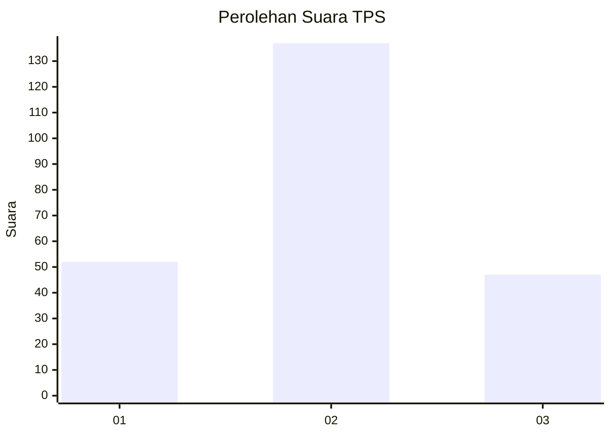
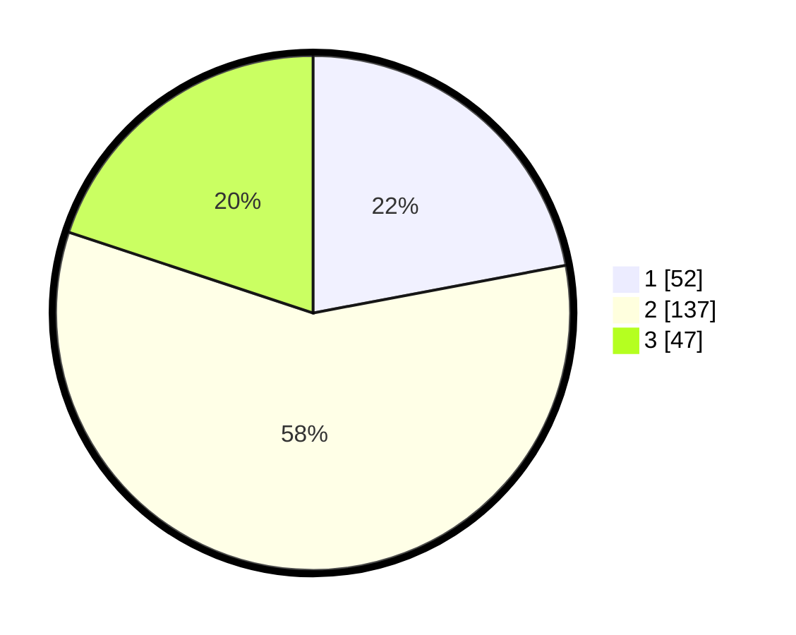

# Hasil

## Grafik

## Tabel

| No. | Nama Paslon    | Suara | Suara (raw) | Persentase |
|:--- |:-------------- | -----:| -----------:| ----------:|
| 1   | ANIES MUHAIMIN | 52    | [52][p-1]   | 22,03      |
| 2   | PRABOWO GIBRAN | 137   | [137][p-2]  | 58,05      |
| 3   | GANJAR MAHFUD  | 47    | [47][p-3]   | 19,92      |

[p-1]: https://github.com/gigit-pemilu/pemilu-2024-16-sumatera-selatan/blob/main/pilpres/hitung-suara/sub/16-sumatera-selatan/sub/06-musi-banyuasin/sub/05-sanga-desa/sub/1016-ngulak-i/sub/004-tps/sub/paslon-1.txt
[p-2]: https://github.com/gigit-pemilu/pemilu-2024-16-sumatera-selatan/blob/main/pilpres/hitung-suara/sub/16-sumatera-selatan/sub/06-musi-banyuasin/sub/05-sanga-desa/sub/1016-ngulak-i/sub/004-tps/sub/paslon-2.txt
[p-3]: https://github.com/gigit-pemilu/pemilu-2024-16-sumatera-selatan/blob/main/pilpres/hitung-suara/sub/16-sumatera-selatan/sub/06-musi-banyuasin/sub/05-sanga-desa/sub/1016-ngulak-i/sub/004-tps/sub/paslon-3.txt

## Foto C Plano

https://sirekap-obj-formc.kpu.go.id/b4d2/pemilu/ppwp/16/06/05/10/16/1606051016004-20240215-064225--4e54f3a9-393f-49c1-826f-9d89da00a4ee.jpg

https://sirekap-obj-formc.kpu.go.id/b4d2/pemilu/ppwp/16/06/05/10/16/1606051016004-20240215-064341--8ba6703e-a2ac-4b30-8a32-a0642d323164.jpg

https://sirekap-obj-formc.kpu.go.id/b4d2/pemilu/ppwp/16/06/05/10/16/1606051016004-20240215-064444--300532b5-e18d-4921-b832-c1d085254a3c.jpg

## Metadata

| Key        | Value               |
| ---------- | ------------------- |
| Time Stamp | 2024-02-25 15:00:00 |

