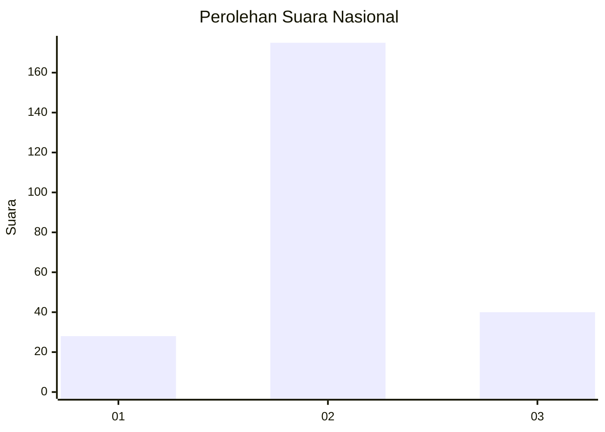
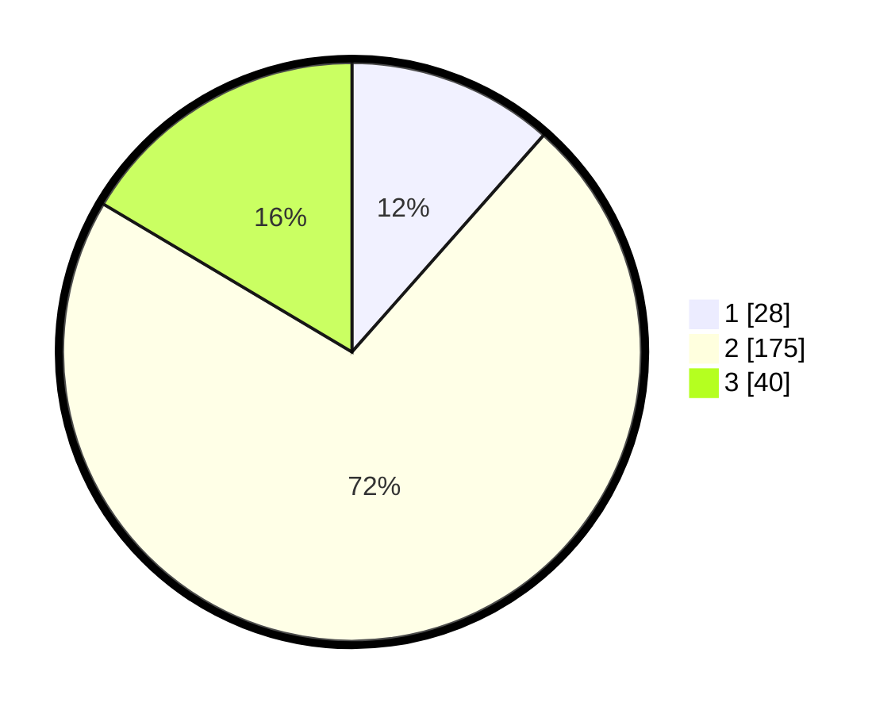

# Hasil

## Grafik

## Tabel

| No. | Nama Paslon    | Suara | Suara (raw) | Persentase |
|:--- |:-------------- | -----:| -----------:| ----------:|
| 1   | ANIES MUHAIMIN | 28    | [28][p-1]   | 11,52      |
| 2   | PRABOWO GIBRAN | 175   | [175][p-2]  | 72,02      |
| 3   | GANJAR MAHFUD  | 40    | [40][p-3]   | 16,46      |

[p-1]: https://github.com/gigit-pemilu/pemilu-2024/blob/main/pilpres/hitung-suara/sub/16-sumatera-selatan/sub/06-musi-banyuasin/sub/05-sanga-desa/sub/1016-ngulak-i/sub/005-tps/sub/paslon-1.txt
[p-2]: https://github.com/gigit-pemilu/pemilu-2024/blob/main/pilpres/hitung-suara/sub/16-sumatera-selatan/sub/06-musi-banyuasin/sub/05-sanga-desa/sub/1016-ngulak-i/sub/005-tps/sub/paslon-2.txt
[p-3]: https://github.com/gigit-pemilu/pemilu-2024/blob/main/pilpres/hitung-suara/sub/16-sumatera-selatan/sub/06-musi-banyuasin/sub/05-sanga-desa/sub/1016-ngulak-i/sub/005-tps/sub/paslon-3.txt

## Foto C Plano

https://sirekap-obj-formc.kpu.go.id/7341/pemilu/ppwp/16/06/05/10/16/1606051016005-20240215-114435--abbd225e-720d-42cd-9e84-5b1c0ec8a501.jpg

https://sirekap-obj-formc.kpu.go.id/7341/pemilu/ppwp/16/06/05/10/16/1606051016005-20240215-134519--aba73c7d-5869-44c2-9061-0d5a21aad07e.jpg

https://sirekap-obj-formc.kpu.go.id/7341/pemilu/ppwp/16/06/05/10/16/1606051016005-20240215-134526--5a779a92-5d62-4148-8360-63f62abd0e29.jpg

## Metadata

| Key        | Value               |
| ---------- | ------------------- |
| Time Stamp | 2024-02-24 22:31:28 |

