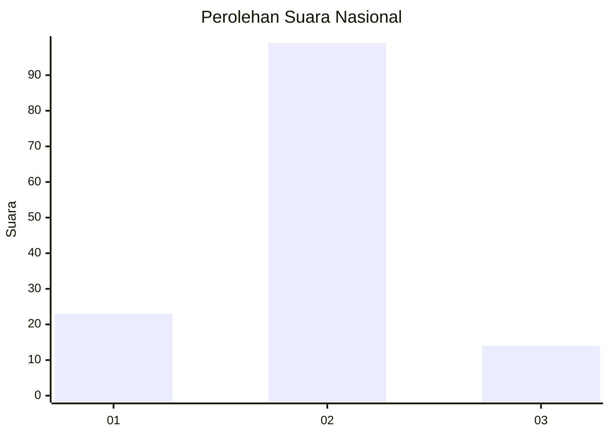
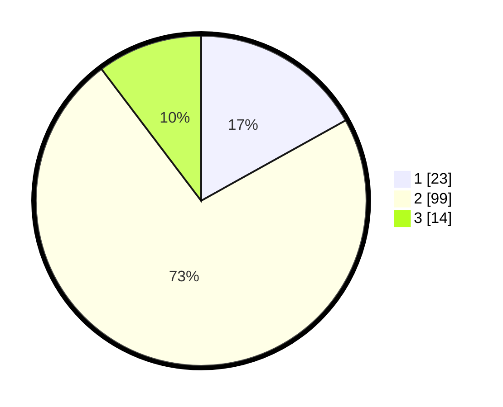

# Hasil

## Grafik

## Tabel

| No. | Nama Paslon    | Suara | Suara (raw) | Persentase |
|:--- |:-------------- | -----:| -----------:| ----------:|
| 1   | ANIES MUHAIMIN | 23    | [23][p-1]   | 16,91      |
| 2   | PRABOWO GIBRAN | 99    | [99][p-2]   | 72,79      |
| 3   | GANJAR MAHFUD  | 14    | [14][p-3]   | 10,29      |

[p-1]: https://github.com/gigit-pemilu/pemilu-2024/blob/main/pilpres/hitung-suara/sub/16-sumatera-selatan/sub/06-musi-banyuasin/sub/06-babat-toman/sub/1039-mangun-jaya/sub/011-tps/sub/paslon-1.txt
[p-2]: https://github.com/gigit-pemilu/pemilu-2024/blob/main/pilpres/hitung-suara/sub/16-sumatera-selatan/sub/06-musi-banyuasin/sub/06-babat-toman/sub/1039-mangun-jaya/sub/011-tps/sub/paslon-2.txt
[p-3]: https://github.com/gigit-pemilu/pemilu-2024/blob/main/pilpres/hitung-suara/sub/16-sumatera-selatan/sub/06-musi-banyuasin/sub/06-babat-toman/sub/1039-mangun-jaya/sub/011-tps/sub/paslon-3.txt

## Foto C Plano

https://sirekap-obj-formc.kpu.go.id/6c33/pemilu/ppwp/16/06/06/10/39/1606061039011-20240220-214200--3c736b31-724b-4f01-9e14-e3fba5b26312.jpg

https://sirekap-obj-formc.kpu.go.id/6c33/pemilu/ppwp/16/06/06/10/39/1606061039011-20240220-214154--12ed0833-d753-4aac-b978-1a00cf530f15.jpg

https://sirekap-obj-formc.kpu.go.id/6c33/pemilu/ppwp/16/06/06/10/39/1606061039011-20240220-214213--0e8f70a2-bf87-4979-b5cd-f8c1374d3094.jpg

## Metadata

| Key        | Value               |
| ---------- | ------------------- |
| Time Stamp | 2024-02-25 20:00:00 |

