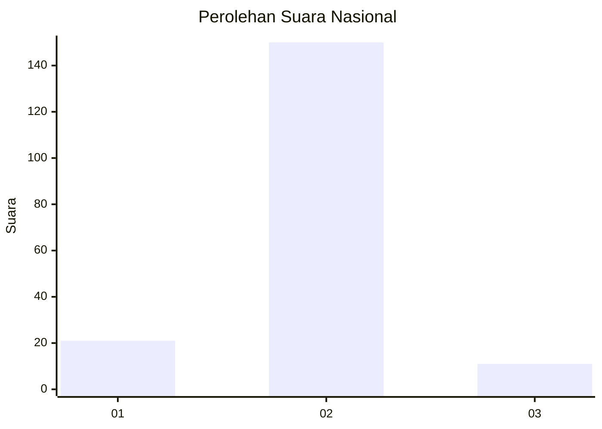
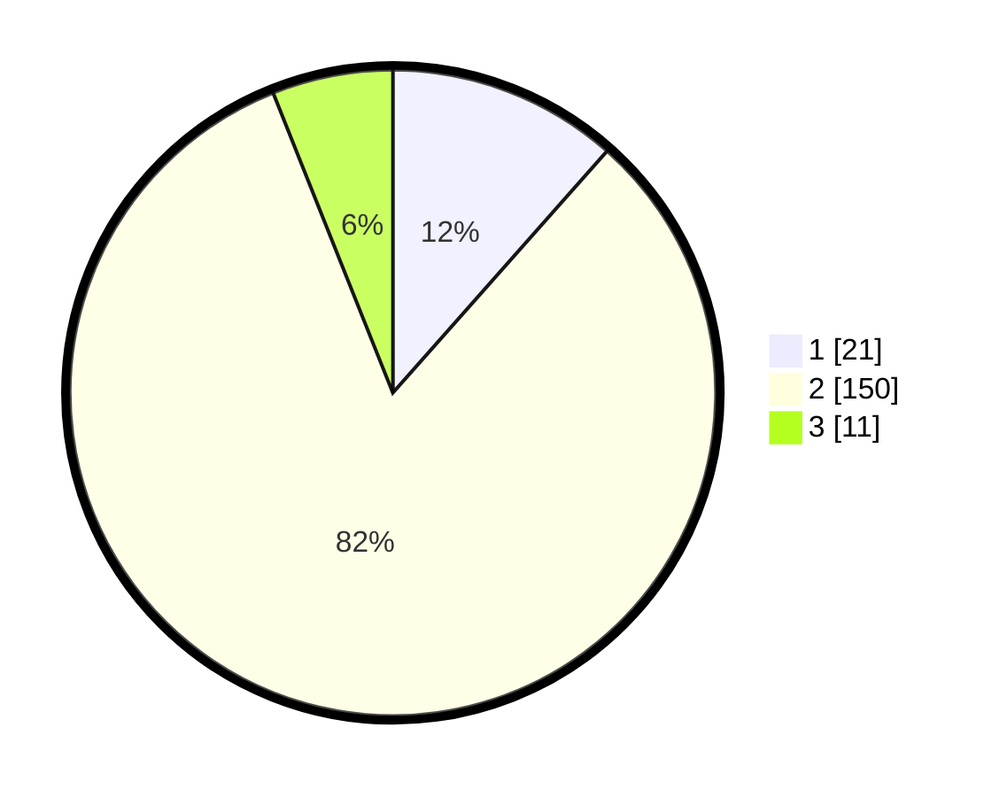

# Hasil

## Grafik

## Tabel

| No. | Nama Paslon    | Suara | Suara (raw) | Persentase |
|:--- |:-------------- | -----:| -----------:| ----------:|
| 1   | ANIES MUHAIMIN | 21    | [21][p-1]   | 11,54      |
| 2   | PRABOWO GIBRAN | 150   | [150][p-2]  | 82,42      |
| 3   | GANJAR MAHFUD  | 11    | [11][p-3]   | 6,04       |

[p-1]: https://github.com/gigit-pemilu/pemilu-2024/blob/main/pilpres/hitung-suara/sub/16-sumatera-selatan/sub/06-musi-banyuasin/sub/06-babat-toman/sub/2005-muara-punjung/sub/004-tps/sub/paslon-1.txt
[p-2]: https://github.com/gigit-pemilu/pemilu-2024/blob/main/pilpres/hitung-suara/sub/16-sumatera-selatan/sub/06-musi-banyuasin/sub/06-babat-toman/sub/2005-muara-punjung/sub/004-tps/sub/paslon-2.txt
[p-3]: https://github.com/gigit-pemilu/pemilu-2024/blob/main/pilpres/hitung-suara/sub/16-sumatera-selatan/sub/06-musi-banyuasin/sub/06-babat-toman/sub/2005-muara-punjung/sub/004-tps/sub/paslon-3.txt

## Foto C Plano

https://sirekap-obj-formc.kpu.go.id/842a/pemilu/ppwp/16/06/06/20/05/1606062005004-20240215-020507--09293baf-ed27-441b-93ff-541749a9e6c4.jpg

https://sirekap-obj-formc.kpu.go.id/842a/pemilu/ppwp/16/06/06/20/05/1606062005004-20240215-020929--5471cd2e-beb0-47be-aa05-f1899e888aae.jpg

https://sirekap-obj-formc.kpu.go.id/842a/pemilu/ppwp/16/06/06/20/05/1606062005004-20240215-021015--a0fc1bc0-5207-4859-ba82-f6b9af77af65.jpg

## Metadata

| Key        | Value               |
| ---------- | ------------------- |
| Time Stamp | 2024-02-16 12:51:22 |

