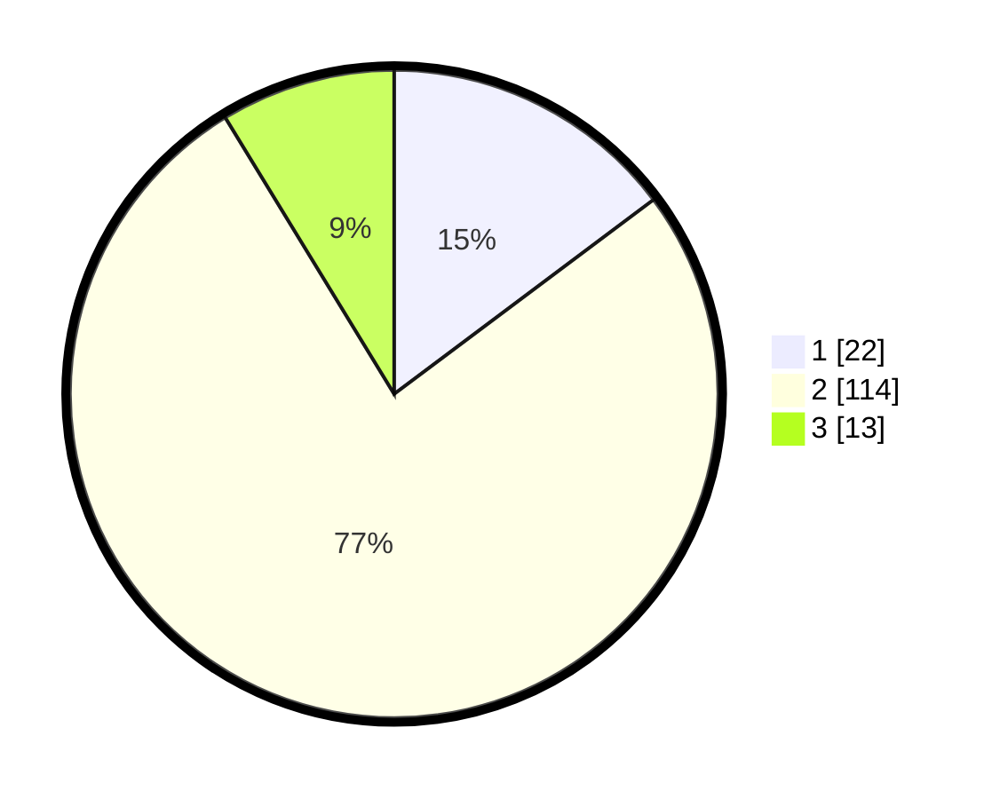

# Hasil

## Grafik

## Tabel

| No. | Nama Paslon    | Suara | Suara (raw) | Persentase |
|:--- |:-------------- | -----:| -----------:| ----------:|
| 1   | ANIES MUHAIMIN | 22    | [22][p-1]   | 14,77      |
| 2   | PRABOWO GIBRAN | 114   | [114][p-2]  | 76,51      |
| 3   | GANJAR MAHFUD  | 13    | [13][p-3]   | 8,72       |

[p-1]: https://github.com/gigit-pemilu/pemilu-2024-16-sumatera-selatan/blob/main/pilpres/hitung-suara/sub/16-sumatera-selatan/sub/06-musi-banyuasin/sub/06-babat-toman/sub/2009-kasmaran/sub/013-tps/sub/paslon-1.txt
[p-2]: https://github.com/gigit-pemilu/pemilu-2024-16-sumatera-selatan/blob/main/pilpres/hitung-suara/sub/16-sumatera-selatan/sub/06-musi-banyuasin/sub/06-babat-toman/sub/2009-kasmaran/sub/013-tps/sub/paslon-2.txt
[p-3]: https://github.com/gigit-pemilu/pemilu-2024-16-sumatera-selatan/blob/main/pilpres/hitung-suara/sub/16-sumatera-selatan/sub/06-musi-banyuasin/sub/06-babat-toman/sub/2009-kasmaran/sub/013-tps/sub/paslon-3.txt

## Foto C Plano

https://sirekap-obj-formc.kpu.go.id/5b8d/pemilu/ppwp/16/06/06/20/09/1606062009013-20240215-012303--67509053-71db-45f5-98db-6d76f4fd4a4d.jpg

https://sirekap-obj-formc.kpu.go.id/5b8d/pemilu/ppwp/16/06/06/20/09/1606062009013-20240215-012338--f5748445-f0dc-4bf7-a25b-e853f243decc.jpg

https://sirekap-obj-formc.kpu.go.id/5b8d/pemilu/ppwp/16/06/06/20/09/1606062009013-20240215-012400--598b028f-aebf-4879-af54-fe5ce229baa5.jpg

## Metadata

| Key        | Value               |
| ---------- | ------------------- |
| Time Stamp | 2024-02-16 14:00:34 |

