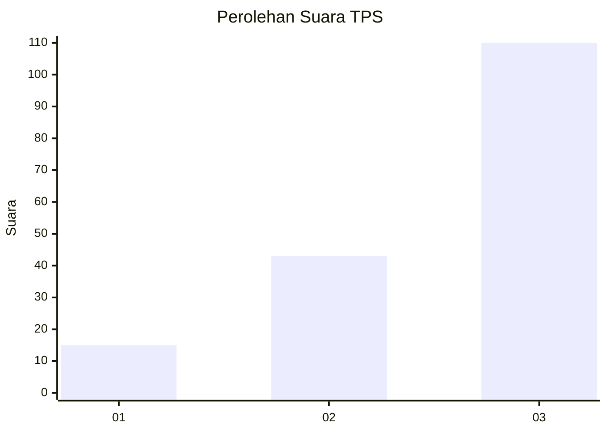
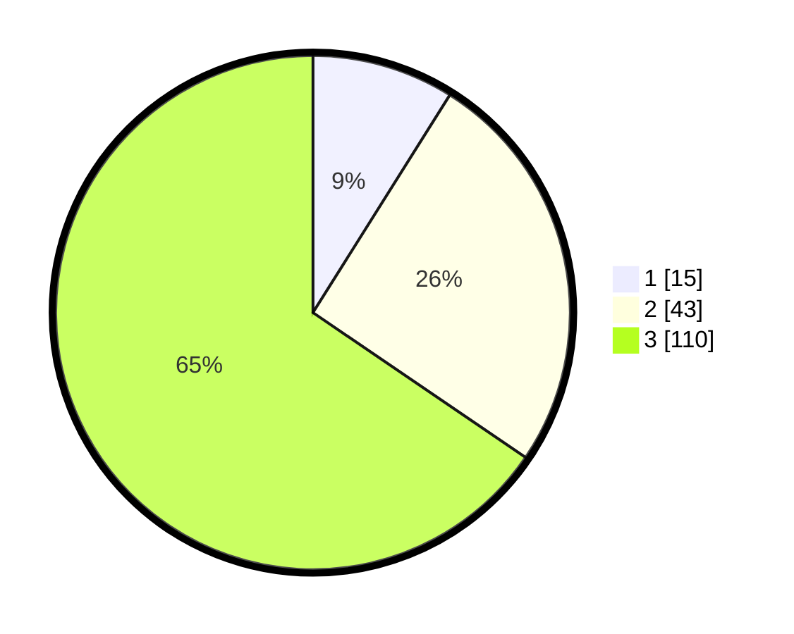

# Hasil

## Grafik

## Tabel

| No. | Nama Paslon    | Suara | Suara (raw) | Persentase |
|:--- |:-------------- | -----:| -----------:| ----------:|
| 1   | ANIES MUHAIMIN | 15    | [15][p-1]   | 8,93       |
| 2   | PRABOWO GIBRAN | 43    | [43][p-2]   | 25,60      |
| 3   | GANJAR MAHFUD  | 110   | [110][p-3]  | 65,48      |

[p-1]: https://github.com/gigit-pemilu/pemilu-2024-16-sumatera-selatan/blob/main/pilpres/hitung-suara/sub/16-sumatera-selatan/sub/06-musi-banyuasin/sub/06-babat-toman/sub/2009-kasmaran/sub/015-tps/sub/paslon-1.txt
[p-2]: https://github.com/gigit-pemilu/pemilu-2024-16-sumatera-selatan/blob/main/pilpres/hitung-suara/sub/16-sumatera-selatan/sub/06-musi-banyuasin/sub/06-babat-toman/sub/2009-kasmaran/sub/015-tps/sub/paslon-2.txt
[p-3]: https://github.com/gigit-pemilu/pemilu-2024-16-sumatera-selatan/blob/main/pilpres/hitung-suara/sub/16-sumatera-selatan/sub/06-musi-banyuasin/sub/06-babat-toman/sub/2009-kasmaran/sub/015-tps/sub/paslon-3.txt

## Foto C Plano

https://sirekap-obj-formc.kpu.go.id/a4a8/pemilu/ppwp/16/06/06/20/09/1606062009015-20240215-033354--3fb2dbba-572d-4d04-aa2e-c127ad652719.jpg

https://sirekap-obj-formc.kpu.go.id/a4a8/pemilu/ppwp/16/06/06/20/09/1606062009015-20240215-033410--90b581df-1b8e-4d7a-943f-9f8850c6c04c.jpg

https://sirekap-obj-formc.kpu.go.id/a4a8/pemilu/ppwp/16/06/06/20/09/1606062009015-20240215-033435--b295ba49-30de-4804-921b-a208d1115444.jpg

## Metadata

| Key        | Value               |
| ---------- | ------------------- |
| Time Stamp | 2024-02-16 12:51:22 |

