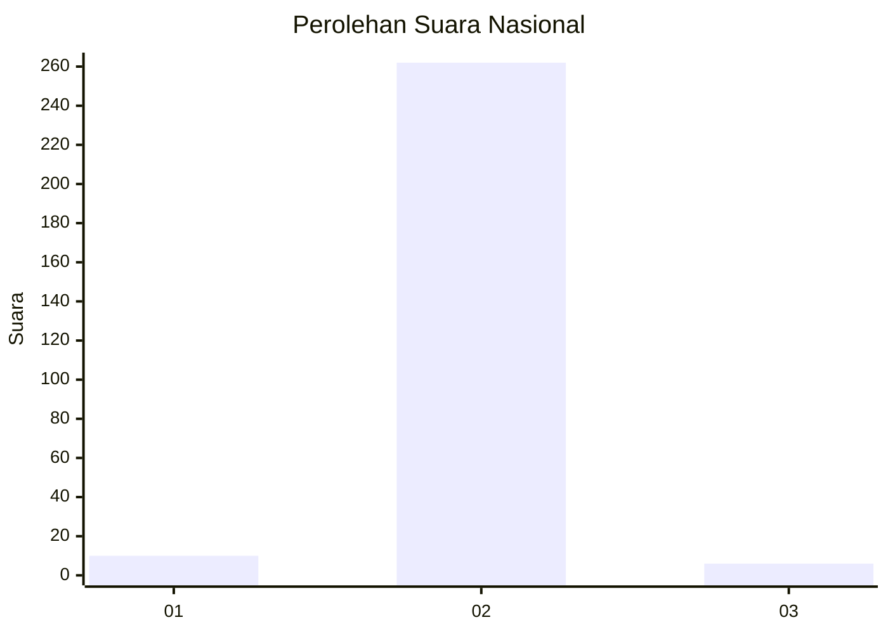
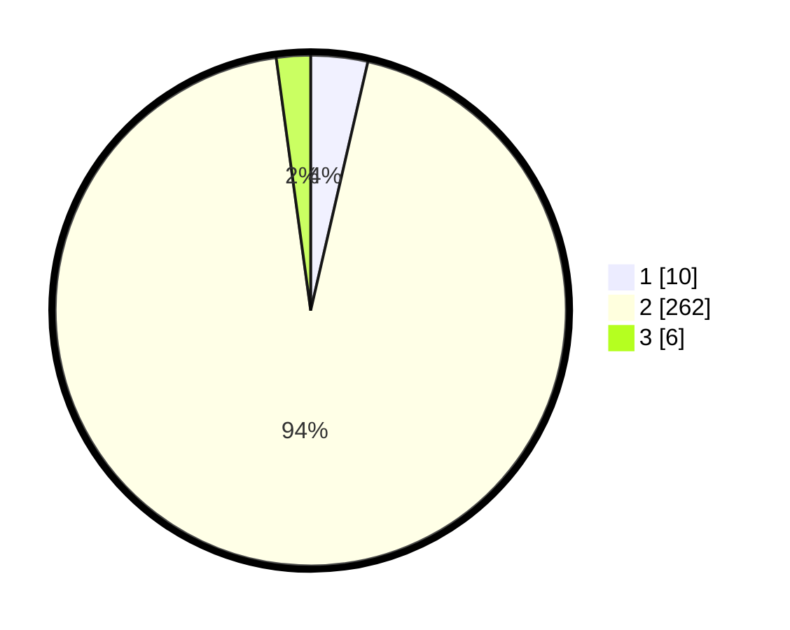

# Hasil

## Grafik

## Tabel

| No. | Nama Paslon    | Suara | Suara (raw) | Persentase |
|:--- |:-------------- | -----:| -----------:| ----------:|
| 1   | ANIES MUHAIMIN | 10    | [10][p-1]   | 3,60       |
| 2   | PRABOWO GIBRAN | 262   | [262][p-2]  | 94,24      |
| 3   | GANJAR MAHFUD  | 6     | [6][p-3]    | 2,16       |

[p-1]: https://github.com/gigit-pemilu/pemilu-2024/blob/main/pilpres/hitung-suara/sub/16-sumatera-selatan/sub/06-musi-banyuasin/sub/06-babat-toman/sub/2022-sungai-angit/sub/003-tps/sub/paslon-1.txt
[p-2]: https://github.com/gigit-pemilu/pemilu-2024/blob/main/pilpres/hitung-suara/sub/16-sumatera-selatan/sub/06-musi-banyuasin/sub/06-babat-toman/sub/2022-sungai-angit/sub/003-tps/sub/paslon-2.txt
[p-3]: https://github.com/gigit-pemilu/pemilu-2024/blob/main/pilpres/hitung-suara/sub/16-sumatera-selatan/sub/06-musi-banyuasin/sub/06-babat-toman/sub/2022-sungai-angit/sub/003-tps/sub/paslon-3.txt

## Foto C Plano

https://sirekap-obj-formc.kpu.go.id/1ff3/pemilu/ppwp/16/06/06/20/22/1606062022003-20240220-112855--b827b1d2-c960-4adc-8581-433fbe6ac57c.jpg

https://sirekap-obj-formc.kpu.go.id/1ff3/pemilu/ppwp/16/06/06/20/22/1606062022003-20240220-113129--05a9d929-ee46-4e3d-9409-f484cb0ecbad.jpg

https://sirekap-obj-formc.kpu.go.id/1ff3/pemilu/ppwp/16/06/06/20/22/1606062022003-20240214-234626--103c61e0-5db1-48b9-acd7-738db89a4f42.jpg

## Metadata

| Key        | Value               |
| ---------- | ------------------- |
| Time Stamp | 2024-02-25 19:00:00 |

