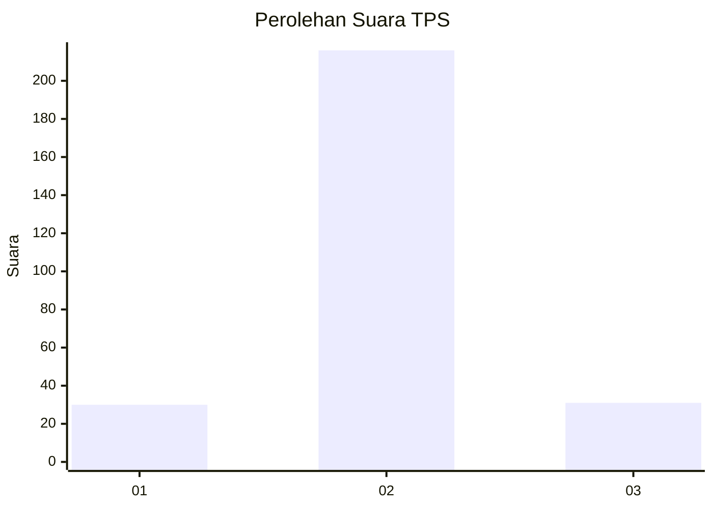
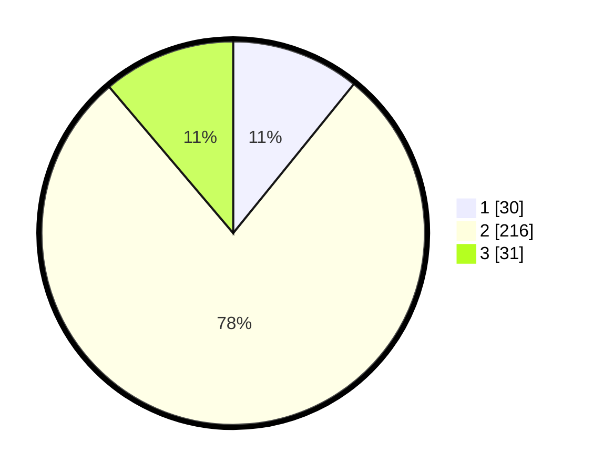

# Hasil

## Grafik

## Tabel

| No. | Nama Paslon    | Suara | Suara (raw) | Persentase |
|:--- |:-------------- | -----:| -----------:| ----------:|
| 1   | ANIES MUHAIMIN | 30    | [30][p-1]   | 10,83      |
| 2   | PRABOWO GIBRAN | 216   | [216][p-2]  | 77,98      |
| 3   | GANJAR MAHFUD  | 31    | [31][p-3]   | 11,19      |

[p-1]: https://github.com/gigit-pemilu/pemilu-2024-16-sumatera-selatan/blob/main/pilpres/hitung-suara/sub/16-sumatera-selatan/sub/06-musi-banyuasin/sub/06-babat-toman/sub/2023-srimulyo/sub/002-tps/sub/paslon-1.txt
[p-2]: https://github.com/gigit-pemilu/pemilu-2024-16-sumatera-selatan/blob/main/pilpres/hitung-suara/sub/16-sumatera-selatan/sub/06-musi-banyuasin/sub/06-babat-toman/sub/2023-srimulyo/sub/002-tps/sub/paslon-2.txt
[p-3]: https://github.com/gigit-pemilu/pemilu-2024-16-sumatera-selatan/blob/main/pilpres/hitung-suara/sub/16-sumatera-selatan/sub/06-musi-banyuasin/sub/06-babat-toman/sub/2023-srimulyo/sub/002-tps/sub/paslon-3.txt

## Foto C Plano

https://sirekap-obj-formc.kpu.go.id/d740/pemilu/ppwp/16/06/06/20/23/1606062023002-20240215-093430--429edebf-e24e-40d2-9fa4-f55d7260cf28.jpg

https://sirekap-obj-formc.kpu.go.id/d740/pemilu/ppwp/16/06/06/20/23/1606062023002-20240216-064416--4d09f555-269e-4df4-84d1-55cbcd47eda3.jpg

https://sirekap-obj-formc.kpu.go.id/d740/pemilu/ppwp/16/06/06/20/23/1606062023002-20240216-064415--ae3410c6-6b12-4390-9cfe-569abae31f82.jpg

## Metadata

| Key        | Value               |
| ---------- | ------------------- |
| Time Stamp | 2024-02-16 16:25:10 |

